# Kensan 全体アーキテクチャ

Kensanは、エンジニアの自己改善を支援するパーソナル生産性アプリケーションです。時間管理、タスク管理、学習記録、AI週次レビューを統合し、目標達成をサポートします。

---

## 目次

1. [システム全体像](#システム全体像)
2. [技術スタック一覧](#技術スタック一覧)
3. [サービス構成](#サービス構成)
4. [データフロー](#データフロー)
5. [認証・セキュリティ](#認証セキュリティ)
6. [データベース設計](#データベース設計)
7. [フロントエンドアーキテクチャ](#フロントエンドアーキテクチャ)
8. [バックエンドアーキテクチャ](#バックエンドアーキテクチャ)
9. [AIサービスアーキテクチャ](#aiサービスアーキテクチャ)
10. [Observability](#observability)
11. [開発環境](#開発環境)
12. [詳細ドキュメント](#詳細ドキュメント)

---

## システム全体像

Kensanは **React SPA + Goマイクロサービス + Python AIサービス** の3層構成です。

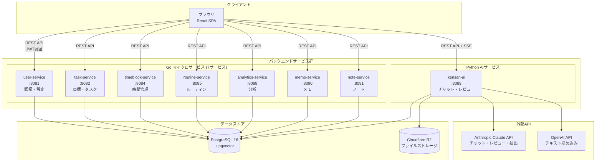

### システムの特徴

- **マイクロサービス構成**: ドメインごとに独立したGoサービス（共有DB）
- **AIネイティブ**: Claude APIによるチャット、週次レビュー、ファクト自動抽出
- **タイムゾーン対応**: DBはUTC保存、フロントエンドでローカル変換
- **マルチテナント**: 全テーブルに`user_id`カラムでデータ完全分離

---

## 技術スタック一覧

| レイヤー | 技術 | バージョン | 用途 |
|---------|------|----------|------|
| **フロントエンド** | React | 18.3 | UIフレームワーク |
| | TypeScript | 5.6 | 型システム |
| | Vite | 6.x | ビルドツール |
| | Zustand | 5.x | 状態管理 |
| | React Router | 7.x | ルーティング |
| | Tailwind CSS | 4.x | スタイリング |
| | shadcn/ui | - | UIコンポーネント |
| | TipTap | 3.16 | リッチテキストエディタ |
| | Recharts | 3.6 | チャート |
| **バックエンド** | Go | 1.24.0 | サービス実装 |
| | chi | v5.1.0 | HTTPルーター |
| | pgx | v5.7.2 | PostgreSQLドライバ |
| | zerolog | v1.33.0 | 構造化ログ |
| | golang-jwt | v5.2.1 | JWT認証 |
| **AIサービス** | Python | 3.12+ | AIサービス実装 |
| | FastAPI | 0.115+ | Webフレームワーク |
| | asyncpg | 0.30+ | 非同期DBドライバ |
| | Anthropic SDK | 0.40+ | Claude API |
| | OpenAI SDK | 1.50+ | 埋め込みAPI |
| **インフラ** | PostgreSQL | 16 | メインDB + pgvector |
| | Cloudflare R2 | - | ファイルストレージ |
| | Docker Compose | - | ローカル開発 |

---

## サービス構成

### サービス一覧とドメイン責務

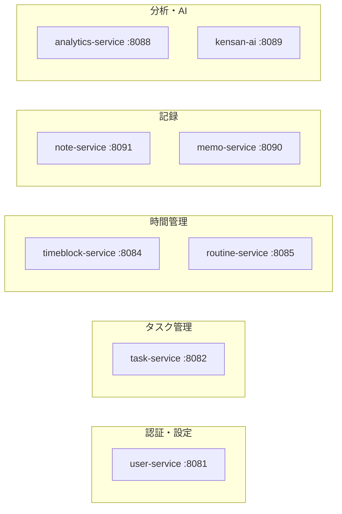

| サービス | ポート | 言語 | ドメイン | 主な責務 |
|---------|--------|------|---------|---------|
| user-service | 8081 | Go | 認証・設定 | ユーザー登録、ログイン、JWT発行、ユーザー設定 |
| task-service | 8082 | Go | タスク管理 | 目標(Goal)、マイルストーン、タグ、タスクのCRUD |
| timeblock-service | 8084 | Go | 時間管理 | 予定(TimeBlock)、実績(TimeEntry)、タイマー |
| routine-service | 8085 | Go | ルーティン | 繰り返しタスクの管理 |
| analytics-service | 8088 | Go | 分析 | 週間/月間サマリー、目標進捗 |
| memo-service | 8090 | Go | メモ | クイックメモ（スクラッチパッド） |
| note-service | 8091 | Go | ノート | 日記、学習記録、一般ノート、読書レビュー |
| kensan-ai | 8089 | Python | AI | チャット、週次レビュー、ファクト抽出 |

### ドメインモデルの関係

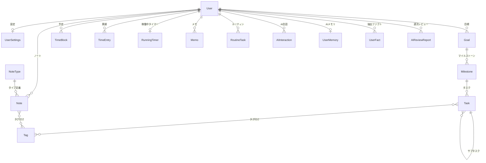

---

## データフロー

### 典型的なユーザー操作のデータフロー

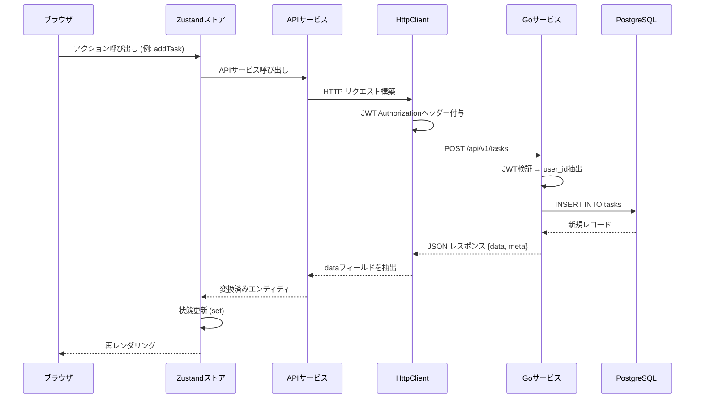

### AIチャットのデータフロー

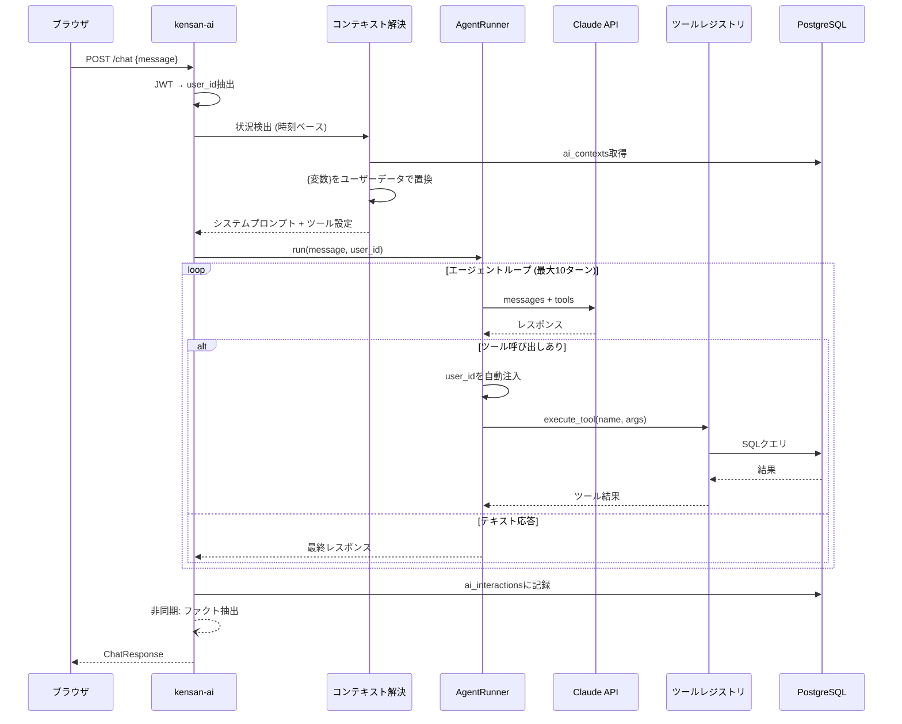

### タイムゾーン変換フロー

DBはUTC保存、フロントエンドでローカル変換する設計です。

```
ユーザー操作 (ローカル時刻)
    ↓ 例: "2026-01-27 09:00" (Asia/Tokyo)
フロントエンド API層
    ↓ localToUtcDatetime() → "2026-01-27T00:00:00.000Z"
バックエンド
    ↓ TIMESTAMPTZ としてUTC保存
PostgreSQL
    ↓ UTC ISO 8601 で返却
フロントエンド 表示層
    ↓ getLocalTime() → "09:00"
ユーザーに表示 (ローカル時刻)
```

---

## 認証・セキュリティ

### 認証フロー

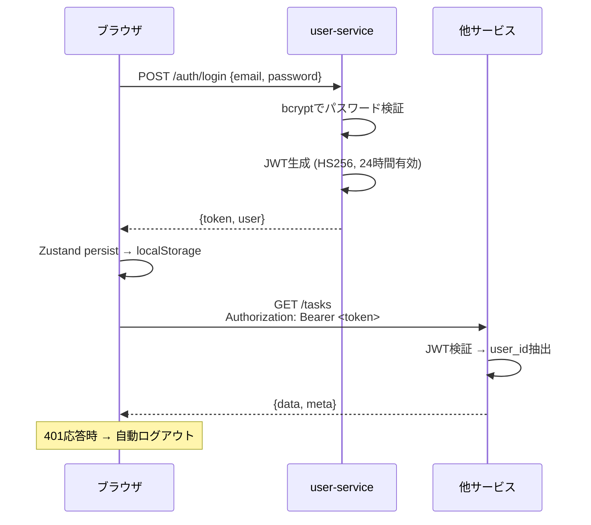

### セキュリティ設計

| 項目 | 実装 |
|------|------|
| 認証方式 | JWT (HS256) |
| トークン有効期限 | 24時間 |
| パスワードハッシュ | bcrypt |
| データ分離 | 全テーブル `user_id` によるマルチテナント |
| 機密データ暗号化 | Clockify APIキー: pgcrypto |
| JWT自動注入 | HttpClient がリクエストに自動付与 |
| AI tool user_id注入 | AgentRunner が自動注入 (LLMに依存しない) |

---

## データベース設計

### テーブル構成概要

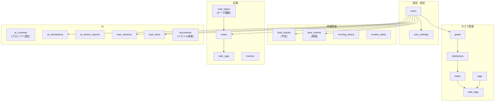

### 主要な設計原則

| 原則 | 詳細 |
|------|------|
| **UUID主キー** | PostgreSQL uuid-ossp拡張 |
| **マルチテナント** | 全テーブルに`user_id`でデータ完全分離 |
| **UTC保存** | TIMESTAMPTZ型、フロントで変換 |
| **非正規化** | TimeBlock/TimeEntry/NoteにGoal名・色を複製 (JOIN回避) |
| **同期トリガー** | Goal/Milestone/Task名変更時に非正規化フィールドを自動同期 |
| **監査証跡** | `updated_at`トリガーによる自動更新 |
| **データ駆動タイプ** | note_typesテーブルでノートタイプを管理 (ハードコード不要) |
| **ベクトル検索** | pgvectorによるセマンティック検索 |

---

## フロントエンドアーキテクチャ

### レイヤー構成

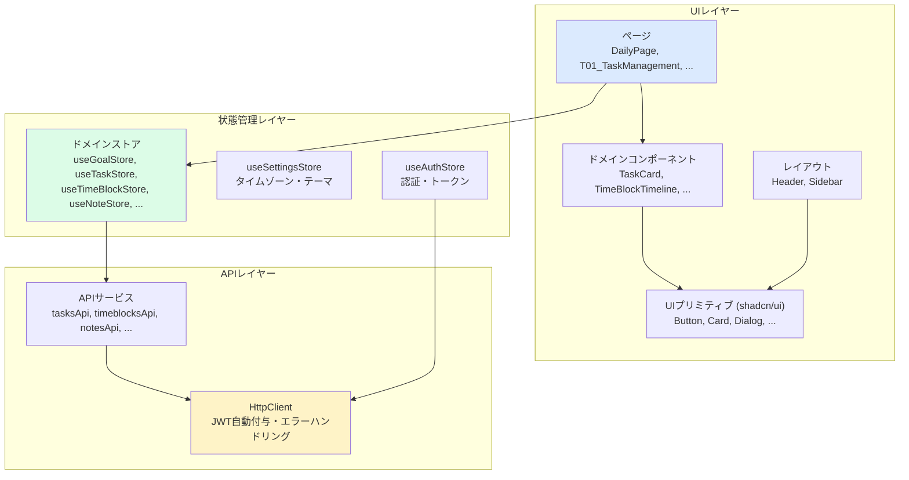

### 状態管理 (Zustand)

12のZustandストアが各ドメインの状態を管理:

| ストア | 状態 | 永続化 |
|-------|------|--------|
| useAuthStore | token, user, isAuthenticated | localStorage |
| useSettingsStore | timezone, theme | localStorage |
| useGoalStore | goals | - |
| useMilestoneStore | milestones | - |
| useTagStore | tags | - |
| useTaskStore | tasks | - |
| useTimeBlockStore | timeBlocks, timeEntries | - |
| useTimerStore | currentTimer, isRunning | - |
| useNoteTypeStore | types (データ駆動) | - |
| useNoteStore | items, noteCache | - |
| useMemoStore | memos | - |
| useRoutineStore | routines | - |

### ルーティング構成

```
/login                   → ログイン画面 (公開)
/settings                → 初期設定

/ (認証済み + Layout)
├── /                    → ダッシュボード
├── /daily               → デイリー (予定・実績タイムライン)
├── /tasks               → タスク管理 (目標・マイルストーン・タスク)
├── /routines            → ルーティン管理
├── /notes               → ノート一覧
│   ├── /notes/new       → ノート新規作成
│   └── /notes/:id       → ノート編集
├── /analytics           → 分析レポート
├── /ai-review           → AI週次レビュー
└── /interactions         → AI Interaction Explorer
```

> 詳細: [src/ARCHITECTURE.md](src/ARCHITECTURE.md)

---

## バックエンドアーキテクチャ

### レイヤードアーキテクチャ (全サービス共通)

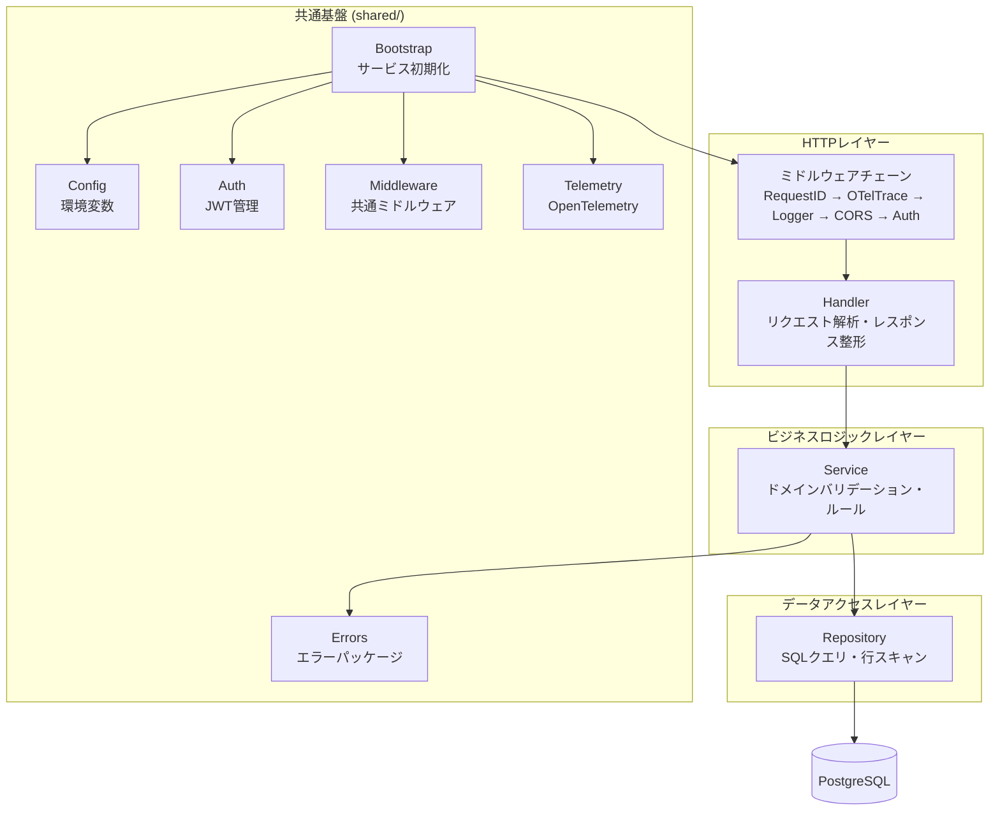

### 各サービスのディレクトリ構成

```
services/<name>/
├── cmd/main.go                    # エントリポイント (bootstrap.New → RegisterRoutes → Run)
├── internal/
│   ├── model.go                   # ドメイン型・DTO
│   ├── handler/handler.go         # HTTPハンドラ
│   ├── service/
│   │   ├── interface.go           # サービスインターフェース (Reader/Writer分離)
│   │   ├── service.go             # ビジネスロジック実装
│   │   └── service_test.go        # ユニットテスト
│   └── repository/
│       ├── interface.go           # リポジトリインターフェース (ISP準拠)
│       └── repository.go          # PostgreSQL実装
├── Dockerfile
└── Makefile
```

### APIレスポンス形式 (全サービス共通)

```json
// 成功時
{
  "data": { /* エンティティ or 配列 */ },
  "meta": { "requestId": "uuid", "timestamp": "ISO8601" },
  "pagination": { "page": 1, "perPage": 20, "total": 100 }
}

// エラー時
{
  "error": { "code": "NOT_FOUND", "message": "リソースが見つかりません" },
  "meta": { "requestId": "uuid", "timestamp": "ISO8601" }
}
```

> 詳細: [backend/ARCHITECTURE.md](backend/ARCHITECTURE.md)

---

## AIサービスアーキテクチャ

### コア概念

kensan-aiは**エージェントベース**のアーキテクチャで、Claude APIのDirect Tools (Function Calling) を使用してユーザーデータに直接アクセスします。

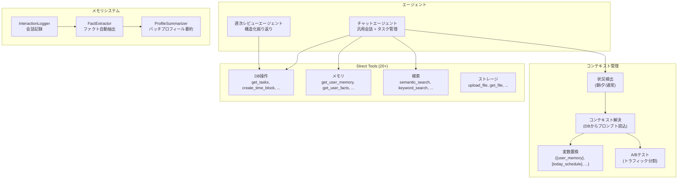

### 動的ツール選択

全ツールを毎回送信するとトークンコストが増大するため、メッセージの意図に基づき必要なツールのみを選択:

```
ユーザーメッセージ
    ↓
意図分析 (Read/Write判定 + キーワードマッチ)
    ↓
┌─────────────────────────────────────────┐
│ 例: "明日の予定を作って"                    │
│   → core (常に) + planning (Write)        │
│   → 7ツール送信 (全27ツール中)              │
│                                           │
│ 例: "目標達成できそう？"                     │
│   → core + goals_read + analytics (Read)  │
│   → 9ツール送信 (Writeなし)                 │
└─────────────────────────────────────────┘
```

### メモリ構築パイプライン

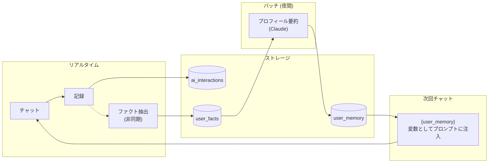

> 詳細: [kensan-ai/ARCHITECTURE.md](kensan-ai/ARCHITECTURE.md)

---

## Observability

### OpenTelemetry統合

Go/Python両方のサービスがOpenTelemetryに対応 (`OTEL_ENABLED=true`で有効化):

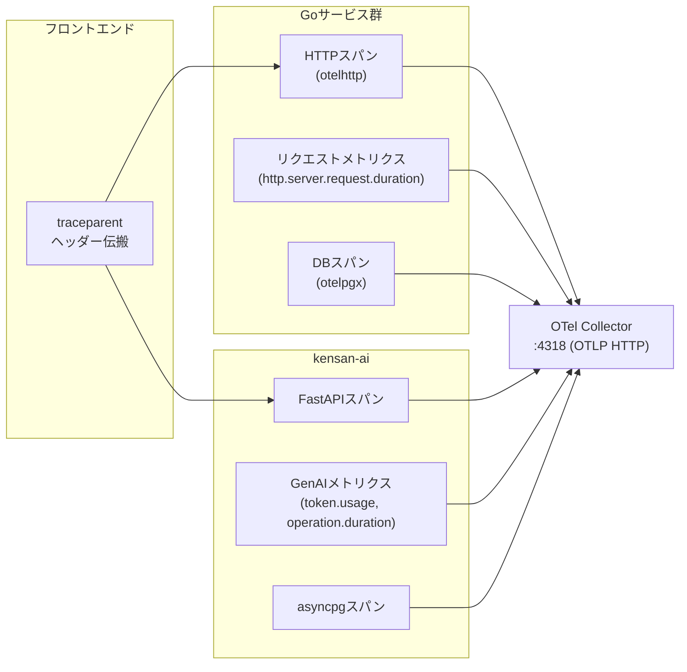

### AI Interaction Explorer

kensan-aiの構造化ログをLoki経由で可視化するフロントエンド機能:

| ログイベント | 内容 |
|------------|------|
| `agent.prompt` | モデル、ツール数、コンテキスト情報 |
| `agent.system_prompt` | システムプロンプト全文 |
| `agent.turn` | ターンごとのトークン使用量、キャッシュヒット |
| `agent.tool_call` | ツール名、入出力、成否 |
| `agent.complete` | 総ターン数、総トークン数、outcome |

---

## 開発環境

### コマンド一覧

```bash
# === フロントエンド ===
npm run dev              # 開発サーバー (localhost:5173)
npm run dev:mock         # MSWモッキング有効
npm run build            # TypeScriptチェック + プロダクションビルド
npm run lint             # ESLint

# === バックエンド ===
cd backend
make build               # 全サービスビルド
make run SERVICE=task-service  # 特定サービス実行
make test                # テスト実行
make lint                # golangci-lint

# === AIサービス ===
cd kensan-ai
pip install -e .
uvicorn kensan_ai.main:app --reload --port 8089
pytest                   # テスト実行

# === Docker (フルスタック) ===
make up                  # 全サービス起動
make down                # 停止
make logs                # ログ表示
make health              # ヘルスチェック
make dev-backend         # バックエンドのみ起動
```

### テストユーザー

| フィールド | 値 |
|----------|-----|
| Email | `test@kensan.dev` |
| Password | `password123` |
| Name | `Yu` |

---

## 詳細ドキュメント

各コンポーネントの詳細なアーキテクチャドキュメント:

| ドキュメント | 内容 |
|------------|------|
| [backend/ARCHITECTURE.md](backend/ARCHITECTURE.md) | Goマイクロサービス: 共通パッケージ、レイヤー設計、DBスキーマ、API仕様 |
| [src/ARCHITECTURE.md](src/ARCHITECTURE.md) | フロントエンド: コンポーネント階層、Zustandストア、APIクライアント、タイムゾーン変換 |
| [kensan-ai/ARCHITECTURE.md](kensan-ai/ARCHITECTURE.md) | AIサービス: Direct Tools、エージェント、コンテキスト管理、メモリシステム |

各サービスの個別ドキュメント:

| ドキュメント | 内容 |
|------------|------|
| [backend/services/user/ARCHITECTURE.md](backend/services/user/ARCHITECTURE.md) | user-service |
| [backend/services/task/ARCHITECTURE.md](backend/services/task/ARCHITECTURE.md) | task-service |
| [backend/services/timeblock/ARCHITECTURE.md](backend/services/timeblock/ARCHITECTURE.md) | timeblock-service |
| [backend/services/routine/ARCHITECTURE.md](backend/services/routine/ARCHITECTURE.md) | routine-service |
| [backend/services/analytics/ARCHITECTURE.md](backend/services/analytics/ARCHITECTURE.md) | analytics-service |
| [backend/services/memo/ARCHITECTURE.md](backend/services/memo/ARCHITECTURE.md) | memo-service |
| [backend/services/note/ARCHITECTURE.md](backend/services/note/ARCHITECTURE.md) | note-service |
