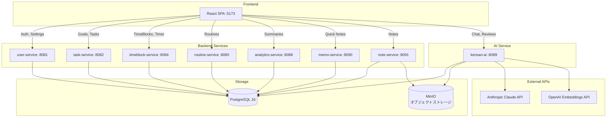
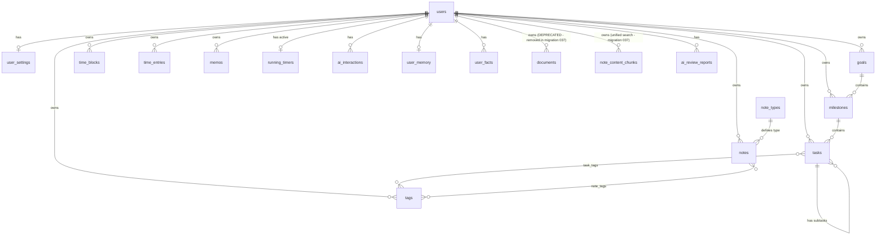

# バックエンドアーキテクチャ

Kensanアプリケーションのバックエンド共通インフラストラクチャ。

---

## 目次

1. [システム概要](#システム概要)
2. [サービス一覧](#サービス一覧)
3. [共通パッケージ](#共通パッケージ)
4. [レイヤードアーキテクチャ](#レイヤードアーキテクチャ)
5. [データベーススキーマ概要](#データベーススキーマ概要)
6. [共通パターン](#共通パターン)
7. [開発コマンド](#開発コマンド)

---

## システム概要

### アーキテクチャスタイル
- **7つの独立したGoマイクロサービス**（ポート8081-8091）
- 単一のPostgreSQL 16データベース（共有スキーマ）
- JWT認証（HS256）
- マルチテナント：全テーブルに`user_id`カラムでデータ分離

### 技術スタック

| コンポーネント | 技術 | バージョン |
|---------------|------|-----------|
| 言語 | Go | 1.24.0 |
| HTTPルーター | chi | v5.1.0 |
| データベース | PostgreSQL | 16 |
| DBドライバ | pgx | v5.7.2 |
| JWT | golang-jwt | v5.2.1 |
| ログ | slog + otelslog | Go標準 + v0.14.0 |
| UUID | google/uuid | v1.6.0 |

### システムアーキテクチャ図



---

## サービス一覧

| サービス | ポート | ドメイン | 詳細ドキュメント |
|---------|--------|---------|-----------------|
| user-service | 8081 | 認証、設定 | [services/user/ARCHITECTURE.md](services/user/ARCHITECTURE.md) |
| task-service | 8082 | 目標、タスク | [services/task/ARCHITECTURE.md](services/task/ARCHITECTURE.md) |
| timeblock-service | 8084 | 時間管理 | [services/timeblock/ARCHITECTURE.md](services/timeblock/ARCHITECTURE.md) |
| routine-service | 8085 | ルーティンタスク | [services/routine/ARCHITECTURE.md](services/routine/ARCHITECTURE.md) |
| analytics-service | 8088 | 分析 | [services/analytics/ARCHITECTURE.md](services/analytics/ARCHITECTURE.md) |
| memo-service | 8090 | クイックメモ | [services/memo/ARCHITECTURE.md](services/memo/ARCHITECTURE.md) |
| note-service | 8091 | ノート | [services/note/ARCHITECTURE.md](services/note/ARCHITECTURE.md) |
| ~~diary-service~~ | - | ~~日記~~ | [DEPRECATED](services/diary/ARCHITECTURE.md)（note-serviceに統合） |
| ~~record-service~~ | - | ~~学習記録~~ | [DEPRECATED](services/record/ARCHITECTURE.md)（note-serviceに統合） |

### サービスディレクトリ構成

各サービスは同一の構成に従う：

```
services/<name>/
├── cmd/main.go                    # エントリポイント、依存性設定
├── internal/
│   ├── model.go                   # ドメイン型とDTO
│   ├── handler/handler.go         # HTTPハンドラ
│   ├── service/service.go         # ビジネスロジック
│   ├── service/interface.go       # サービスインターフェース
│   ├── service/service_test.go    # ユニットテスト
│   └── repository/
│       ├── interface.go           # リポジトリ契約
│       └── repository.go          # PostgreSQL実装
├── Dockerfile
└── Makefile
```

---

## 共通パッケージ

`backend/shared/`に配置（Bootstrap, Config, Auth, Middleware, Telemetry, SQLBuilder, Errors, Types）：

### Bootstrap (`bootstrap/bootstrap.go`)

バッテリー同梱のサービス初期化：

```go
svc := bootstrap.New("user-service")

// 認証必須ルートを登録
svc.RegisterRoutes(func(r chi.Router) {
    r.Get("/users/me", handler.GetProfile)
})

// 公開ルートを登録（認証不要）
svc.RegisterPublicRoutes(func(r chi.Router) {
    r.Post("/auth/login", handler.Login)
})

svc.Run()
```

**提供機能：**
- 環境変数からの設定読み込み
- データベース接続プーリング（pgxpool）
- JWTマネージャー設定
- ミドルウェアチェーン（RequestID、OTelTrace、Logger、CORS、Auth）
- OpenTelemetry自動初期化（`OTEL_ENABLED=true`で有効化）
- グレースフルシャットダウン（OTelプロバイダー含む）
- `/health`エンドポイント

### Config (`config/config.go`)

環境変数ベースの設定：

```go
type Config struct {
    Server    ServerConfig    // Host, Port, Env
    Database  DatabaseConfig  // Host, Port, User, Password, DBName, SSLMode
    JWT       JWTConfig       // Secret, Issuer, ExpireHour
    Telemetry TelemetryConfig // Enabled, CollectorURL
}
```

| 環境変数 | デフォルト | 説明 |
|---------|-----------|------|
| `OTEL_ENABLED` | `false` | OpenTelemetryの有効化 |
| `OTEL_COLLECTOR_URL` | `localhost:4318` | OTel Collector OTLP HTTPエンドポイント |

### Auth (`auth/jwt.go`)

JWTトークン管理：

```go
jwtManager := auth.NewJWTManager(secret, issuer, expireHours)

// トークン生成
token, err := jwtManager.GenerateToken(userID, email)

// トークン検証
claims, err := jwtManager.ValidateToken(tokenString)
```

**クレーム構造：**
- UserID、Email
- IssuedAt、ExpiresAt（デフォルト24時間）
- Issuer: "kensan"

### Middleware (`middleware/`)

**リクエスト処理：**
- `RequestID` - リクエストごとのUUID（またはX-Request-IDヘッダーから取得）
- `OTelTrace` - OpenTelemetry HTTPスパン計装（otelhttp）
- `Metrics` - OTel HTTP SemConv準拠のリクエストdurationヒストグラム記録
- `Logger` - slogによる構造化ログ（otelslogブリッジでtrace_id/span_id自動注入）
- `Auth` - JWT検証、ユーザーID抽出

### Telemetry (`telemetry/telemetry.go`)

OpenTelemetryプロバイダー初期化：

```go
provider, err := telemetry.Initialize(ctx, telemetry.Config{
    ServiceName:  "task-service",
    Environment:  "production",
    CollectorURL: "otel-collector:4318",
    Enabled:      true,
})
defer provider.Shutdown(ctx)
```

**機能：**
- OTLP HTTPエクスポーター（トレース＋メトリクス＋ログ）
- W3C TraceContext + Baggageプロパゲーター
- リソース属性：`service.name`, `service.version`, `deployment.environment`
- HTTPメトリクス（OTel HTTP SemConv準拠）：`http.server.request.duration`（ヒストグラム、属性: `http.request.method`, `http.route`, `http.response.status_code`）。Rate/Errorはhistogram countとstatus_code属性から導出
- `Enabled=false`の場合はno-op（パフォーマンス影響なし）
- pgx DBトレーシング（otelpgx）自動設定
- Service層カスタムスパン用ヘルパー（`telemetry.ServiceTracer()`, `telemetry.StartSpan()`）

**レスポンスヘルパー：**
```go
middleware.JSON(w, r, http.StatusOK, data)
middleware.JSONWithPagination(w, r, status, data, pagination)
middleware.Error(w, r, http.StatusNotFound, "NOT_FOUND", "リソースが見つかりません")
middleware.ValidationError(w, r, []ErrorDetail{{Field: "email", Message: "必須"}})
middleware.HandleServiceError(w, r, err, errorMappings, defaultMsg)
```

**レスポンスエンベロープ：**
```json
{
  "data": { ... },
  "meta": {
    "requestId": "uuid",
    "timestamp": "2026-01-23T..."
  },
  "pagination": { "page": 1, "perPage": 20, "total": 100 }
}
```

### SQL Builder (`sqlbuilder/builder.go`)

動的SQLクエリ構築のための共通ユーティリティ:

```go
// UPDATE文の動的構築
ub := sqlbuilder.NewUpdateBuilder("tasks", "id = $1 AND user_id = $2", taskID, userID)
sqlbuilder.AddField(ub, "name", input.Name)           // *string: nilならスキップ
sqlbuilder.AddField(ub, "due_date", input.DueDate)     // *types.DateOnly
sqlbuilder.AddField(ub, "completed", input.Completed)   // *bool
query, args := ub.Build()                               // "UPDATE tasks SET name=$3, ... WHERE id=$1 AND user_id=$2"

// WHERE句の動的構築
wb := sqlbuilder.NewWhereBuilder()
wb.AddCondition("user_id = ?", userID)
wb.AddConditionIfNotNil("status = ?", filter.Status)
wb.AddInClause("type", slugInterfaces)                  // IN句
wb.AddLike("title", filter.Query)                       // LIKE句
wb.AddConditionIfTrue(filter.Archived, "archived = ?", true)
whereClause, args := wb.Build()                         // "WHERE user_id = $1 AND status = $2 ..."
```

**特徴:**
- ジェネリクス `AddField[T any]` でポインタ型の nil チェックを統一
- パラメータ番号 ($1, $2...) を自動管理
- 全5サービス（task, routine, memo, timeblock, note）のリポジトリで使用

### Errors (`errors/errors.go`)

全サービス共通のエラーパッケージ：

```go
// 基本エラー（ジェネリックのみ、サービス固有のエラーは各サービスで定義）
errors.ErrNotFound, ErrInvalidInput, ErrUnauthorized, ErrAlreadyExists
errors.ErrRequired, ErrInvalidFormat, ErrDatabaseSchema

// ジェネリックコンストラクタ
errors.NotFound("task")         // → "task not found"
errors.AlreadyExists("user")    // → "user already exists"
errors.Required("email")        // → "email required"
errors.InvalidFormat("date", "YYYY-MM-DD")
errors.InvalidStatus("task")    // → wraps ErrInvalidInput

// 型チェック
if errors.IsNotFound(err) { ... }
if errors.IsInvalidInput(err) { ... }

// PostgreSQLエラーヘルパー
errors.IsUniqueViolation(err), errors.IsForeignKeyViolation(err)
errors.WrapDatabaseError(err)
```

**サービスでの使用：**
```go
// 各サービスがジェネリックコンストラクタでローカルエラーを定義
var (
    ErrTaskNotFound = errors.NotFound("task")
    ErrInvalidFrequency = fmt.Errorf("invalid frequency: %w", errors.ErrInvalidInput)
)
```

### Types (`types/date.go`)

**DateOnly** - 時刻なしのPostgreSQL DATE：

```go
type DateOnly struct {
    Time  time.Time
    Valid bool
}

// 実装: sql.Scanner, driver.Valuer, json.Marshaler/Unmarshaler
// JSON: "2026-01-23" または null
```

---

## レイヤードアーキテクチャ

### フロー

```
HTTPリクエスト
    ↓
Handler (HTTPレイヤー)
    - コンテキストからユーザーID抽出
    - リクエストボディ/パラメータをパース
    - サービス呼び出し
    - エラーをHTTPステータスにマッピング
    - JSONレスポンス返却
    ↓
Service (ビジネスロジック)
    - 入力バリデーション（必須フィールド等）
    - ドメインバリデーション
    - ビジネスルール
    - オーケストレーション
    - ドメインエラーを返す
    ↓
Repository (データアクセス)
    - SQLクエリ (pgx)
    - 行スキャン
    - 存在しない行にはErrNotFoundを返す
    ↓
PostgreSQL
```

### ハンドラパターン

```go
func (h *Handler) GetTask(w http.ResponseWriter, r *http.Request) {
    userID := middleware.GetUserID(r.Context())
    taskID := chi.URLParam(r, "taskId")

    task, err := h.service.GetByID(r.Context(), userID, taskID)
    if err != nil {
        switch {
        case errors.Is(err, service.ErrTaskNotFound):
            middleware.Error(w, r, http.StatusNotFound, "NOT_FOUND", "タスクが見つかりません")
        default:
            middleware.Error(w, r, http.StatusInternalServerError, "INTERNAL", "...")
        }
        return
    }

    middleware.JSON(w, r, http.StatusOK, task)
}
```

### サービスインターフェース

全サービスが依存性注入のためインターフェースを定義（`internal/service/interface.go`）:

```go
// task-service: ISP準拠のReader/Writer分離
type TaskReader interface {
    GetByID(ctx context.Context, userID, taskID string) (*Task, error)
    List(ctx context.Context, userID string, filter *Filter) ([]*Task, error)
}
type TaskWriter interface {
    Create(ctx context.Context, userID string, input *CreateInput) (*Task, error)
    Update(ctx context.Context, userID string, input *UpdateInput) (*Task, error)
    Delete(ctx context.Context, userID, taskID string) error
}
type TaskService interface { TaskReader; TaskWriter }

// routine-service, memo-service, analytics-service も同様にinterface.goで定義
```

### リポジトリインターフェース（ISP準拠）

インターフェース分離原則に従い、エンティティごとにリポジトリインターフェースを分割：

```go
// internal/repository/interface.go

// GoalRepository はゴールの永続化を処理
type GoalRepository interface {
    GetByID(ctx context.Context, id string) (*Goal, error)
    List(ctx context.Context, userID string) ([]*Goal, error)
    Create(ctx context.Context, goal *Goal) error
    Update(ctx context.Context, goal *Goal) error
    Delete(ctx context.Context, id string) error
}

// MilestoneRepository はマイルストーンの永続化を処理
type MilestoneRepository interface {
    GetByID(ctx context.Context, id string) (*Milestone, error)
    ListByGoal(ctx context.Context, goalID string) ([]*Milestone, error)
    // ...
}

// 複数リポジトリが必要なサービス用の複合インターフェース
type Repository interface {
    GoalRepository
    MilestoneRepository
    TagRepository
    TaskRepository
}
```

### リポジトリパターン

```go
// インターフェース (internal/repository/interface.go)
type Repository interface {
    GetByID(ctx context.Context, id string) (*Entity, error)
    GetByIDAndUserID(ctx context.Context, id, userID string) (*Entity, error)
    Create(ctx context.Context, entity *Entity) error
    Update(ctx context.Context, entity *Entity) error
    Delete(ctx context.Context, id string) error
    List(ctx context.Context, userID string, filter *Filter) ([]*Entity, error)
}

// 実装 (internal/repository/repository.go)
func (r *PostgresRepository) GetByIDAndUserID(ctx context.Context, id, userID string) (*Entity, error) {
    row := r.pool.QueryRow(ctx, `SELECT ... FROM entities WHERE id = $1 AND user_id = $2`, id, userID)

    var e Entity
    if err := row.Scan(&e.ID, &e.Name, ...); err != nil {
        if errors.Is(err, pgx.ErrNoRows) {
            return nil, ErrNotFound
        }
        return nil, err
    }
    return &e, nil
}
```

---

## データベーススキーマ概要

### ER図



### note_types テーブル（データ駆動ノートタイプ）

ノートタイプをハードコードではなくデータベースで管理。新しいタイプはマイグレーションでシードするだけで追加可能。

```sql
CREATE TABLE note_types (
    id UUID PRIMARY KEY,
    slug VARCHAR(50) NOT NULL UNIQUE,          -- 'diary', 'learning', 'general', 'book_review'
    display_name VARCHAR(100) NOT NULL,        -- 日本語表示名
    display_name_en VARCHAR(100),              -- 英語表示名
    description TEXT,
    icon VARCHAR(50) NOT NULL DEFAULT 'file-text',  -- Lucideアイコン名
    color VARCHAR(7) DEFAULT '#6B7280',
    constraints JSONB NOT NULL DEFAULT '{}',   -- {dateRequired, titleRequired, contentRequired, dailyUnique}
    metadata_schema JSONB NOT NULL DEFAULT '[]', -- [{key, label, labelEn, type, required, constraints}]
    sort_order INT DEFAULT 0,
    is_system BOOLEAN DEFAULT FALSE,
    is_active BOOLEAN DEFAULT TRUE,
    created_at TIMESTAMPTZ,
    updated_at TIMESTAMPTZ
);
```

**制約 (`constraints` JSONB):**
- `dateRequired` - 日付フィールドの必須化（diary, learning）
- `titleRequired` - タイトルの必須化
- `contentRequired` - コンテンツの必須化
- `dailyUnique` - 1日1件制約（diary, learning）

**メタデータスキーマ (`metadata_schema` JSONB配列):**
タイプごとに追加フィールドを定義。例: book_reviewの著者、評価、ISBN等。

| key | type | 説明 |
|-----|------|------|
| string | テキスト入力 | |
| integer | 数値入力 | min/max制約可 |
| float | 小数入力 | min/max制約可 |
| boolean | チェックボックス | |
| enum | 選択リスト | values制約で選択肢定義 |
| date | 日付入力 | |
| url | URL入力 | |

**初期シードデータ:**

| slug | display_name | icon | dateRequired | dailyUnique | metadata_schema |
|------|-------------|------|:---:|:---:|---|
| diary | 日記 | calendar-days | Yes | Yes | [] |
| learning | 学習記録 | book-open | Yes | Yes | [] |
| general | 一般ノート | file-text | No | No | [] |
| book_review | 読書レビュー | book-open-check | No | No | author, rating, isbn, publisher, finished_date, category |

**note-service での活用:**
- 起動時にキャッシュ（`sync.RWMutex`で保護）
- `validateCreateInput()` で制約をデータ駆動チェック
- `validateMetadata()` でメタデータスキーマに基づくバリデーション
- `GET /note-types` エンドポイントでフロントエンドに提供

### note_content_chunks テーブル（統合検索）

ノート検索のためのベクトル埋め込みとチャンクを管理。migration 037 で `documents` テーブルを廃止し、note_content_chunks に統合。

```sql
CREATE TABLE note_content_chunks (
    id UUID PRIMARY KEY,
    user_id UUID NOT NULL,                     -- migration 037で追加
    note_id UUID NOT NULL REFERENCES notes(id) ON DELETE CASCADE,
    content_type VARCHAR(50),                  -- migration 037で追加 ('note', 'attachment', etc.)
    chunk_text TEXT NOT NULL,
    chunk_index INT NOT NULL,
    embedding VECTOR(1536),                    -- OpenAI text-embedding-3-small
    created_at TIMESTAMPTZ,
    updated_at TIMESTAMPTZ
);
```

**migration 037 の変更点:**
- `documents` テーブルを削除（note_id, content_type, file_pathなどを持っていた）
- `note_content_chunks` に `user_id UUID NOT NULL` カラムを追加
- `note_content_chunks` に `content_type VARCHAR(50)` カラムを追加
- 検索処理を note_content_chunks のみに統合

### 主要な設計原則

- **マルチテナント**: 全テーブルに`user_id`カラムでデータ完全分離
- **UUID主キー**: PostgreSQLのuuid-ossp拡張を使用
- **非正規化**: クエリパフォーマンスのため`project_name`、`goal_tag`を複製
- **タイムスタンプ自動更新**: トリガーによる`updated_at`自動更新

### インデックスと制約

- 適切な場所で`ON DELETE CASCADE`の外部キー
- 複合インデックス: `(user_id, date)`, `(user_id, status)`
- 配列カラム（tag_ids, tags）にGINインデックス
- 全文検索インデックス: `to_tsvector('simple', title || ' ' || content)`
- ユニーク制約: `(user_id, email)`, 日記の`(user_id, date)`

### タイムスタンプ自動更新

```sql
CREATE OR REPLACE FUNCTION update_updated_at()
RETURNS TRIGGER AS $$
BEGIN
    NEW.updated_at = NOW();
    RETURN NEW;
END;
$$ LANGUAGE plpgsql;

CREATE TRIGGER update_timestamp
    BEFORE UPDATE ON <table>
    FOR EACH ROW EXECUTE FUNCTION update_updated_at();
```

### 非正規化フィールド自動同期トリガー

goals/milestones/tasks の name/color 変更時に、非正規化フィールドを持つテーブルを自動更新するAFTER UPDATEトリガー（`033_denormalized_field_sync_triggers.sql`）。

| トリガー関数 | 発火条件 | 更新先テーブル | 更新フィールド |
|-------------|---------|--------------|--------------|
| `sync_goal_denormalized_fields()` | goals の name または color が変更 | time_blocks, time_entries, running_timers, notes | goal_name, goal_color |
| `sync_milestone_denormalized_fields()` | milestones の name が変更 | time_blocks, time_entries, running_timers, notes | milestone_name |
| `sync_task_denormalized_fields()` | tasks の name が変更 | time_blocks, time_entries, running_timers | task_name |

- `IS DISTINCT FROM` で実際に値が変わった時のみ実行（不要なUPDATEを防止）
- Go/AI両方のDB書き込みを一元的にカバー

---

## 共通パターン

### マルチテナント

全クエリに`WHERE user_id = $1`を含める：
```go
query := `SELECT * FROM tasks WHERE user_id = $1 AND id = $2`
```

### 非正規化

TimeBlock、TimeEntry、Noteにゴール/マイルストーン情報を直接保存：
- `goal_id`, `goal_name`, `goal_color`
- `milestone_id`, `milestone_name`

**理由:** 一覧クエリでJOINを回避。ゴール/マイルストーン更新後も表示データが残る。

### オプショナルフィールド更新

「未指定」と「nullに設定」を区別するためポインタを使用：
```go
type UpdateInput struct {
    Name  *string `json:"name,omitempty"`
    Theme *string `json:"theme,omitempty"`
}

// サービス内:
if input.Name != nil {
    entity.Name = *input.Name
}
```

### エラーマッピング

```go
func handleError(w http.ResponseWriter, r *http.Request, err error) {
    switch {
    case errors.Is(err, service.ErrNotFound):
        middleware.Error(w, r, http.StatusNotFound, "NOT_FOUND", "...")
    case errors.Is(err, service.ErrInvalidInput):
        middleware.Error(w, r, http.StatusBadRequest, "INVALID_INPUT", "...")
    default:
        middleware.Error(w, r, http.StatusInternalServerError, "INTERNAL", "...")
    }
}
```

### コンテキスト伝播

```go
func (h *Handler) Create(w http.ResponseWriter, r *http.Request) {
    ctx := r.Context()
    userID := middleware.GetUserID(ctx)

    entity, err := h.service.Create(ctx, userID, input)
    // ctxはリクエストID、タイムアウト、キャンセルを伝播
}
```

---

## 開発コマンド

### ビルドとテスト

```bash
cd backend

# 全サービスビルド
make build

# 特定サービス実行
make run SERVICE=user-service

# テスト実行
make test

# Lint
make lint

# フォーマット
make fmt
```

### Docker

```bash
# プロジェクトルートから
make up          # 全サービス起動
make down        # 全サービス停止
make logs        # ログ表示
make rebuild     # 再ビルドして再起動
```

### 環境変数

```bash
SERVER_PORT=8081
SERVER_ENV=development
DB_HOST=localhost
DB_PORT=5432
DB_USER=kensan
DB_PASSWORD=kensan
DB_NAME=kensan
JWT_SECRET=your-secret-key
```

### 新サービス追加手順

1. `services/<name>/`に標準構成でディレクトリ作成
2. `internal/model.go`にモデル定義
3. リポジトリインターフェースとPostgreSQL実装
4. ビジネスロジックのサービスレイヤー実装
5. HTTPハンドラ実装
6. `cmd/main.go`でbootstrapを使用して配線
7. Dockerfile追加
8. docker-compose.ymlに追加
9. 必要に応じてデータベースマイグレーション作成

---

## 依存関係

```
github.com/go-chi/chi/v5                         v5.1.0
github.com/go-chi/cors                           v1.2.1
github.com/golang-jwt/jwt/v5                     v5.2.1
github.com/google/uuid                           v1.6.0
github.com/jackc/pgx/v5                          v5.7.4
go.opentelemetry.io/contrib/bridges/otelslog     v0.14.0
go.opentelemetry.io/otel/sdk/log                 v0.15.0
go.opentelemetry.io/otel/exporters/otlp/otlplog  v0.15.0
golang.org/x/crypto                              v0.46.0
```
