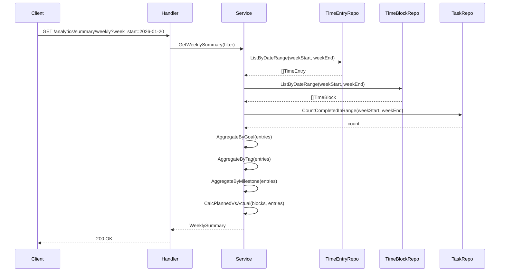

# analytics-service

分析・集計機能を提供するサービス。

---

## 目次

1. [概要](#概要)
2. [エンティティ](#エンティティ)
3. [API仕様](#api仕様)
4. [ビジネスロジック](#ビジネスロジック)
5. [リポジトリ](#リポジトリ)

---

## 概要

| 項目 | 値 |
|------|-----|
| ポート | 8088 |
| ベースパス | `/api/v1` |
| 責務 | 週次/月次サマリー、目標別・タグ別集計、トレンド分析 |

### 主な機能

- **週次サマリー**: 週間の作業時間集計
- **月次サマリー**: 月間の作業時間集計
- **トレンド分析**: 期間別の推移
- **日次学習時間**: グラフ表示用データ

---

## エンティティ

### 集計モデル

```go
// GoalSummary は目標別の集計データ
type GoalSummary struct {
    ID      string `json:"id"`
    Name    string `json:"name"`
    Color   string `json:"color"`
    Minutes int    `json:"minutes"`
}

// TagSummary はタグ別の集計データ
type TagSummary struct {
    ID      string `json:"id"`
    Name    string `json:"name"`
    Color   string `json:"color"`
    Minutes int    `json:"minutes"`
}

// MilestoneSummary はマイルストーン別の集計データ
type MilestoneSummary struct {
    ID      string `json:"id"`
    Name    string `json:"name"`
    GoalID  string `json:"goalId"`
    Minutes int    `json:"minutes"`
}

// PlannedVsActual は予定と実績の比較
type PlannedVsActual struct {
    Planned int `json:"planned"`  // 予定分数
    Actual  int `json:"actual"`   // 実績分数
}

// DailyBreakdown は日別の内訳
type DailyBreakdown struct {
    Date    string `json:"date"`    // YYYY-MM-DD
    Minutes int    `json:"minutes"`
}
```

### WeeklySummary

```go
type WeeklySummary struct {
    WeekStart       string             `json:"weekStart"`       // YYYY-MM-DD（月曜）
    WeekEnd         string             `json:"weekEnd"`         // YYYY-MM-DD（日曜）
    TotalMinutes    int                `json:"totalMinutes"`
    ByGoal          []GoalSummary      `json:"byGoal"`
    ByTag           []TagSummary       `json:"byTag"`
    ByMilestone     []MilestoneSummary `json:"byMilestone"`
    CompletedTasks  int                `json:"completedTasks"`
    PlannedVsActual PlannedVsActual    `json:"plannedVsActual"`
}
```

### MonthlySummary

```go
type MonthlySummary struct {
    Year            int                `json:"year"`
    Month           int                `json:"month"`
    TotalMinutes    int                `json:"totalMinutes"`
    ByGoal          []GoalSummary      `json:"byGoal"`
    ByTag           []TagSummary       `json:"byTag"`
    ByMilestone     []MilestoneSummary `json:"byMilestone"`
    CompletedTasks  int                `json:"completedTasks"`
    PlannedVsActual PlannedVsActual    `json:"plannedVsActual"`
    WeeklyBreakdown []DailyBreakdown   `json:"weeklyBreakdown"`  // 週ごとの内訳
}
```

### TrendDataPoint

```go
type TrendPeriod string

const (
    TrendPeriodWeek    TrendPeriod = "week"
    TrendPeriodMonth   TrendPeriod = "month"
    TrendPeriodQuarter TrendPeriod = "quarter"
)

type TrendDataPoint struct {
    StartDate    string `json:"startDate"`    // 期間開始日
    EndDate      string `json:"endDate"`      // 期間終了日
    TotalMinutes int    `json:"totalMinutes"`
}
```

### DailyStudyHour

```go
type DailyStudyHour struct {
    Date  string  `json:"date"`  // YYYY-MM-DD
    Hours float64 `json:"hours"` // 小数点表示
    Day   string  `json:"day"`   // 曜日（Mon, Tue, ...）
}
```

---

## API仕様

全エンドポイントは認証必須。

### GET /api/v1/analytics/summary/weekly

週次サマリーを取得。

**クエリパラメータ:**
- `week_start` (string) - 週の開始日（月曜日、YYYY-MM-DD）。省略時は今週。

**レスポンス:** `200 OK`
```json
{
  "data": {
    "weekStart": "2026-01-20",
    "weekEnd": "2026-01-26",
    "totalMinutes": 1800,
    "byGoal": [
      {
        "id": "uuid",
        "name": "Golden Kubestronaut",
        "color": "#3B82F6",
        "minutes": 1200
      },
      {
        "id": "uuid",
        "name": "OSS貢献",
        "color": "#10B981",
        "minutes": 600
      }
    ],
    "byTag": [
      {
        "id": "uuid",
        "name": "学習",
        "color": "#8B5CF6",
        "minutes": 900
      }
    ],
    "byMilestone": [
      {
        "id": "uuid",
        "name": "CKA合格",
        "goalId": "uuid",
        "minutes": 800
      }
    ],
    "completedTasks": 15,
    "plannedVsActual": {
      "planned": 2100,
      "actual": 1800
    }
  }
}
```

**エラー:**
- `400 INVALID_WEEK_START` - 日付形式が不正

### GET /api/v1/analytics/summary/monthly

月次サマリーを取得。

**クエリパラメータ:**
- `year` (int) - 年（例: 2026）
- `month` (int) - 月（1-12）

**レスポンス:** `200 OK`
```json
{
  "data": {
    "year": 2026,
    "month": 1,
    "totalMinutes": 7200,
    "byGoal": [...],
    "byTag": [...],
    "byMilestone": [...],
    "completedTasks": 60,
    "plannedVsActual": {
      "planned": 8400,
      "actual": 7200
    },
    "weeklyBreakdown": [
      {"date": "2026-01-06", "minutes": 1800},
      {"date": "2026-01-13", "minutes": 1900},
      {"date": "2026-01-20", "minutes": 1800},
      {"date": "2026-01-27", "minutes": 1700}
    ]
  }
}
```

**エラー:**
- `400 INVALID_YEAR` - 年が不正
- `400 INVALID_MONTH` - 月が1-12の範囲外

### GET /api/v1/analytics/trends

トレンドデータを取得。

**クエリパラメータ:**
- `period` (string) - "week", "month", "quarter"
- `count` (int) - 取得期間数（例: 12週分）

**レスポンス:** `200 OK`
```json
{
  "data": [
    {
      "startDate": "2025-11-04",
      "endDate": "2025-11-10",
      "totalMinutes": 1500
    },
    {
      "startDate": "2025-11-11",
      "endDate": "2025-11-17",
      "totalMinutes": 1800
    }
  ]
}
```

**エラー:**
- `400 INVALID_PERIOD` - periodが不正
- `400 INVALID_COUNT` - countが正の整数でない

### GET /api/v1/analytics/daily-study-hours

日次学習時間を取得（グラフ表示用）。

**クエリパラメータ:**
- `days` (int) - 取得日数（デフォルト: 7）

**レスポンス:** `200 OK`
```json
{
  "data": [
    {"date": "2026-01-17", "hours": 2.5, "day": "Fri"},
    {"date": "2026-01-18", "hours": 3.0, "day": "Sat"},
    {"date": "2026-01-19", "hours": 1.5, "day": "Sun"},
    {"date": "2026-01-20", "hours": 2.0, "day": "Mon"},
    {"date": "2026-01-21", "hours": 2.5, "day": "Tue"},
    {"date": "2026-01-22", "hours": 3.5, "day": "Wed"},
    {"date": "2026-01-23", "hours": 2.0, "day": "Thu"}
  ]
}
```

---

## ビジネスロジック

### 集計フロー



### 集計ロジック

**目標別集計:**
```go
func (s *Service) aggregateByGoal(entries []*TimeEntry) []GoalSummary {
    goalMap := make(map[string]*GoalSummary)

    for _, entry := range entries {
        if entry.GoalID == nil {
            continue
        }

        if _, exists := goalMap[*entry.GoalID]; !exists {
            goalMap[*entry.GoalID] = &GoalSummary{
                ID:    *entry.GoalID,
                Name:  *entry.GoalName,
                Color: *entry.GoalColor,
            }
        }

        // 時間計算: (endTime - startTime) を分に変換
        duration := calculateDuration(entry.StartTime, entry.EndTime)
        goalMap[*entry.GoalID].Minutes += duration
    }

    return sortByMinutesDesc(goalMap)
}
```

**タグ別集計:**

TimeEntryの`tag_ids`配列を展開し、タグごとに集計。同一エントリが複数タグを持つ場合、各タグに時間を配分。

**予定vs実績:**

```go
func (s *Service) calcPlannedVsActual(blocks []*TimeBlock, entries []*TimeEntry) PlannedVsActual {
    planned := 0
    for _, block := range blocks {
        planned += calculateDuration(block.StartTime, block.EndTime)
    }

    actual := 0
    for _, entry := range entries {
        actual += calculateDuration(entry.StartTime, entry.EndTime)
    }

    return PlannedVsActual{Planned: planned, Actual: actual}
}
```

### 週の定義

- 週の開始: 月曜日
- 週の終了: 日曜日
- `week_start`パラメータは月曜日の日付を期待

---

## リポジトリ

### インターフェース

```go
type Repository interface {
    // TimeEntry集計
    ListTimeEntriesByDateRange(ctx context.Context, userID string, startDate, endDate string) ([]*TimeEntry, error)

    // TimeBlock集計
    ListTimeBlocksByDateRange(ctx context.Context, userID string, startDate, endDate string) ([]*TimeBlock, error)

    // タスク完了数
    CountCompletedTasksInRange(ctx context.Context, userID string, startDate, endDate string) (int, error)

    // 日次集計
    GetDailyMinutes(ctx context.Context, userID string, days int) ([]DailyBreakdown, error)
}
```

### 主要クエリ

**目標別集計:**
```sql
SELECT
    goal_id,
    goal_name,
    goal_color,
    SUM(EXTRACT(EPOCH FROM (end_time - start_time)) / 60)::int as minutes
FROM time_entries
WHERE user_id = $1
  AND date BETWEEN $2 AND $3
  AND goal_id IS NOT NULL
GROUP BY goal_id, goal_name, goal_color
ORDER BY minutes DESC
```

**タグ別集計:**
```sql
SELECT
    t.id,
    t.name,
    t.color,
    SUM(EXTRACT(EPOCH FROM (te.end_time - te.start_time)) / 60)::int as minutes
FROM time_entries te
CROSS JOIN LATERAL unnest(te.tag_ids) AS tag_id
JOIN tags t ON t.id = tag_id
WHERE te.user_id = $1
  AND te.date BETWEEN $2 AND $3
GROUP BY t.id, t.name, t.color
ORDER BY minutes DESC
```

**日次学習時間:**
```sql
SELECT
    date,
    SUM(EXTRACT(EPOCH FROM (end_time - start_time)) / 3600)::decimal(5,2) as hours
FROM time_entries
WHERE user_id = $1
  AND date >= CURRENT_DATE - $2::interval
GROUP BY date
ORDER BY date
```

---

## エラー定義

```go
var (
    ErrInvalidWeekStart = errors.New("invalid week_start format")
    ErrInvalidYear      = errors.New("invalid year")
    ErrInvalidMonth     = errors.New("month must be between 1 and 12")
    ErrInvalidPeriod    = errors.New("period must be week, month, or quarter")
    ErrInvalidCount     = errors.New("count must be a positive integer")
)
```
