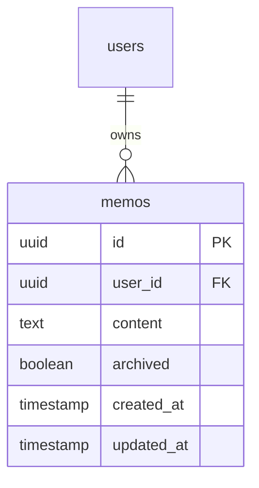
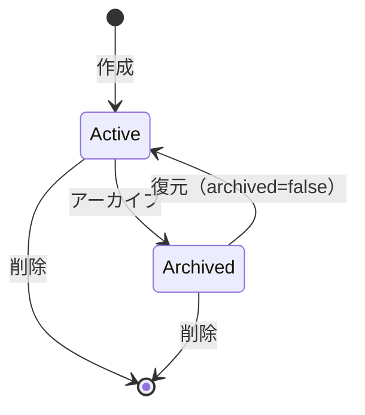

# memo-service

クイックメモ機能を提供するシンプルなサービス。

---

## 目次

1. [概要](#概要)
2. [エンティティ](#エンティティ)
3. [API仕様](#api仕様)
4. [ビジネスロジック](#ビジネスロジック)
5. [リポジトリ](#リポジトリ)

---

## 概要

| 項目 | 値 |
|------|-----|
| ポート | 8090 |
| ベースパス | `/api/v1` |
| 責務 | クイックメモのCRUD、アーカイブ機能 |

### 主な機能

- テキストメモの作成・編集・削除
- アーカイブ機能（削除せずに非表示）
- 日付でのフィルタリング

---

## エンティティ

### ER図



### Memo

```go
type Memo struct {
    ID        string    `json:"id"`
    UserID    string    `json:"userId"`
    Content   string    `json:"content"`
    Archived  bool      `json:"archived"`
    CreatedAt time.Time `json:"createdAt"`
    UpdatedAt time.Time `json:"updatedAt"`
}
```

### 入力型

```go
type CreateMemoInput struct {
    Content string `json:"content"`
}

type UpdateMemoInput struct {
    Content  *string `json:"content,omitempty"`
    Archived *bool   `json:"archived,omitempty"`
}
```

### フィルタ型

```go
type MemoFilter struct {
    Archived   *bool   // アーカイブ状態でフィルタ
    Date       *string // 日付でフィルタ（YYYY-MM-DD）
    Limit      int     // 最大件数
    IncludeAll bool    // アーカイブ済みも含める
}
```

---

## API仕様

全エンドポイントは認証必須。

### GET /api/v1/memos

メモ一覧を取得。

**クエリパラメータ:**
| パラメータ | 型 | 説明 |
|-----------|-----|------|
| archived | bool | アーカイブ済みのみ取得 |
| include_all | bool | アーカイブ含めて全件取得 |
| date | string | 作成日でフィルタ（YYYY-MM-DD） |
| limit | int | 最大件数 |

**レスポンス:** `200 OK`
```json
{
  "data": [
    {
      "id": "uuid",
      "userId": "uuid",
      "content": "明日までにドキュメントを確認",
      "archived": false,
      "createdAt": "2026-01-23T10:00:00Z",
      "updatedAt": "2026-01-23T10:00:00Z"
    }
  ]
}
```

### POST /api/v1/memos

メモを新規作成。

**リクエスト:**
```json
{
  "content": "明日までにドキュメントを確認"
}
```

**レスポンス:** `201 Created`
```json
{
  "data": {
    "id": "uuid",
    "userId": "uuid",
    "content": "明日までにドキュメントを確認",
    "archived": false,
    "createdAt": "2026-01-23T10:00:00Z",
    "updatedAt": "2026-01-23T10:00:00Z"
  }
}
```

**エラー:**
- `400 VALIDATION_ERROR` - contentが空

### GET /api/v1/memos/{memoId}

メモを取得。

**レスポンス:** `200 OK`

**エラー:**
- `404 MEMO_NOT_FOUND` - メモが存在しない

### PATCH /api/v1/memos/{memoId}

メモを部分更新。

**リクエスト:**
```json
{
  "content": "更新された内容"
}
```

または

```json
{
  "archived": true
}
```

**レスポンス:** `200 OK`

### POST /api/v1/memos/{memoId}/archive

メモをアーカイブ。

**レスポンス:** `200 OK`
```json
{
  "data": {
    "id": "uuid",
    "archived": true
  }
}
```

### DELETE /api/v1/memos/{memoId}

メモを完全削除。

**レスポンス:** `204 No Content`

---

## ビジネスロジック

### アーカイブ機能

メモは削除せずにアーカイブ状態にできる:



### デフォルトの表示ルール

- `include_all=false`（デフォルト）: アクティブなメモのみ
- `include_all=true`: アーカイブ済みも含む
- `archived=true`: アーカイブ済みのみ

### ソート順

- 作成日時の降順（新しいものが先頭）

---

## リポジトリ

### インターフェース

```go
type Repository interface {
    GetByID(ctx context.Context, id string) (*Memo, error)
    GetByIDAndUserID(ctx context.Context, id, userID string) (*Memo, error)
    List(ctx context.Context, userID string, filter MemoFilter) ([]*Memo, error)
    Create(ctx context.Context, memo *Memo) error
    Update(ctx context.Context, memo *Memo) error
    Delete(ctx context.Context, id string) error
}
```

### 主要クエリ

**List:**
```sql
SELECT id, user_id, content, archived, created_at, updated_at
FROM memos
WHERE user_id = $1
  AND ($2::boolean IS NULL OR archived = $2)
  AND ($3::date IS NULL OR DATE(created_at) = $3)
ORDER BY created_at DESC
LIMIT COALESCE(NULLIF($4, 0), 100)
```

**Create:**
```sql
INSERT INTO memos (id, user_id, content, archived, created_at, updated_at)
VALUES ($1, $2, $3, false, NOW(), NOW())
RETURNING id, user_id, content, archived, created_at, updated_at
```

**Archive:**
```sql
UPDATE memos
SET archived = true, updated_at = NOW()
WHERE id = $1 AND user_id = $2
RETURNING id, user_id, content, archived, created_at, updated_at
```

---

## エラー定義

```go
var (
    ErrMemoNotFound = errors.New("memo not found")
    ErrInvalidInput = errors.New("invalid input")
)
```

---

## ユースケース

### クイックメモ

朝の計画や作業中に思いついたことをすぐにメモ:

```
POST /memos
{"content": "Pod Security Standardsの記事を読む"}
```

### 週次レビュー

アーカイブ済みを含めて確認:

```
GET /memos?include_all=true
```

### 整理

完了したメモをアーカイブ:

```
POST /memos/{memoId}/archive
```
