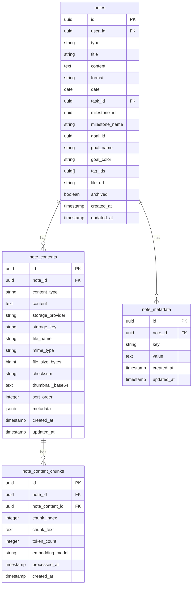
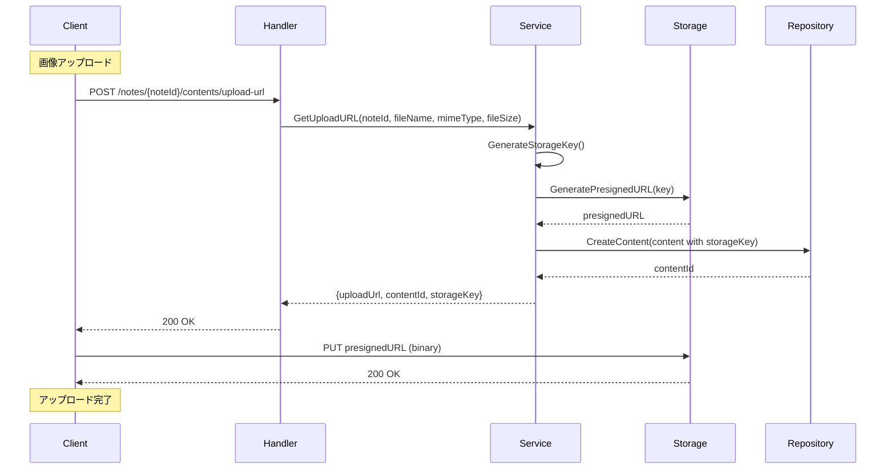

# note-service

統合ノート機能（日記、学習記録）を提供するサービス。

---

## 目次

1. [概要](#概要)
2. [エンティティ](#エンティティ)
3. [API仕様](#api仕様)
4. [ビジネスロジック](#ビジネスロジック)
5. [リポジトリ](#リポジトリ)

---

## 概要

| 項目 | 値 |
|------|-----|
| ポート | 8091 |
| ベースパス | `/api/v1` |
| 責務 | ノートのCRUD、マルチフォーマット対応、コンテンツ管理、検索 |

### 主な機能

- **統合ノート**: 日記と学習記録を同一構造で管理
- **マルチフォーマット**: Markdown、Drawio、画像、PDF
- **複数コンテンツ**: 1ノートに複数のコンテンツを添付
- **全文検索**: タイトル・本文での検索
- **ストレージ連携**: 外部ストレージへのファイルアップロード

---

## エンティティ

### ER図



### Note

```go
type NoteType string

const (
    NoteTypeDiary    NoteType = "diary"    // 日記
    NoteTypeLearning NoteType = "learning" // 学習記録
)

type NoteFormat string

const (
    NoteFormatMarkdown NoteFormat = "markdown"
    NoteFormatDrawio   NoteFormat = "drawio"
)

type Note struct {
    ID                  string             `json:"id"`
    UserID              string             `json:"userId"`
    Type                NoteType           `json:"type"`
    Title               *string            `json:"title,omitempty"`
    Content             string             `json:"content"`
    Format              NoteFormat         `json:"format"`
    Date                types.DateOnly     `json:"date,omitempty"`
    TaskID              *string            `json:"taskId,omitempty"`
    MilestoneID         *string            `json:"milestoneId,omitempty"`
    MilestoneName       *string            `json:"milestoneName,omitempty"`
    GoalID              *string            `json:"goalId,omitempty"`
    GoalName            *string            `json:"goalName,omitempty"`
    GoalColor           *string            `json:"goalColor,omitempty"`
    TagIDs              []string           `json:"tagIds,omitempty"`
    Metadata            []NoteMetadataItem `json:"metadata,omitempty"`
    RelatedTimeEntryIDs []string           `json:"relatedTimeEntryIds,omitempty"`
    FileURL             *string            `json:"fileUrl,omitempty"`
    Archived            bool               `json:"archived"`
    CreatedAt           time.Time          `json:"createdAt"`
    UpdatedAt           time.Time          `json:"updatedAt"`
}
```

### NoteListItem（一覧用、content除外）

```go
type NoteListItem struct {
    ID                  string         `json:"id"`
    UserID              string         `json:"userId"`
    Type                NoteType       `json:"type"`
    Title               *string        `json:"title,omitempty"`
    Format              NoteFormat     `json:"format"`
    Date                types.DateOnly `json:"date,omitempty"`
    TaskID              *string        `json:"taskId,omitempty"`
    MilestoneID         *string        `json:"milestoneId,omitempty"`
    MilestoneName       *string        `json:"milestoneName,omitempty"`
    GoalID              *string        `json:"goalId,omitempty"`
    GoalName            *string        `json:"goalName,omitempty"`
    GoalColor           *string        `json:"goalColor,omitempty"`
    TagIDs              []string       `json:"tagIds,omitempty"`
    RelatedTimeEntryIDs []string       `json:"relatedTimeEntryIds,omitempty"`
    FileURL             *string        `json:"fileUrl,omitempty"`
    Archived            bool           `json:"archived"`
    CreatedAt           time.Time      `json:"createdAt"`
    UpdatedAt           time.Time      `json:"updatedAt"`
}
```

### NoteContent

```go
type ContentType string

const (
    ContentTypeMarkdown ContentType = "markdown"
    ContentTypeDrawio   ContentType = "drawio"
    ContentTypeImage    ContentType = "image"
    ContentTypePDF      ContentType = "pdf"
    ContentTypeCode     ContentType = "code"
)

type StorageProvider string

const (
    StorageProviderMinIO StorageProvider = "minio"
    StorageProviderR2    StorageProvider = "r2"
    StorageProviderS3    StorageProvider = "s3"
    StorageProviderLocal StorageProvider = "local"
)

type NoteContent struct {
    ID              string           `json:"id"`
    NoteID          string           `json:"noteId"`
    ContentType     ContentType      `json:"contentType"`
    Content         *string          `json:"content,omitempty"`         // インラインコンテンツ
    StorageProvider *StorageProvider `json:"storageProvider,omitempty"` // ストレージ種別
    StorageKey      *string          `json:"storageKey,omitempty"`      // ストレージ内のキー
    FileName        *string          `json:"fileName,omitempty"`
    MimeType        *string          `json:"mimeType,omitempty"`
    FileSizeBytes   *int64           `json:"fileSizeBytes,omitempty"`
    Checksum        *string          `json:"checksum,omitempty"`
    ThumbnailBase64 *string          `json:"thumbnailBase64,omitempty"`
    SortOrder       int              `json:"sortOrder"`
    Metadata        map[string]any   `json:"metadata,omitempty"`
    CreatedAt       time.Time        `json:"createdAt"`
    UpdatedAt       time.Time        `json:"updatedAt"`
}
```

### NoteMetadataItem

```go
type NoteMetadataItem struct {
    ID        string    `json:"id"`
    NoteID    string    `json:"noteId"`
    Key       string    `json:"key"`
    Value     *string   `json:"value,omitempty"`
    CreatedAt time.Time `json:"createdAt"`
    UpdatedAt time.Time `json:"updatedAt"`
}
```

---

## API仕様

全エンドポイントは認証必須。

### Note API

| Method | Endpoint | 説明 |
|--------|----------|------|
| GET | /notes | 一覧取得（NoteListItem） |
| POST | /notes | 新規作成 |
| GET | /notes/search | 全文検索 |
| GET | /notes/{noteId} | 取得（content含む） |
| PUT | /notes/{noteId} | 更新 |
| DELETE | /notes/{noteId} | 削除 |
| POST | /notes/{noteId}/archive | アーカイブ切替 |

**GET /notes クエリパラメータ:**
| パラメータ | 型 | 説明 |
|-----------|-----|------|
| types | string | カンマ区切り（diary,learning） |
| goal_id | string | Goal IDでフィルタ |
| milestone_id | string | Milestone IDでフィルタ |
| task_id | string | Task IDでフィルタ |
| tag_ids | string | カンマ区切りのタグID（AND条件） |
| format | string | markdown または drawio |
| date_from | string | 日付範囲開始（YYYY-MM-DD） |
| date_to | string | 日付範囲終了（YYYY-MM-DD） |
| archived | bool | アーカイブ状態 |
| q | string | タイトル・内容で検索 |

**POST /notes リクエスト:**
```json
{
  "type": "learning",
  "title": "Kubernetes Pod Security入門",
  "content": "# Pod Security Standards\n\n...",
  "format": "markdown",
  "date": "2026-01-23",
  "milestoneId": "uuid",
  "milestoneName": "CKA合格",
  "goalId": "uuid",
  "goalName": "Golden Kubestronaut",
  "goalColor": "#3B82F6",
  "tagIds": ["uuid1", "uuid2"],
  "metadata": [
    {"key": "difficulty", "value": "intermediate"},
    {"key": "source", "value": "kubernetes.io"}
  ]
}
```

**GET /notes/search クエリパラメータ:**
| パラメータ | 型 | 説明 |
|-----------|-----|------|
| q | string | 検索クエリ（必須） |
| types | string | タイプでフィルタ |
| archived | bool | アーカイブ状態 |
| limit | int | 最大件数（デフォルト: 20） |

**POST /notes/{noteId}/archive リクエスト:**
```json
{
  "archived": true
}
```

### NoteContent API

| Method | Endpoint | 説明 |
|--------|----------|------|
| GET | /notes/{noteId}/contents | コンテンツ一覧 |
| POST | /notes/{noteId}/contents | コンテンツ追加 |
| GET | /notes/{noteId}/contents/{contentId} | コンテンツ取得 |
| PUT | /notes/{noteId}/contents/{contentId} | コンテンツ更新 |
| DELETE | /notes/{noteId}/contents/{contentId} | コンテンツ削除 |
| PATCH | /notes/{noteId}/contents/reorder | 並び替え |

**POST /notes/{noteId}/contents リクエスト（インライン）:**
```json
{
  "contentType": "markdown",
  "content": "## 追加のメモ\n\n...",
  "sortOrder": 1
}
```

**POST /notes/{noteId}/contents リクエスト（ファイル参照）:**
```json
{
  "contentType": "image",
  "storageProvider": "r2",
  "storageKey": "notes/uuid/image.png",
  "fileName": "diagram.png",
  "mimeType": "image/png",
  "fileSizeBytes": 102400
}
```

**PATCH /notes/{noteId}/contents/reorder リクエスト:**
```json
{
  "contentIds": ["uuid1", "uuid2", "uuid3"]
}
```

### Storage API

| Method | Endpoint | 説明 |
|--------|----------|------|
| POST | /notes/{noteId}/contents/upload-url | アップロードURL取得 |
| GET | /notes/{noteId}/contents/{contentId}/download-url | ダウンロードURL取得 |

**POST /notes/{noteId}/contents/upload-url リクエスト:**
```json
{
  "fileName": "architecture.drawio",
  "mimeType": "application/xml",
  "fileSize": 51200
}
```

**レスポンス:**
```json
{
  "data": {
    "uploadUrl": "https://r2.example.com/presigned-url...",
    "contentId": "uuid",
    "storageKey": "notes/noteId/uuid/architecture.drawio"
  }
}
```

---

## ビジネスロジック

### ノートタイプ

| タイプ | 用途 | 必須フィールド |
|--------|------|---------------|
| diary | 日記、振り返り | date |
| learning | 学習記録、技術メモ | title, date |

### コンテンツ管理フロー



### 検索ロジック

PostgreSQLの全文検索を使用:

```sql
SELECT n.*,
       ts_rank(to_tsvector('simple', COALESCE(n.title, '') || ' ' || n.content),
               plainto_tsquery('simple', $2)) as score
FROM notes n
WHERE n.user_id = $1
  AND to_tsvector('simple', COALESCE(n.title, '') || ' ' || n.content)
      @@ plainto_tsquery('simple', $2)
ORDER BY score DESC
LIMIT $3
```

### バリデーション

| フィールド | ルール |
|----------|--------|
| type | 必須、diary または learning |
| title | learningタイプでは必須 |
| content | 必須 |
| format | 必須、markdown または drawio |
| date | diary/learningでは必須 |

---

## リポジトリ

### インターフェース（ISP準拠）

```go
// NoteRepository はノートの永続化を処理
type NoteRepository interface {
    GetByID(ctx context.Context, id string) (*Note, error)
    GetByIDAndUserID(ctx context.Context, id, userID string) (*Note, error)
    List(ctx context.Context, userID string, filter *NoteFilter) ([]*NoteListItem, error)
    Create(ctx context.Context, note *Note) error
    Update(ctx context.Context, note *Note) error
    Delete(ctx context.Context, id string) error
    Search(ctx context.Context, userID, query string, filter *NoteFilter, limit int) ([]*SearchResult, error)
}

// NoteContentRepository はコンテンツの永続化を処理
type NoteContentRepository interface {
    GetByID(ctx context.Context, id string) (*NoteContent, error)
    ListByNoteID(ctx context.Context, noteID string) ([]*NoteContent, error)
    Create(ctx context.Context, content *NoteContent) error
    Update(ctx context.Context, content *NoteContent) error
    Delete(ctx context.Context, id string) error
    UpdateSortOrders(ctx context.Context, noteID string, contentIDs []string) error
}

// NoteMetadataRepository はメタデータの永続化を処理
type NoteMetadataRepository interface {
    GetByNoteID(ctx context.Context, noteID string) ([]*NoteMetadataItem, error)
    SetMetadata(ctx context.Context, noteID string, items []SetNoteMetadataInput) error
    DeleteByNoteID(ctx context.Context, noteID string) error
}

// Repository は全リポジトリを統合
type Repository interface {
    NoteRepository
    NoteContentRepository
    NoteMetadataRepository
}
```

### 主要クエリ

**List:**
```sql
SELECT id, user_id, type, title, format, date, task_id,
       milestone_id, milestone_name, goal_id, goal_name, goal_color,
       tag_ids, related_time_entry_ids, file_url, archived, created_at, updated_at
FROM notes
WHERE user_id = $1
  AND ($2::text[] IS NULL OR type = ANY($2))
  AND ($3::uuid IS NULL OR goal_id = $3)
  AND ($4::uuid IS NULL OR milestone_id = $4)
  AND ($5::date IS NULL OR date >= $5)
  AND ($6::date IS NULL OR date <= $6)
  AND ($7::boolean IS NULL OR archived = $7)
ORDER BY date DESC, created_at DESC
```

**Search:**
```sql
SELECT n.id, n.user_id, n.type, n.title, n.format, n.date,
       ts_rank(to_tsvector('simple', COALESCE(n.title, '') || ' ' || n.content),
               plainto_tsquery('simple', $2)) as score
FROM notes n
WHERE n.user_id = $1
  AND n.archived = false
  AND to_tsvector('simple', COALESCE(n.title, '') || ' ' || n.content)
      @@ plainto_tsquery('simple', $2)
ORDER BY score DESC
LIMIT $3
```

**ListContents:**
```sql
SELECT id, note_id, content_type, content, storage_provider, storage_key,
       file_name, mime_type, file_size_bytes, checksum, thumbnail_base64,
       sort_order, metadata, created_at, updated_at
FROM note_contents
WHERE note_id = $1
ORDER BY sort_order, created_at
```

---

## エラー定義

```go
var (
    ErrNoteNotFound       = errors.New("note not found")
    ErrUnauthorized       = errors.New("not authorized")
    ErrTypeRequired       = errors.New("type is required")
    ErrInvalidType        = errors.New("invalid note type")
    ErrTitleRequired      = errors.New("title is required")
    ErrContentRequired    = errors.New("content is required")
    ErrFormatRequired     = errors.New("format is required")
    ErrInvalidFormat      = errors.New("invalid format")
    ErrDateRequired       = errors.New("date is required")
    ErrQueryRequired      = errors.New("search query is required")
    ErrContentNotFound    = errors.New("content not found")
    ErrContentTypeRequired = errors.New("content type is required")
    ErrInvalidContentType = errors.New("invalid content type")
    ErrStorageUnavailable = errors.New("storage service unavailable")
)
```

---

## ストレージ設計

### ストレージキー構造

```
notes/{userID}/{noteID}/{contentID}/{filename}
```

例:
```
notes/abc123/def456/ghi789/architecture.drawio
```

### サポートファイルタイプ

| ContentType | MIMEタイプ例 |
|-------------|-------------|
| markdown | text/markdown |
| drawio | application/xml |
| image | image/png, image/jpeg, image/gif |
| pdf | application/pdf |
| code | text/plain, application/json |
