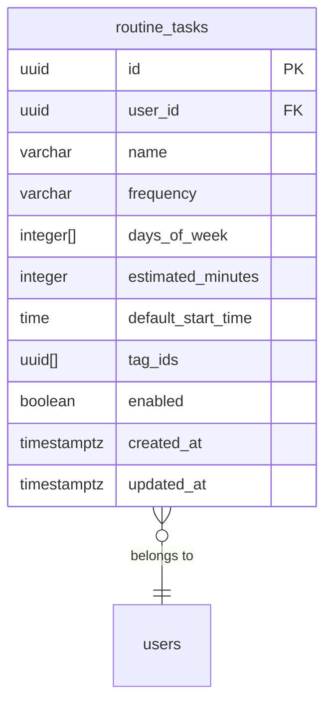
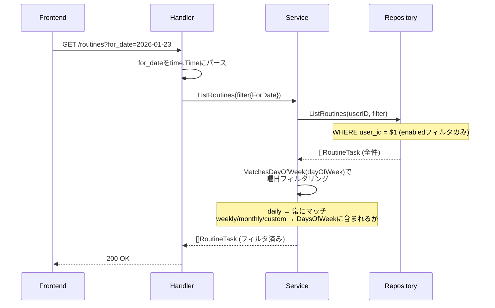

# routine-service

ルーティンタスク（定期タスク）の管理を提供するサービス。

---

## 目次

1. [概要](#概要)
2. [エンティティ](#エンティティ)
3. [API仕様](#api仕様)
4. [ビジネスロジック](#ビジネスロジック)
5. [リポジトリ](#リポジトリ)
6. [エラー定義](#エラー定義)

---

## 概要

| 項目 | 値 |
|------|-----|
| ポート | 8085 |
| ベースパス | `/api/v1` |
| 責務 | RoutineTask（定期タスク）の管理 |

### 主な機能

- **RoutineTask**: 繰り返し実行するタスクの定義（毎日、毎週、毎月、カスタム）
- 頻度（frequency）に基づくスケジュール管理
- 曜日指定による実行日フィルタリング
- 有効/無効のトグル切り替え
- timeblock-service と連携し、ルーティンからTimeBlockを自動生成

---

## エンティティ

### ER図



### RoutineTask

```go
type RoutineTask struct {
    ID               string           `json:"id"`
    UserID           string           `json:"userId"`
    Name             string           `json:"name"`
    Frequency        RoutineFrequency `json:"frequency"`
    DaysOfWeek       []int            `json:"daysOfWeek,omitempty"`     // 0=Sunday, 1=Monday, ..., 6=Saturday
    EstimatedMinutes int              `json:"estimatedMinutes"`
    DefaultStartTime *string          `json:"defaultStartTime,omitempty"` // HH:mm format
    Enabled          bool             `json:"enabled"`
    CreatedAt        time.Time        `json:"createdAt"`
    UpdatedAt        time.Time        `json:"updatedAt"`
}
```

### RoutineFrequency

```go
type RoutineFrequency string

const (
    FrequencyDaily   RoutineFrequency = "daily"
    FrequencyWeekly  RoutineFrequency = "weekly"
    FrequencyMonthly RoutineFrequency = "monthly"
    FrequencyCustom  RoutineFrequency = "custom"
)
```

### 入力DTO

```go
type CreateRoutineInput struct {
    Name             string           `json:"name"`
    Frequency        RoutineFrequency `json:"frequency"`
    DaysOfWeek       []int            `json:"daysOfWeek,omitempty"`
    EstimatedMinutes int              `json:"estimatedMinutes"`
    DefaultStartTime *string          `json:"defaultStartTime,omitempty"`
    Enabled          bool             `json:"enabled"`
}

type UpdateRoutineInput struct {
    Name             *string           `json:"name,omitempty"`
    Frequency        *RoutineFrequency `json:"frequency,omitempty"`
    DaysOfWeek       []int             `json:"daysOfWeek,omitempty"`
    EstimatedMinutes *int              `json:"estimatedMinutes,omitempty"`
    DefaultStartTime *string           `json:"defaultStartTime,omitempty"`
    Enabled          *bool             `json:"enabled,omitempty"`
}
```

---

## API仕様

全エンドポイントは認証必須。

### Routine API

| Method | Endpoint | 説明 |
|--------|----------|------|
| GET | /routines | 一覧取得 |
| POST | /routines | 新規作成 |
| PUT | /routines/{routineId} | 更新 |
| PATCH | /routines/{routineId}/toggle | 有効/無効トグル |
| DELETE | /routines/{routineId} | 削除 |

**GET /routines クエリパラメータ:**

| パラメータ | 型 | 説明 |
|-----------|-----|------|
| enabled | boolean | 有効/無効でフィルタ |
| for_date | string | 日付（YYYY-MM-DD）で曜日フィルタ |

**POST /routines リクエスト:**
```json
{
  "name": "技術ニュースチェック",
  "frequency": "daily",
  "estimatedMinutes": 30,
  "defaultStartTime": "09:00",
  "enabled": true
}
```

**POST /routines リクエスト（weekly）:**
```json
{
  "name": "週次振り返り",
  "frequency": "weekly",
  "daysOfWeek": [0],
  "estimatedMinutes": 60,
  "defaultStartTime": "20:00",
  "enabled": true
}
```

**レスポンス（201 Created / 200 OK）:**
```json
{
  "data": {
    "id": "uuid",
    "userId": "uuid",
    "name": "技術ニュースチェック",
    "frequency": "daily",
    "daysOfWeek": [],
    "estimatedMinutes": 30,
    "defaultStartTime": "09:00",
    "enabled": true,
    "createdAt": "2026-01-23T00:00:00Z",
    "updatedAt": "2026-01-23T00:00:00Z"
  }
}
```

**PUT /routines/{routineId} リクエスト（部分更新）:**
```json
{
  "name": "技術記事チェック",
  "estimatedMinutes": 20
}
```

**PATCH /routines/{routineId}/toggle レスポンス:**
```json
{
  "data": {
    "id": "uuid",
    "name": "技術ニュースチェック",
    "enabled": false,
    "..."
  }
}
```

**DELETE /routines/{routineId}:**

204 No Content を返す。

---

## ビジネスロジック

### 曜日フィルタリング

`for_date` クエリパラメータが指定された場合、サービス層で曜日によるフィルタリングを実施。
リポジトリは `enabled` フィルタのみ適用し、曜日フィルタリングはアプリケーション側で行う。



### 頻度と曜日の関係

| 頻度 | DaysOfWeek | MatchesDayOfWeek の動作 |
|------|-----------|----------------------|
| daily | 不要 | 全曜日にマッチ |
| weekly | 必須 | 指定曜日のみマッチ |
| monthly | 必須 | 指定曜日のみマッチ |
| custom | 必須 | 指定曜日のみマッチ |

### 入力バリデーション

| フィールド | ルール |
|----------|--------|
| name | 必須（空文字不可） |
| frequency | `daily`, `weekly`, `monthly`, `custom` のいずれか |
| daysOfWeek | 各値は 0-6 の範囲。weekly/monthly/custom の場合は1つ以上必須 |

### TimeBlockとの連携

timeblock-service の `POST /timeblocks/generate-from-routines` が指定日のルーティンを取得し、TimeBlock を自動生成する。
routine-service はデータ提供元として機能。

---

## リポジトリ

### インターフェース

```go
type Repository interface {
    // ListRoutines returns all routine tasks for a user with optional filters
    ListRoutines(ctx context.Context, userID string, filter routine.RoutineFilter) ([]routine.RoutineTask, error)

    // GetRoutineByID returns a routine task by ID for a specific user
    GetRoutineByID(ctx context.Context, userID, routineID string) (*routine.RoutineTask, error)

    // CreateRoutine creates a new routine task
    CreateRoutine(ctx context.Context, userID string, input routine.CreateRoutineInput) (*routine.RoutineTask, error)

    // UpdateRoutine updates an existing routine task
    UpdateRoutine(ctx context.Context, userID, routineID string, input routine.UpdateRoutineInput) (*routine.RoutineTask, error)

    // ToggleRoutineEnabled toggles the enabled status of a routine task
    ToggleRoutineEnabled(ctx context.Context, userID, routineID string) (*routine.RoutineTask, error)

    // DeleteRoutine deletes a routine task
    DeleteRoutine(ctx context.Context, userID, routineID string) error
}
```

### 主要クエリ

**ListRoutines（フィルタ付き）:**
```sql
SELECT id, user_id, name, frequency, days_of_week, estimated_minutes,
       default_start_time, enabled, created_at, updated_at
FROM routine_tasks
WHERE user_id = $1
  AND enabled = $2  -- enabledフィルタ指定時のみ
ORDER BY created_at DESC
```

**GetRoutineByID:**
```sql
SELECT id, user_id, name, frequency, days_of_week, estimated_minutes,
       default_start_time, enabled, created_at, updated_at
FROM routine_tasks
WHERE id = $1 AND user_id = $2
```

**CreateRoutine:**
```sql
INSERT INTO routine_tasks (
    id, user_id, name, frequency, days_of_week, estimated_minutes,
    default_start_time, enabled, created_at, updated_at
) VALUES ($1, $2, $3, $4, $5, $6, $7, $8, $9, $10)
RETURNING id, user_id, name, frequency, days_of_week, estimated_minutes,
          default_start_time, enabled, created_at, updated_at
```

**ToggleRoutineEnabled:**
```sql
UPDATE routine_tasks
SET enabled = NOT enabled, updated_at = $3
WHERE id = $1 AND user_id = $2
RETURNING id, user_id, name, frequency, days_of_week, estimated_minutes,
          default_start_time, enabled, created_at, updated_at
```

**UpdateRoutine（動的SET句）:**

更新対象フィールドのみSET句を動的に構築。未指定フィールドは変更しない。

**DeleteRoutine:**
```sql
DELETE FROM routine_tasks WHERE id = $1 AND user_id = $2
```

---

## エラー定義

```go
var (
    ErrRoutineNotFound  = errors.ErrRoutineNotFound  // shared/errors から再エクスポート
    ErrInvalidFrequency = errors.ErrInvalidFrequency // shared/errors から再エクスポート
    ErrInvalidInput     = errors.ErrInvalidInput     // shared/errors から再エクスポート
)
```
