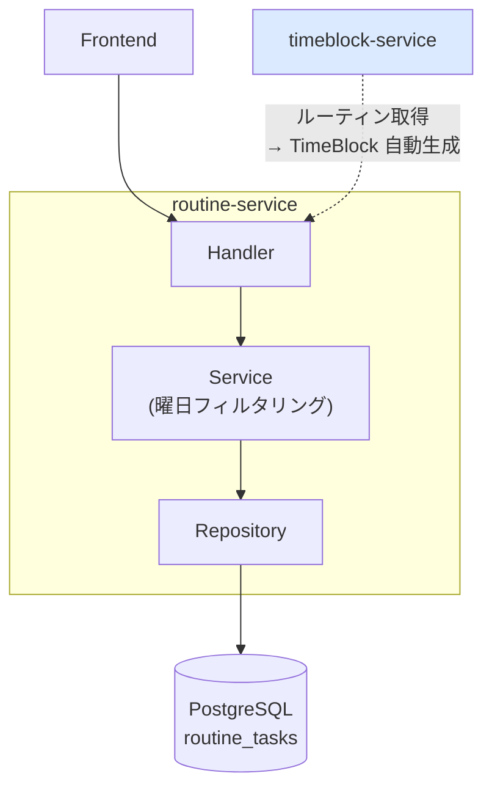
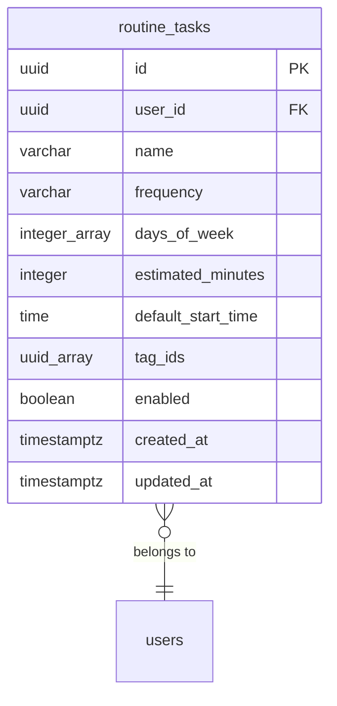
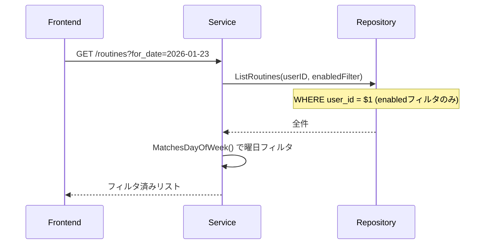

# routine-service

ルーティンタスク（定期タスク）の管理を提供するサービス。

---

## 目次

1. [アーキテクチャ](#1-アーキテクチャ)
2. [データモデル](#2-データモデル)
3. [API](#3-api)
4. [ビジネスロジック](#4-ビジネスロジック)
5. [エラー](#5-エラー)

---

## 1. アーキテクチャ

| 項目 | 値 |
|------|-----|
| ポート | 8085 |
| ベースパス | `/api/v1` |
| 責務 | RoutineTask（定期タスク）の定義と管理 |

**特徴:**
- シンプルな CRUD + 曜日フィルタリングロジック
- 曜日フィルタリングは Repository ではなく Service 層で実施（頻度ごとのマッチルールが複雑なため）
- timeblock-service がデータ取得元として利用

---

## 2. データモデル

### 主要フィールド

| フィールド | 型 | 説明 |
|-----------|-----|------|
| frequency | string | `daily` / `weekly` / `monthly` / `custom` |
| days_of_week | int[] | 0=日, 1=月, ..., 6=土 |
| estimated_minutes | int | 予想所要時間 |
| default_start_time | time | TimeBlock 生成時のデフォルト開始時刻（HH:mm） |
| enabled | boolean | 有効/無効トグル |
| tag_ids | UUID[] | 横断分類タグ |

---

## 3. API

| Method | Endpoint | 説明 |
|--------|----------|------|
| GET | /routines | 一覧（`?enabled`, `?for_date` フィルタ） |
| POST | /routines | 作成 |
| PUT | /routines/{routineId} | 更新 |
| PATCH | /routines/{routineId}/toggle | 有効/無効トグル |
| DELETE | /routines/{routineId} | 削除 |

**`for_date` パラメータ:** 日付（YYYY-MM-DD）を指定すると、その曜日に該当するルーティンのみ返す。

---

## 4. ビジネスロジック

### 曜日フィルタリング

### 頻度と曜日マッチルール

| 頻度 | DaysOfWeek | MatchesDayOfWeek の動作 |
|------|-----------|----------------------|
| daily | 不要 | 全曜日にマッチ |
| weekly | 必須 | 指定曜日のみマッチ |
| monthly | 必須 | 指定曜日のみマッチ |
| custom | 必須 | 指定曜日のみマッチ |

### バリデーション

| フィールド | ルール |
|-----------|--------|
| name | 必須（空文字不可） |
| frequency | `daily` / `weekly` / `monthly` / `custom` のいずれか |
| daysOfWeek | 各値 0-6。weekly/monthly/custom の場合は 1 つ以上必須 |

### TimeBlock 連携

timeblock-service の `POST /timeblocks/generate-from-routines` が指定日のルーティンを取得し、`defaultStartTime` + `estimatedMinutes` で TimeBlock を自動生成する。routine-service はデータ提供元として機能。

---

## 5. エラー

| エラー | HTTP | コード | 条件 |
|--------|------|--------|------|
| ErrRoutineNotFound | 404 | NOT_FOUND | ルーティンが存在しない |
| ErrInvalidFrequency | 400 | INVALID_INPUT | frequency が不正 |
| ErrInvalidInput | 400 | INVALID_INPUT | 入力値が不正 |
