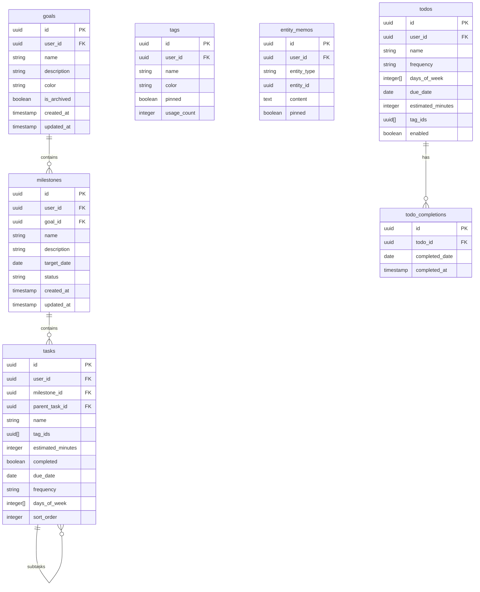
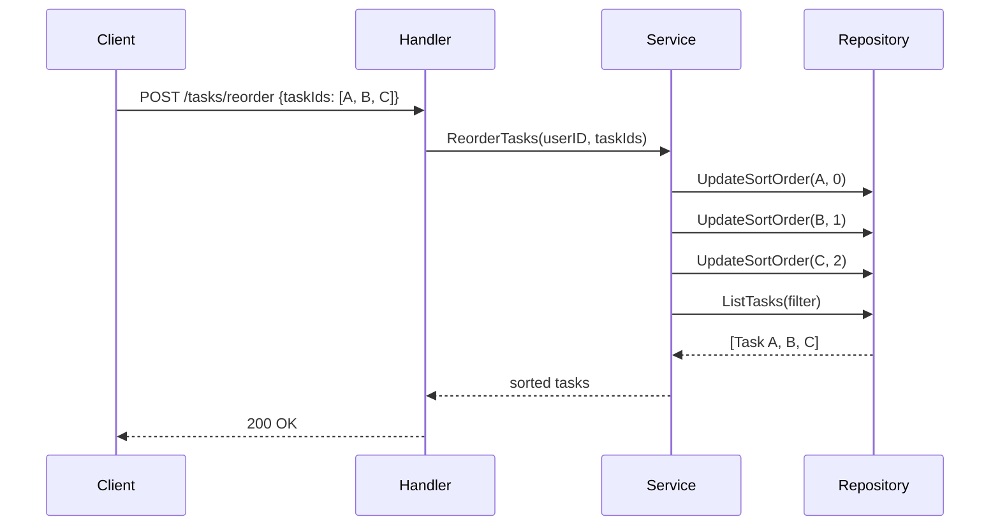

# task-service

目標管理、タスク管理、Todo管理を提供するサービス。

---

## 目次

1. [概要](#概要)
2. [エンティティ](#エンティティ)
3. [API仕様](#api仕様)
4. [ビジネスロジック](#ビジネスロジック)
5. [リポジトリ](#リポジトリ)

---

## 概要

| 項目 | 値 |
|------|-----|
| ポート | 8082 |
| ベースパス | `/api/v1` |
| 責務 | Goal/Milestone/Task/Tag/Todo/EntityMemoのCRUD、階層構造管理 |

### 主な機能

- **Goal**: 最上位の目標管理（例: "Golden Kubestronaut取得"）
- **Milestone**: Goal配下の中間目標（例: "CKA合格"）
- **Task**: 実行可能なタスク、サブタスク対応
- **Tag**: 横断的な分類タグ
- **Todo**: 単発/繰り返しタスク（日次チェック用）
- **EntityMemo**: Goal/Milestone/Taskに紐づくメモ

---

## エンティティ

### ER図



### Goal

```go
type Goal struct {
    ID          string    `json:"id"`
    UserID      string    `json:"userId"`
    Name        string    `json:"name"`
    Description *string   `json:"description,omitempty"`
    Color       string    `json:"color"`        // 例: "#3B82F6"
    IsArchived  bool      `json:"isArchived"`
    CreatedAt   time.Time `json:"createdAt"`
    UpdatedAt   time.Time `json:"updatedAt"`
}
```

### Milestone

```go
type MilestoneStatus string

const (
    MilestoneStatusActive    MilestoneStatus = "active"
    MilestoneStatusCompleted MilestoneStatus = "completed"
    MilestoneStatusArchived  MilestoneStatus = "archived"
)

type Milestone struct {
    ID          string          `json:"id"`
    UserID      string          `json:"userId"`
    GoalID      string          `json:"goalId"`
    Name        string          `json:"name"`
    Description *string         `json:"description,omitempty"`
    TargetDate  types.DateOnly  `json:"targetDate,omitempty"`
    Status      MilestoneStatus `json:"status"`
    CreatedAt   time.Time       `json:"createdAt"`
    UpdatedAt   time.Time       `json:"updatedAt"`
}
```

### Task

```go
type TaskFrequency string

const (
    TaskFrequencyDaily  TaskFrequency = "daily"
    TaskFrequencyWeekly TaskFrequency = "weekly"
    TaskFrequencyCustom TaskFrequency = "custom"
)

type Task struct {
    ID               string         `json:"id"`
    UserID           string         `json:"userId"`
    MilestoneID      *string        `json:"milestoneId,omitempty"`
    ParentTaskID     *string        `json:"parentTaskId,omitempty"`
    Name             string         `json:"name"`
    TagIDs           []string       `json:"tagIds,omitempty"`
    EstimatedMinutes *int           `json:"estimatedMinutes,omitempty"`
    Completed        bool           `json:"completed"`
    DueDate          types.DateOnly `json:"dueDate,omitempty"`
    Frequency        *TaskFrequency `json:"frequency,omitempty"`   // nil = 単発タスク
    DaysOfWeek       []int          `json:"daysOfWeek,omitempty"` // 0=日, 6=土
    SortOrder        int            `json:"sortOrder"`
    CreatedAt        time.Time      `json:"createdAt"`
    UpdatedAt        time.Time      `json:"updatedAt"`
}
```

### Tag

```go
type Tag struct {
    ID         string    `json:"id"`
    UserID     string    `json:"userId"`
    Name       string    `json:"name"`
    Color      string    `json:"color"`
    Pinned     bool      `json:"pinned"`
    UsageCount int       `json:"usageCount"`
    CreatedAt  time.Time `json:"createdAt"`
    UpdatedAt  time.Time `json:"updatedAt"`
}
```

### Todo

```go
type TodoFrequency string

const (
    TodoFrequencyDaily   TodoFrequency = "daily"
    TodoFrequencyWeekly  TodoFrequency = "weekly"
    TodoFrequencyMonthly TodoFrequency = "monthly"
    TodoFrequencyCustom  TodoFrequency = "custom"
)

type Todo struct {
    ID               string         `json:"id"`
    UserID           string         `json:"userId"`
    Name             string         `json:"name"`
    Frequency        *TodoFrequency `json:"frequency,omitempty"`  // nil = 単発
    DaysOfWeek       []int          `json:"daysOfWeek,omitempty"`
    DueDate          types.DateOnly `json:"dueDate,omitempty"`    // 単発タスク用
    EstimatedMinutes *int           `json:"estimatedMinutes,omitempty"`
    TagIDs           []string       `json:"tagIds,omitempty"`
    Enabled          bool           `json:"enabled"`
    CreatedAt        time.Time      `json:"createdAt"`
    UpdatedAt        time.Time      `json:"updatedAt"`
}

// TodoWithStatus は特定日の完了状態を含む
type TodoWithStatus struct {
    Todo
    CompletedToday bool       `json:"completedToday"`
    CompletedAt    *time.Time `json:"completedAt,omitempty"`
    IsOverdue      bool       `json:"isOverdue"`
}
```

### EntityMemo

```go
type EntityType string

const (
    EntityTypeGoal      EntityType = "goal"
    EntityTypeMilestone EntityType = "milestone"
    EntityTypeTask      EntityType = "task"
)

type EntityMemo struct {
    ID         string     `json:"id"`
    UserID     string     `json:"userId"`
    EntityType EntityType `json:"entityType"`
    EntityID   string     `json:"entityId"`
    Content    string     `json:"content"`
    Pinned     bool       `json:"pinned"`
    CreatedAt  time.Time  `json:"createdAt"`
    UpdatedAt  time.Time  `json:"updatedAt"`
}
```

---

## API仕様

全エンドポイントは認証必須。

### Goal API

| Method | Endpoint | 説明 |
|--------|----------|------|
| GET | /goals | 一覧取得 |
| POST | /goals | 新規作成 |
| GET | /goals/{goalId} | 取得 |
| PUT | /goals/{goalId} | 更新 |
| DELETE | /goals/{goalId} | 削除 |

**GET /goals クエリパラメータ:**
- `archived` (bool) - アーカイブ済みのみ/除外

**POST /goals リクエスト:**
```json
{
  "name": "Golden Kubestronaut取得",
  "description": "2026年までに全資格取得",
  "color": "#3B82F6"
}
```

### Milestone API

| Method | Endpoint | 説明 |
|--------|----------|------|
| GET | /milestones | 一覧取得 |
| POST | /milestones | 新規作成 |
| GET | /milestones/{milestoneId} | 取得 |
| PUT | /milestones/{milestoneId} | 更新 |
| DELETE | /milestones/{milestoneId} | 削除 |

**GET /milestones クエリパラメータ:**
- `goal_id` (string) - Goal IDでフィルタ
- `status` (string) - active/completed/archived

**POST /milestones リクエスト:**
```json
{
  "goalId": "uuid",
  "name": "CKA合格",
  "description": "2026年3月まで",
  "targetDate": "2026-03-31"
}
```

### Tag API

| Method | Endpoint | 説明 |
|--------|----------|------|
| GET | /tags | 一覧取得 |
| POST | /tags | 新規作成 |
| GET | /tags/{tagId} | 取得 |
| PUT | /tags/{tagId} | 更新 |
| DELETE | /tags/{tagId} | 削除 |

**POST /tags リクエスト:**
```json
{
  "name": "重要",
  "color": "#EF4444",
  "pinned": true
}
```

### Task API

| Method | Endpoint | 説明 |
|--------|----------|------|
| GET | /tasks | 一覧取得 |
| POST | /tasks | 新規作成 |
| GET | /tasks/{taskId} | 取得 |
| PUT | /tasks/{taskId} | 更新 |
| PATCH | /tasks/{taskId}/complete | 完了切替 |
| DELETE | /tasks/{taskId} | 削除 |
| POST | /tasks/reorder | 並び替え |
| POST | /tasks/bulk-delete | 一括削除 |
| POST | /tasks/bulk-complete | 一括完了 |

**GET /tasks クエリパラメータ:**
- `milestone_id` (string) - Milestone IDでフィルタ
- `completed` (bool) - 完了状態でフィルタ
- `parent_id` (string) - 親タスクでフィルタ（サブタスク取得）

**POST /tasks リクエスト:**
```json
{
  "name": "Kubernetes公式ドキュメント読む",
  "milestoneId": "uuid",
  "parentTaskId": null,
  "tagIds": ["uuid1", "uuid2"],
  "estimatedMinutes": 120,
  "dueDate": "2026-02-15",
  "frequency": "daily",
  "daysOfWeek": [1, 2, 3, 4, 5]
}
```

**POST /tasks/reorder リクエスト:**
```json
{
  "taskIds": ["uuid1", "uuid2", "uuid3"]
}
```

**POST /tasks/bulk-complete リクエスト:**
```json
{
  "taskIds": ["uuid1", "uuid2"],
  "completed": true
}
```

### EntityMemo API

| Method | Endpoint | 説明 |
|--------|----------|------|
| GET | /entity-memos | 一覧取得 |
| POST | /entity-memos | 新規作成 |
| GET | /entity-memos/{memoId} | 取得 |
| PUT | /entity-memos/{memoId} | 更新 |
| DELETE | /entity-memos/{memoId} | 削除 |

**GET /entity-memos クエリパラメータ:**
- `entity_type` (string) - goal/milestone/task
- `entity_id` (string) - 紐づく対象のID
- `pinned` (bool) - ピン留めのみ

**POST /entity-memos リクエスト:**
```json
{
  "entityType": "task",
  "entityId": "uuid",
  "content": "参考リンク: https://...",
  "pinned": false
}
```

### Todo API

| Method | Endpoint | 説明 |
|--------|----------|------|
| GET | /todos | 一覧取得 |
| POST | /todos | 新規作成 |
| GET | /todos/{todoId} | 取得 |
| PUT | /todos/{todoId} | 更新 |
| DELETE | /todos/{todoId} | 削除 |
| PATCH | /todos/{todoId}/complete | 完了切替 |

**GET /todos クエリパラメータ:**
- `date` (string) - 日付指定でTodoWithStatusを返す（YYYY-MM-DD）
- `enabled` (bool) - 有効/無効でフィルタ
- `is_recurring` (bool) - 繰り返し/単発でフィルタ

**PATCH /todos/{todoId}/complete クエリパラメータ:**
- `date` (string, 必須) - 完了日（YYYY-MM-DD）

**POST /todos リクエスト:**
```json
{
  "name": "技術ニュースチェック",
  "frequency": "daily",
  "daysOfWeek": [1, 2, 3, 4, 5],
  "estimatedMinutes": 15,
  "tagIds": ["uuid"]
}
```

---

## ビジネスロジック

### 階層構造

```
User
 └── Goal (目標)
      └── Milestone (マイルストーン)
           └── Task (タスク)
                └── Task (サブタスク)
```

### タスク並び替え



### Todo完了ロジック

- 繰り返しTodo: `todo_completions`に日付ごとの完了レコードを作成
- 単発Todo: 完了レコードを作成し、期限を過ぎると`isOverdue`がtrue
- 同じ日に再度トグルすると完了レコードを削除

```go
// 完了切替
func (s *Service) ToggleTodoComplete(ctx context.Context, userID, todoID, date string) (*TodoWithStatus, error) {
    completion, err := s.repo.GetTodoCompletion(ctx, todoID, date)
    if err == nil {
        // 完了済み → 未完了に
        s.repo.DeleteTodoCompletion(ctx, completion.ID)
    } else {
        // 未完了 → 完了に
        s.repo.CreateTodoCompletion(ctx, todoID, date)
    }
    return s.GetTodoWithStatus(ctx, userID, todoID, date)
}
```

### 頻度バリデーション

| Frequency | DaysOfWeek | DueDate |
|-----------|------------|---------|
| nil (単発) | 空 | 任意 |
| daily | 空または[0-6] | - |
| weekly | [0-6]必須 | - |
| monthly | - | - |
| custom | [0-6]必須 | - |

---

## リポジトリ

### インターフェース（ISP準拠）

```go
// GoalRepository はゴールの永続化を処理
type GoalRepository interface {
    GetByID(ctx context.Context, id string) (*Goal, error)
    GetByIDAndUserID(ctx context.Context, id, userID string) (*Goal, error)
    List(ctx context.Context, userID string, filter GoalFilter) ([]*Goal, error)
    Create(ctx context.Context, goal *Goal) error
    Update(ctx context.Context, goal *Goal) error
    Delete(ctx context.Context, id string) error
}

// MilestoneRepository
type MilestoneRepository interface {
    GetByID(ctx context.Context, id string) (*Milestone, error)
    GetByIDAndUserID(ctx context.Context, id, userID string) (*Milestone, error)
    List(ctx context.Context, userID string, filter MilestoneFilter) ([]*Milestone, error)
    Create(ctx context.Context, milestone *Milestone) error
    Update(ctx context.Context, milestone *Milestone) error
    Delete(ctx context.Context, id string) error
}

// TagRepository
type TagRepository interface {
    GetByID(ctx context.Context, id string) (*Tag, error)
    GetByIDAndUserID(ctx context.Context, id, userID string) (*Tag, error)
    List(ctx context.Context, userID string) ([]*Tag, error)
    Create(ctx context.Context, tag *Tag) error
    Update(ctx context.Context, tag *Tag) error
    Delete(ctx context.Context, id string) error
    IncrementUsageCount(ctx context.Context, tagIDs []string) error
    DecrementUsageCount(ctx context.Context, tagIDs []string) error
}

// TaskRepository
type TaskRepository interface {
    GetByID(ctx context.Context, id string) (*Task, error)
    GetByIDAndUserID(ctx context.Context, id, userID string) (*Task, error)
    List(ctx context.Context, userID string, filter TaskFilter) ([]*Task, error)
    Create(ctx context.Context, task *Task) error
    Update(ctx context.Context, task *Task) error
    Delete(ctx context.Context, id string) error
    UpdateSortOrder(ctx context.Context, id string, sortOrder int) error
    BulkDelete(ctx context.Context, ids []string) error
    BulkUpdateCompleted(ctx context.Context, ids []string, completed bool) error
}

// EntityMemoRepository
type EntityMemoRepository interface {
    GetByID(ctx context.Context, id string) (*EntityMemo, error)
    GetByIDAndUserID(ctx context.Context, id, userID string) (*EntityMemo, error)
    List(ctx context.Context, userID string, filter EntityMemoFilter) ([]*EntityMemo, error)
    Create(ctx context.Context, memo *EntityMemo) error
    Update(ctx context.Context, memo *EntityMemo) error
    Delete(ctx context.Context, id string) error
}

// TodoRepository
type TodoRepository interface {
    GetByID(ctx context.Context, id string) (*Todo, error)
    GetByIDAndUserID(ctx context.Context, id, userID string) (*Todo, error)
    List(ctx context.Context, userID string, filter TodoFilter) ([]*Todo, error)
    ListWithStatus(ctx context.Context, userID, date string) ([]*TodoWithStatus, error)
    Create(ctx context.Context, todo *Todo) error
    Update(ctx context.Context, todo *Todo) error
    Delete(ctx context.Context, id string) error
    GetTodoCompletion(ctx context.Context, todoID, date string) (*TodoCompletion, error)
    CreateTodoCompletion(ctx context.Context, todoID, date string) error
    DeleteTodoCompletion(ctx context.Context, id string) error
}

// Repository は全リポジトリを統合
type Repository interface {
    GoalRepository
    MilestoneRepository
    TagRepository
    TaskRepository
    EntityMemoRepository
    TodoRepository
}
```

### 主要クエリ

**ListTasks:**
```sql
SELECT id, user_id, milestone_id, parent_task_id, name, tag_ids,
       estimated_minutes, completed, due_date, frequency, days_of_week,
       sort_order, created_at, updated_at
FROM tasks
WHERE user_id = $1
  AND ($2::uuid IS NULL OR milestone_id = $2)
  AND ($3::boolean IS NULL OR completed = $3)
  AND ($4::uuid IS NULL OR parent_task_id = $4)
ORDER BY sort_order, created_at
```

**ListTodosWithStatus:**
```sql
SELECT t.*,
       tc.id IS NOT NULL as completed_today,
       tc.completed_at,
       (t.frequency IS NULL AND t.due_date < $2) as is_overdue
FROM todos t
LEFT JOIN todo_completions tc ON t.id = tc.todo_id AND tc.completed_date = $2
WHERE t.user_id = $1
  AND t.enabled = true
  AND (
    t.frequency IS NOT NULL  -- 繰り返しタスク
    OR t.due_date IS NULL    -- 期限なし単発
    OR t.due_date >= $2      -- 期限内単発
    OR tc.id IS NOT NULL     -- 完了済み（期限切れでも表示）
  )
ORDER BY t.created_at
```

---

## エラー定義

```go
var (
    ErrGoalNotFound       = errors.New("goal not found")
    ErrMilestoneNotFound  = errors.New("milestone not found")
    ErrTaskNotFound       = errors.New("task not found")
    ErrTagNotFound        = errors.New("tag not found")
    ErrEntityMemoNotFound = errors.New("entity memo not found")
    ErrTodoNotFound       = errors.New("todo not found")
    ErrInvalidInput       = errors.New("invalid input")
    ErrInvalidStatus      = errors.New("invalid status")
    ErrInvalidEntityType  = errors.New("invalid entity type")
    ErrInvalidFrequency   = errors.New("invalid frequency")
)
```
