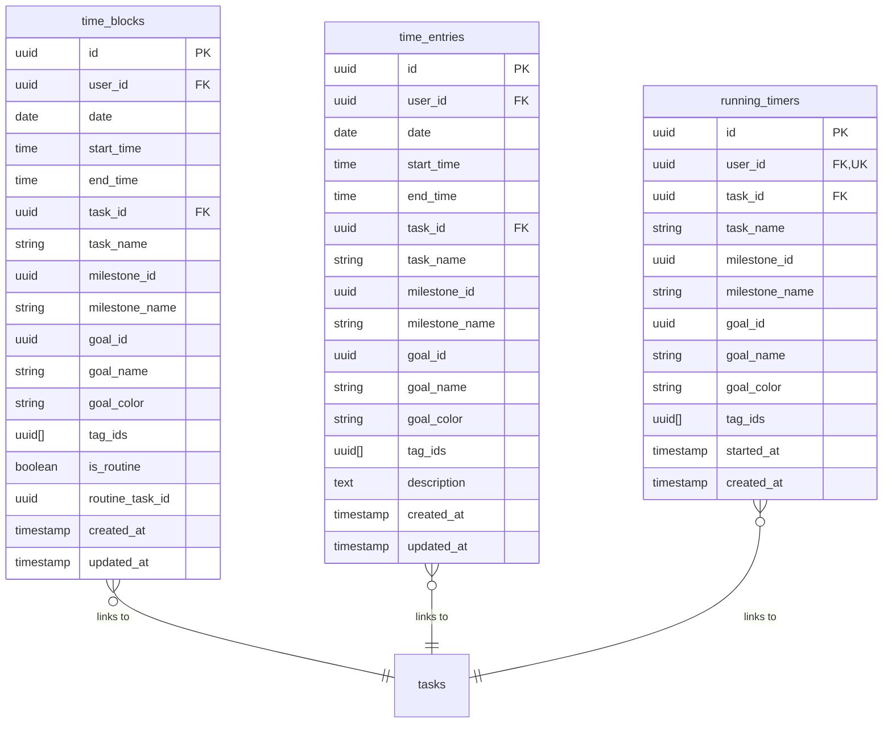
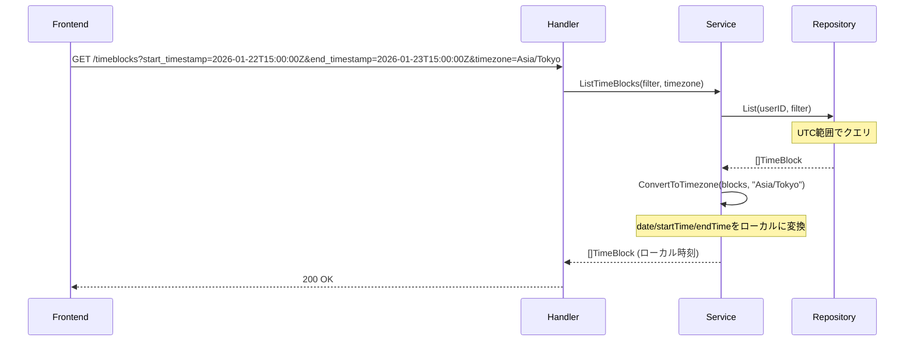
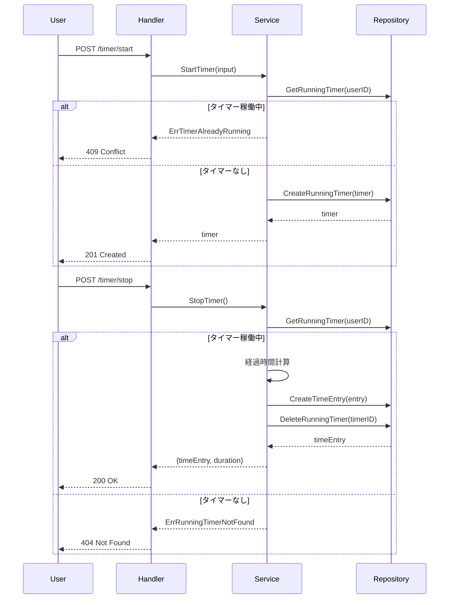

# timeblock-service

時間管理（予定・実績・タイマー）を提供するサービス。

---

## 目次

1. [概要](#概要)
2. [エンティティ](#エンティティ)
3. [API仕様](#api仕様)
4. [ビジネスロジック](#ビジネスロジック)
5. [リポジトリ](#リポジトリ)

---

## 概要

| 項目 | 値 |
|------|-----|
| ポート | 8084 |
| ベースパス | `/api/v1` |
| 責務 | TimeBlock（予定）、TimeEntry（実績）、RunningTimer（タイマー）の管理 |

### 主な機能

- **TimeBlock**: 日次の時間予定（朝の計画で作成）
- **TimeEntry**: 実際の作業記録（タイマーまたは手入力）
- **Timer**: リアルタイムの作業計測
- タイムゾーン対応のクエリ
- ルーティンからの予定自動生成

---

## エンティティ

### ER図



### TimeBlock（予定）

```go
type TimeBlock struct {
    ID            string    `json:"id"`
    UserID        string    `json:"userId"`
    Date          string    `json:"date"`      // YYYY-MM-DD
    StartTime     string    `json:"startTime"` // HH:mm
    EndTime       string    `json:"endTime"`   // HH:mm
    TaskID        *string   `json:"taskId,omitempty"`
    TaskName      string    `json:"taskName"`
    MilestoneID   *string   `json:"milestoneId,omitempty"`
    MilestoneName *string   `json:"milestoneName,omitempty"`
    GoalID        *string   `json:"goalId,omitempty"`
    GoalName      *string   `json:"goalName,omitempty"`
    GoalColor     *string   `json:"goalColor,omitempty"`
    TagIDs        []string  `json:"tagIds,omitempty"`
    IsRoutine     bool      `json:"isRoutine"`
    RoutineTaskID *string   `json:"routineTaskId,omitempty"`
    CreatedAt     time.Time `json:"createdAt"`
    UpdatedAt     time.Time `json:"updatedAt"`
}
```

### TimeEntry（実績）

```go
type TimeEntry struct {
    ID            string    `json:"id"`
    UserID        string    `json:"userId"`
    Date          string    `json:"date"`      // YYYY-MM-DD
    StartTime     string    `json:"startTime"` // HH:mm
    EndTime       string    `json:"endTime"`   // HH:mm
    TaskID        *string   `json:"taskId,omitempty"`
    TaskName      string    `json:"taskName"`
    MilestoneID   *string   `json:"milestoneId,omitempty"`
    MilestoneName *string   `json:"milestoneName,omitempty"`
    GoalID        *string   `json:"goalId,omitempty"`
    GoalName      *string   `json:"goalName,omitempty"`
    GoalColor     *string   `json:"goalColor,omitempty"`
    TagIDs        []string  `json:"tagIds,omitempty"`
    Description   *string   `json:"description,omitempty"`
    CreatedAt     time.Time `json:"createdAt"`
    UpdatedAt     time.Time `json:"updatedAt"`
}
```

### RunningTimer

```go
type RunningTimer struct {
    ID            string    `json:"id"`
    UserID        string    `json:"userId"`
    TaskID        *string   `json:"taskId,omitempty"`
    TaskName      string    `json:"taskName"`
    MilestoneID   *string   `json:"milestoneId,omitempty"`
    MilestoneName *string   `json:"milestoneName,omitempty"`
    GoalID        *string   `json:"goalId,omitempty"`
    GoalName      *string   `json:"goalName,omitempty"`
    GoalColor     *string   `json:"goalColor,omitempty"`
    TagIDs        []string  `json:"tagIds,omitempty"`
    StartedAt     time.Time `json:"startedAt"`
    CreatedAt     time.Time `json:"createdAt"`
}
```

---

## API仕様

全エンドポイントは認証必須。

### TimeBlock API

| Method | Endpoint | 説明 |
|--------|----------|------|
| GET | /timeblocks | 一覧取得 |
| POST | /timeblocks | 新規作成 |
| PUT | /timeblocks/{timeBlockId} | 更新 |
| DELETE | /timeblocks/{timeBlockId} | 削除 |
| POST | /timeblocks/generate-from-routines | ルーティンから生成 |

**GET /timeblocks クエリパラメータ:**

| パラメータ | 型 | 説明 |
|-----------|-----|------|
| date | string | 日付指定（YYYY-MM-DD） |
| start_date | string | 範囲開始（YYYY-MM-DD） |
| end_date | string | 範囲終了（YYYY-MM-DD） |
| start_timestamp | string | UTC範囲開始（ISO8601） |
| end_timestamp | string | UTC範囲終了（ISO8601） |
| timezone | string | レスポンス変換用TZ |
| goal_id | string | Goal IDでフィルタ |
| milestone_id | string | Milestone IDでフィルタ |

**タイムスタンプフィルタ優先**: `start_timestamp`/`end_timestamp`が指定されると`date`/`start_date`/`end_date`より優先

**POST /timeblocks リクエスト:**
```json
{
  "date": "2026-01-23",
  "startTime": "09:00",
  "endTime": "11:00",
  "taskId": "uuid",
  "taskName": "Kubernetes学習",
  "milestoneId": "uuid",
  "milestoneName": "CKA合格",
  "goalId": "uuid",
  "goalName": "Golden Kubestronaut",
  "goalColor": "#3B82F6",
  "tagIds": ["uuid1", "uuid2"],
  "isRoutine": false
}
```

**POST /timeblocks/generate-from-routines:**

指定日のルーティンタスクからTimeBlockを自動生成。

```json
{
  "date": "2026-01-23"
}
```

**レスポンス:**
```json
{
  "data": {
    "generated": 3,
    "blocks": [...]
  }
}
```

### TimeEntry API

| Method | Endpoint | 説明 |
|--------|----------|------|
| GET | /time-entries | 一覧取得 |
| POST | /time-entries | 新規作成 |
| PUT | /time-entries/{entryId} | 更新 |
| DELETE | /time-entries/{entryId} | 削除 |

クエリパラメータはTimeBlockと同様。

**POST /time-entries リクエスト:**
```json
{
  "date": "2026-01-23",
  "startTime": "09:15",
  "endTime": "10:45",
  "taskId": "uuid",
  "taskName": "Kubernetes学習",
  "goalId": "uuid",
  "goalName": "Golden Kubestronaut",
  "goalColor": "#3B82F6",
  "description": "Pod Securityの章を完了"
}
```

### Timer API

| Method | Endpoint | 説明 |
|--------|----------|------|
| GET | /timer/current | 現在のタイマー取得 |
| POST | /timer/start | タイマー開始 |
| POST | /timer/stop | タイマー停止 |

**GET /timer/current レスポンス:**

タイマー稼働中:
```json
{
  "data": {
    "id": "uuid",
    "taskName": "Kubernetes学習",
    "goalName": "Golden Kubestronaut",
    "startedAt": "2026-01-23T09:00:00Z"
  }
}
```

タイマー停止中:
```json
{
  "data": null
}
```

**POST /timer/start リクエスト:**
```json
{
  "taskId": "uuid",
  "taskName": "Kubernetes学習",
  "milestoneId": "uuid",
  "milestoneName": "CKA合格",
  "goalId": "uuid",
  "goalName": "Golden Kubestronaut",
  "goalColor": "#3B82F6",
  "tagIds": ["uuid"]
}
```

**POST /timer/stop レスポンス:**
```json
{
  "data": {
    "timeEntry": {
      "id": "uuid",
      "date": "2026-01-23",
      "startTime": "09:00",
      "endTime": "10:30",
      "taskName": "Kubernetes学習"
    },
    "duration": 5400
  }
}
```

---

## ビジネスロジック

### タイムゾーン変換

フロントエンドはローカル日付をUTCタイムスタンプ範囲に変換してクエリ:

```
ローカル日付: 2026-01-23 (Asia/Tokyo)
UTC範囲: 2026-01-22T15:00:00Z ~ 2026-01-23T15:00:00Z
```



### タイマーフロー



### 日跨ぎ処理

タイマー停止時に日付を跨いでいた場合:
- 開始日と終了日が異なる場合、終了日の`date`を使用
- `startTime`は開始時刻、`endTime`は停止時刻

### 入力バリデーション

| フィールド | ルール |
|----------|--------|
| date | YYYY-MM-DD形式 |
| startTime | HH:mm形式 |
| endTime | HH:mm形式、startTime以降 |
| taskName | 必須 |

---

## リポジトリ

### インターフェース（ISP準拠）

```go
// TimeBlockRepository はTimeBlockの永続化を処理
type TimeBlockRepository interface {
    GetByID(ctx context.Context, id string) (*TimeBlock, error)
    GetByIDAndUserID(ctx context.Context, id, userID string) (*TimeBlock, error)
    List(ctx context.Context, userID string, filter TimeBlockFilter) ([]*TimeBlock, error)
    Create(ctx context.Context, block *TimeBlock) error
    Update(ctx context.Context, block *TimeBlock) error
    Delete(ctx context.Context, id string) error
}

// TimeEntryRepository はTimeEntryの永続化を処理
type TimeEntryRepository interface {
    GetByID(ctx context.Context, id string) (*TimeEntry, error)
    GetByIDAndUserID(ctx context.Context, id, userID string) (*TimeEntry, error)
    List(ctx context.Context, userID string, filter TimeEntryFilter) ([]*TimeEntry, error)
    Create(ctx context.Context, entry *TimeEntry) error
    Update(ctx context.Context, entry *TimeEntry) error
    Delete(ctx context.Context, id string) error
}

// RunningTimerRepository はRunningTimerの永続化を処理
type RunningTimerRepository interface {
    GetByUserID(ctx context.Context, userID string) (*RunningTimer, error)
    Create(ctx context.Context, timer *RunningTimer) error
    Delete(ctx context.Context, id string) error
}

// Repository は全リポジトリを統合
type Repository interface {
    TimeBlockRepository
    TimeEntryRepository
    RunningTimerRepository
}
```

### 主要クエリ

**ListTimeBlocks (タイムスタンプフィルタ):**
```sql
SELECT id, user_id, date, start_time, end_time, task_id, task_name,
       milestone_id, milestone_name, goal_id, goal_name, goal_color,
       tag_ids, is_routine, routine_task_id, created_at, updated_at
FROM time_blocks
WHERE user_id = $1
  AND (date + start_time) >= $2::timestamp  -- start_timestamp
  AND (date + start_time) < $3::timestamp   -- end_timestamp
ORDER BY date, start_time
```

**GetRunningTimer:**
```sql
SELECT id, user_id, task_id, task_name, milestone_id, milestone_name,
       goal_id, goal_name, goal_color, tag_ids, started_at, created_at
FROM running_timers
WHERE user_id = $1
```

**CreateTimeEntry (タイマー停止時):**
```sql
INSERT INTO time_entries (
    id, user_id, date, start_time, end_time, task_id, task_name,
    milestone_id, milestone_name, goal_id, goal_name, goal_color,
    tag_ids, description, created_at, updated_at
) VALUES (
    $1, $2, $3, $4, $5, $6, $7, $8, $9, $10, $11, $12, $13, $14, NOW(), NOW()
)
```

---

## エラー定義

```go
var (
    ErrTimeBlockNotFound    = errors.New("time block not found")
    ErrTimeEntryNotFound    = errors.New("time entry not found")
    ErrRunningTimerNotFound = errors.New("no running timer")
    ErrTimerAlreadyRunning  = errors.New("timer already running")
    ErrInvalidDate          = errors.New("invalid date format")
    ErrInvalidTime          = errors.New("invalid time format")
    ErrInvalidInput         = errors.New("invalid input")
)
```
