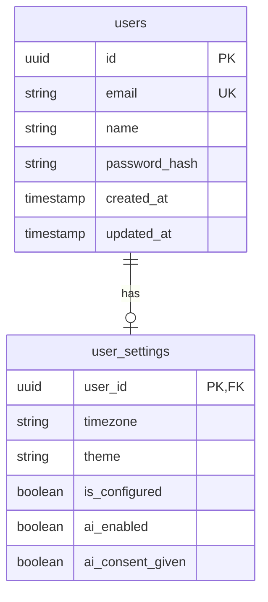
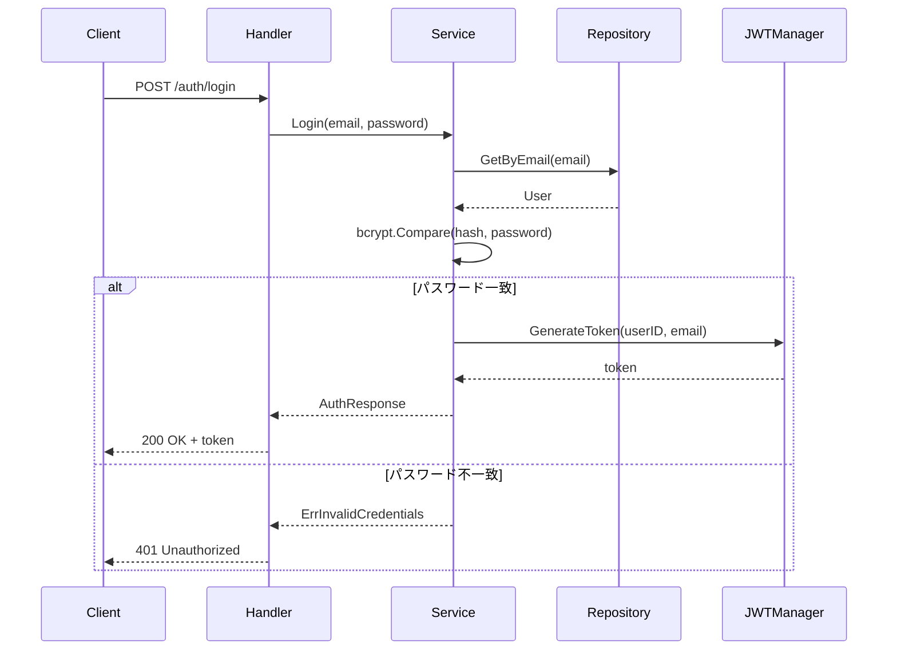

# user-service

認証とユーザー設定を管理するサービス。

---

## 目次

1. [概要](#概要)
2. [エンティティ](#エンティティ)
3. [API仕様](#api仕様)
4. [ビジネスロジック](#ビジネスロジック)
5. [リポジトリ](#リポジトリ)

---

## 概要

| 項目 | 値 |
|------|-----|
| ポート | 8081 |
| ベースパス | `/api/v1` |
| 責務 | ユーザー登録、ログイン、JWT認証、プロファイル管理、設定管理、AI同意管理 |

### 主な機能

- ユーザー登録・ログイン（JWT発行）
- プロファイル取得・更新
- ユーザー設定（タイムゾーン、テーマ、AI機能）
- AI同意管理

---

## エンティティ

### ER図



### User

```go
type User struct {
    ID        string    `json:"id"`
    Email     string    `json:"email"`
    Name      string    `json:"name"`
    Password  string    `json:"-"`  // JSON出力から除外
    CreatedAt time.Time `json:"createdAt"`
    UpdatedAt time.Time `json:"updatedAt"`
}
```

### UserSettings

```go
type UserSettings struct {
    UserID         string `json:"userId"`
    Timezone       string `json:"timezone"`       // 例: "Asia/Tokyo"
    Theme          string `json:"theme"`          // "light", "dark", "system"
    IsConfigured   bool   `json:"isConfigured"`
    AIEnabled      bool   `json:"aiEnabled"`
    AIConsentGiven bool   `json:"aiConsentGiven"`
}
```

---

## API仕様

### 認証エンドポイント（公開）

#### POST /api/v1/auth/register

ユーザー登録。

**リクエスト:**
```json
{
  "email": "user@example.com",
  "password": "password123",
  "name": "山田太郎"
}
```

**レスポンス:** `201 Created`
```json
{
  "data": {
    "token": "eyJhbGciOiJIUzI1NiIs...",
    "user": {
      "id": "uuid",
      "email": "user@example.com",
      "name": "山田太郎",
      "createdAt": "2026-01-23T..."
    }
  }
}
```

**エラー:**
- `400 VALIDATION_ERROR` - メール/パスワード/名前が不正
- `409 USER_EXISTS` - メールアドレスが既に登録済み

#### POST /api/v1/auth/login

ログイン。

**リクエスト:**
```json
{
  "email": "user@example.com",
  "password": "password123"
}
```

**レスポンス:** `200 OK`
```json
{
  "data": {
    "token": "eyJhbGciOiJIUzI1NiIs...",
    "user": {
      "id": "uuid",
      "email": "user@example.com",
      "name": "山田太郎"
    }
  }
}
```

**エラー:**
- `401 INVALID_CREDENTIALS` - メールまたはパスワードが不正

### プロファイルエンドポイント（認証必須）

#### GET /api/v1/users/me

現在のユーザープロファイルを取得。

**レスポンス:** `200 OK`
```json
{
  "data": {
    "id": "uuid",
    "email": "user@example.com",
    "name": "山田太郎",
    "createdAt": "2026-01-23T..."
  }
}
```

#### PUT /api/v1/users/me

プロファイルを更新。

**リクエスト:**
```json
{
  "name": "山田次郎",
  "email": "newemail@example.com"
}
```

**レスポンス:** `200 OK`

### 設定エンドポイント（認証必須）

#### GET /api/v1/users/me/settings

ユーザー設定を取得。

**レスポンス:** `200 OK`
```json
{
  "data": {
    "userId": "uuid",
    "timezone": "Asia/Tokyo",
    "theme": "system",
    "isConfigured": true,
    "aiEnabled": true,
    "aiConsentGiven": true
  }
}
```

#### PUT /api/v1/users/me/settings

設定を更新。

**リクエスト:**
```json
{
  "timezone": "America/New_York",
  "theme": "dark",
  "aiEnabled": false
}
```

**レスポンス:** `200 OK`

**エラー:**
- `400 INVALID_THEME` - テーマ値が不正（light/dark/system以外）

#### POST /api/v1/users/me/ai-consent

AI機能の利用同意を記録。

**リクエスト:**
```json
{
  "consent": true
}
```

**レスポンス:** `200 OK`
```json
{
  "data": {
    "userId": "uuid",
    "aiConsentGiven": true,
    "aiEnabled": true
  }
}
```

---

## ビジネスロジック

### 認証フロー



### バリデーションルール

| フィールド | ルール |
|----------|--------|
| email | 必須、有効なメール形式 |
| password | 必須、8文字以上 |
| name | 必須 |
| theme | "light", "dark", "system" のいずれか |

### パスワードハッシュ化

- アルゴリズム: bcrypt
- コスト: 10（デフォルト）

```go
hashedPassword, _ := bcrypt.GenerateFromPassword([]byte(password), bcrypt.DefaultCost)
err := bcrypt.CompareHashAndPassword([]byte(hashedPassword), []byte(password))
```

### 設定初期化

新規ユーザー登録時、デフォルト設定を作成:

```go
defaultSettings := &UserSettings{
    UserID:         userID,
    Timezone:       "UTC",
    Theme:          "system",
    IsConfigured:   false,
    AIEnabled:      false,
    AIConsentGiven: false,
}
```

---

## リポジトリ

### インターフェース

```go
type Repository interface {
    // User operations
    CreateUser(ctx context.Context, user *User) error
    GetUserByID(ctx context.Context, id string) (*User, error)
    GetUserByEmail(ctx context.Context, email string) (*User, error)
    UpdateUser(ctx context.Context, user *User) error
    UserExistsByEmail(ctx context.Context, email string) (bool, error)

    // Settings operations
    CreateSettings(ctx context.Context, settings *UserSettings) error
    GetSettings(ctx context.Context, userID string) (*UserSettings, error)
    UpdateSettings(ctx context.Context, settings *UserSettings) error
}
```

### 主要クエリ

**GetUserByEmail:**
```sql
SELECT id, email, name, password_hash, created_at, updated_at
FROM users
WHERE email = $1
```

**GetSettings:**
```sql
SELECT user_id, timezone, theme, is_configured, ai_enabled, ai_consent_given
FROM user_settings
WHERE user_id = $1
```

**UpdateSettings:**
```sql
UPDATE user_settings
SET timezone = $2, theme = $3, is_configured = $4, ai_enabled = $5, ai_consent_given = $6
WHERE user_id = $1
```

---

## エラー定義

```go
var (
    ErrUserNotFound      = errors.New("user not found")
    ErrUserExists        = errors.New("user already exists")
    ErrInvalidCredentials = errors.New("invalid credentials")
    ErrEmailRequired     = errors.New("email is required")
    ErrPasswordRequired  = errors.New("password is required")
    ErrNameRequired      = errors.New("name is required")
    ErrInvalidEmail      = errors.New("invalid email format")
    ErrPasswordTooShort  = errors.New("password must be at least 8 characters")
    ErrInvalidTheme      = errors.New("theme must be light, dark, or system")
)
```
