# Kensan ドキュメント整備計画

## 目的

各コードベースのARCHITECTURE.mdを拡充し、以下を追加する：
- Mermaid図によるビジュアル化（ER図、データフロー、アーキテクチャ図）
- 勉強用かつ実際の開発で使える実用的なリファレンス

---

## 1. backend/ARCHITECTURE.md の改善

### 追加するセクション

#### 1.1 System Architecture Diagram
サービス間の関係を示す全体図（Mermaidフローチャート）

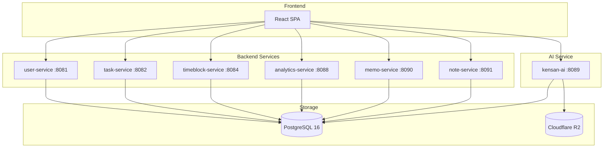

#### 1.2 Entity Relationship Diagram (ER図)
全テーブルの関係を示す詳細なER図

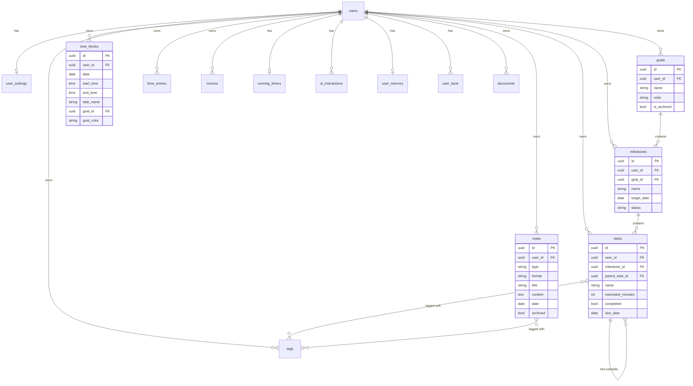

#### 1.3 Authentication Flow Sequence Diagram

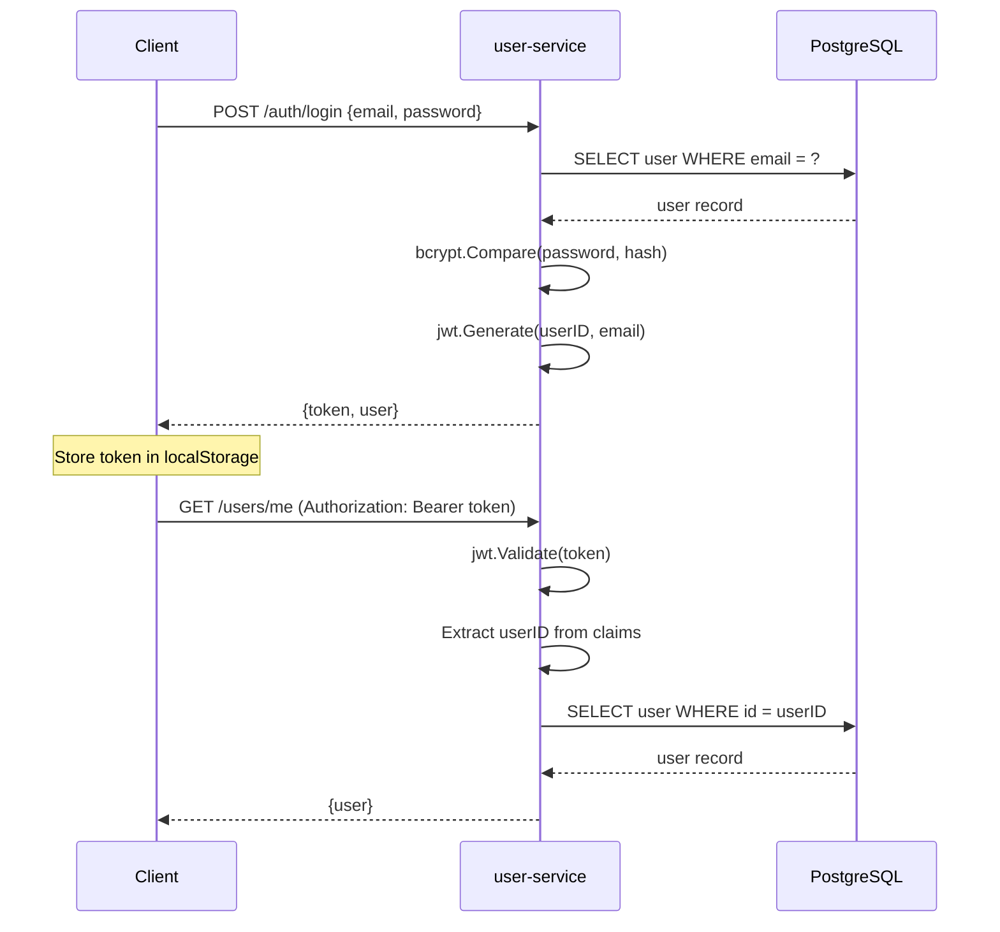

#### 1.4 Timer Start/Stop Flow

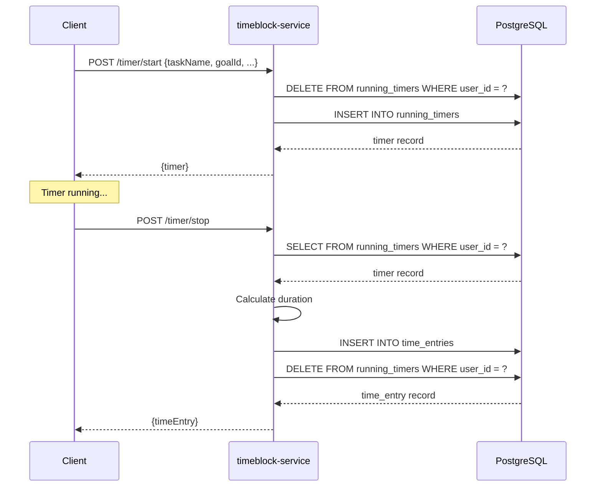

---

## 2. src/ARCHITECTURE.md の改善

### 追加するセクション

#### 2.1 Component Hierarchy Diagram

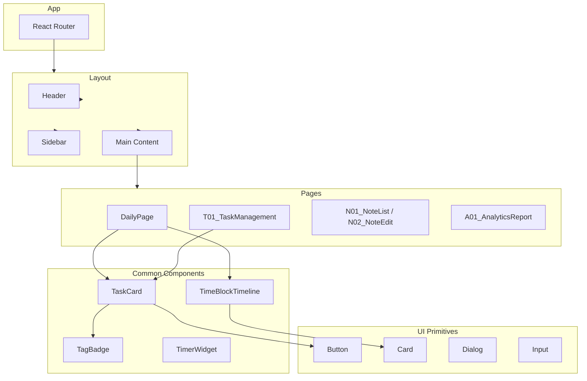

#### 2.2 Data Flow Diagram

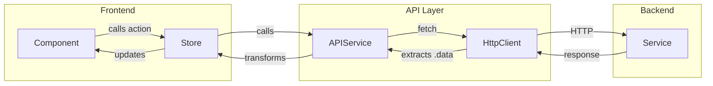

#### 2.3 Store Interaction Diagram

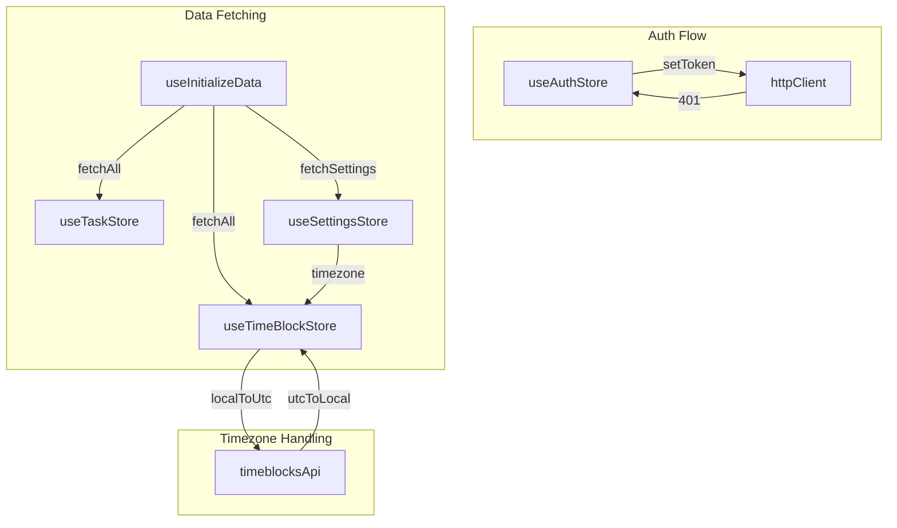

#### 2.4 Timezone Conversion Flow

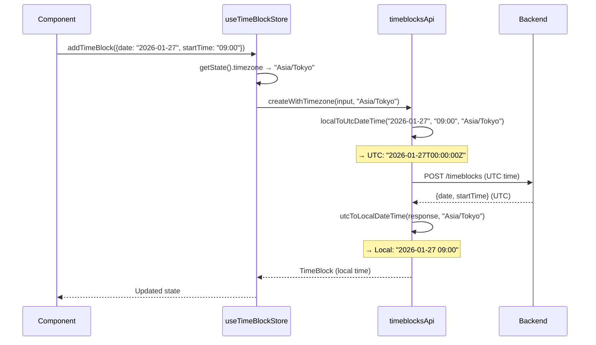

---

## 3. kensan-ai/ARCHITECTURE.md の改善

### 追加するセクション

#### 3.1 Agent Execution Flow

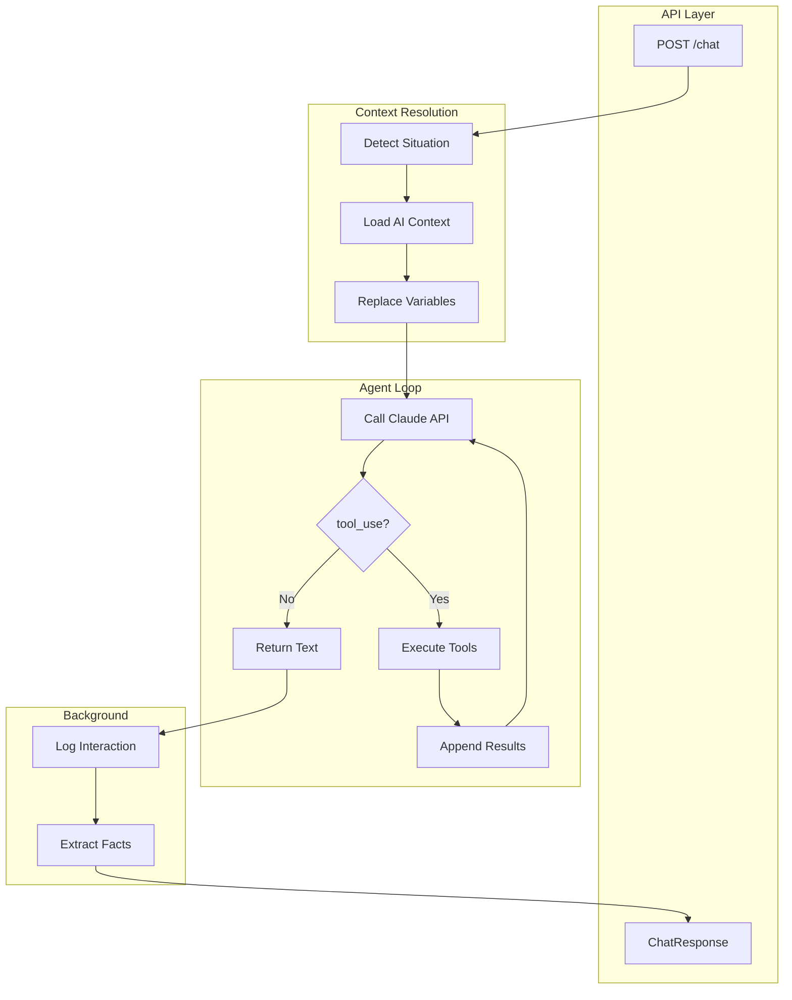

#### 3.2 Memory System Flow

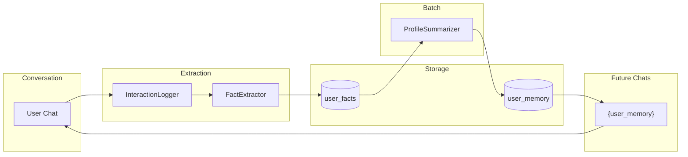

#### 3.3 Tool Execution Detail

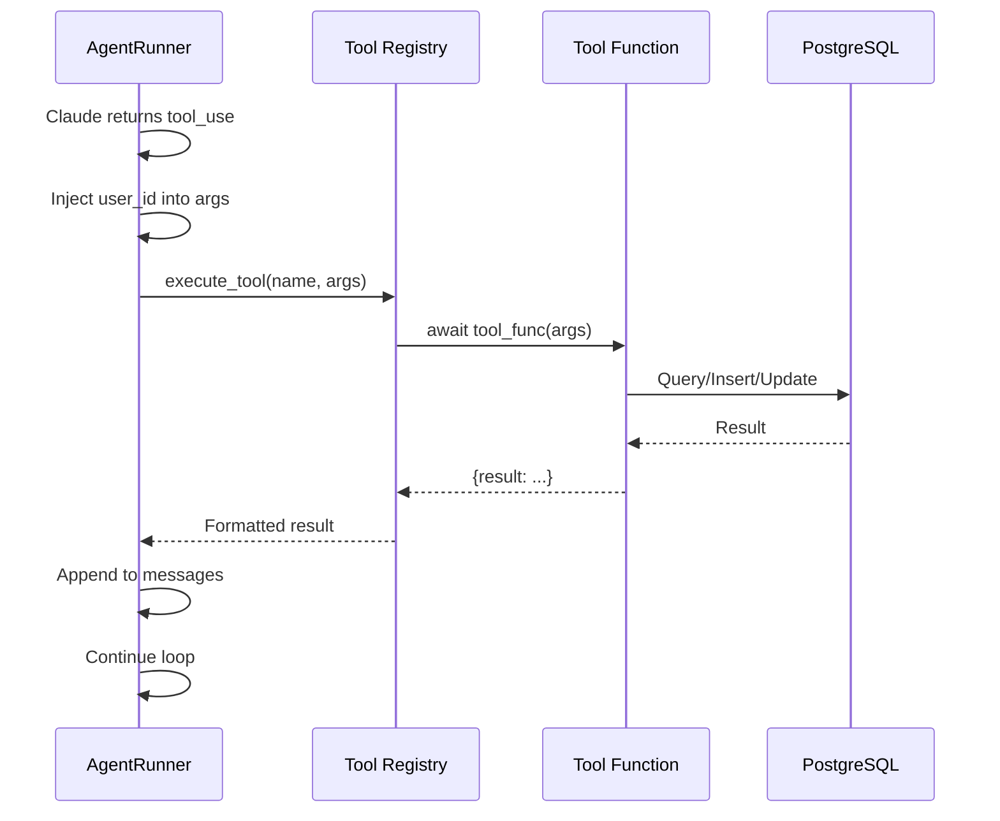

#### 3.4 Context Selection Flow

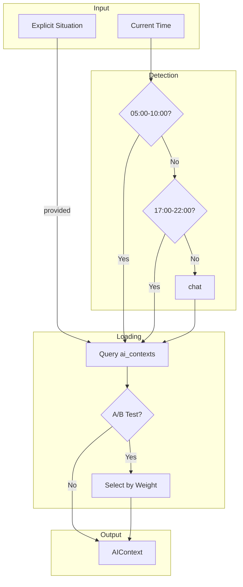

---

## 4. 実装順序

1. **backend/ARCHITECTURE.md** - ER図とデータフロー図の追加
2. **src/ARCHITECTURE.md** - コンポーネント階層とストア連携図の追加
3. **kensan-ai/ARCHITECTURE.md** - エージェントとツール実行フローの追加

---

## 5. 既存ドキュメントとの整合性

- 既存のテーブル一覧・パターン説明は維持
- Mermaid図は「Data Flow Diagrams」などの新セクションとして追加
- 重複を避け、図で補完する形式

---

## 期待される成果物

| ファイル | 追加する図 |
|---------|-----------|
| backend/ARCHITECTURE.md | System Architecture, ER Diagram, Auth Flow, Timer Flow |
| src/ARCHITECTURE.md | Component Hierarchy, Data Flow, Store Interaction, Timezone Flow |
| kensan-ai/ARCHITECTURE.md | Agent Execution, Memory System, Tool Execution, Context Selection |

---

## 補足

- Mermaid図はGitHub/VSCode/Obsidianで直接レンダリング可能
- 図の更新はコード変更時に必要に応じて実施
- 入門者向けの説明は mydocs/architecture_guide_for_beginners.md で既にカバー済み
