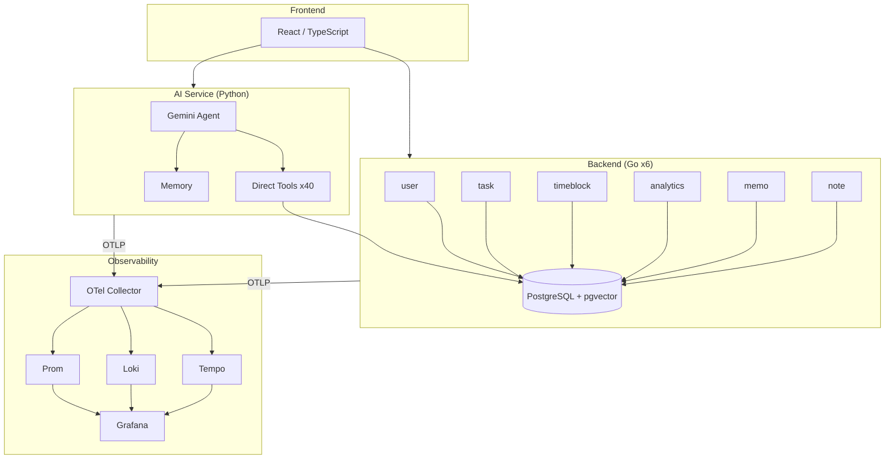

# デモ動画 制作ガイド（工数最小プラン）

## 方針

- 画面録画 + AI音声ナレーション後付け
- 自分の声は使わない（録り直しコスト排除）
- 編集はカット＋音声合成のみ。凝らない

## 必要なツール

| 用途 | ツール | 備考 |
|------|--------|------|
| 画面録画 | **QuickTime Player** (macOS標準) | OBSでもOK。QuickTimeが最速 |
| ナレーション音声生成 | **Vrew** (https://vrew.ai/ja/) | 台本テキスト→AI音声を一括生成。無料枠あり |
| 編集 | **Vrew** | 録画に音声を乗せてカット編集もVrew内で完結 |
| アーキテクチャ図 | **Mermaid Live Editor** → スクショ | https://mermaid.live |

**Vrewを選ぶ理由**: 台本テキスト入力→AI音声生成→動画への合成→字幕付与→書き出しが **1ツールで完結** する。別途TTS+動画編集ソフトを組み合わせる必要がない。

### 代替案

| やりたいこと | 代替ツール |
|-------------|-----------|
| もっと自然な日本語音声が欲しい | VOICEVOX（無料）で音声だけ生成→Vrewに取り込み |
| ブラウザだけで完結させたい | Canva動画エディタ（TTS機能内蔵） |
| 字幕不要・音声だけ後付け | QuickTime録画 → iMovieで音声トラック追加 |

---

## 手順

### Step 1: 素材準備（〜15min）

#### 1-1. アーキテクチャ図を画像化

https://mermaid.live を開き、以下を貼り付けてPNG出力:



#### 1-2. ナレーション台本を整形

以下のテキストをそのままVrewに入力する（セクションごとに分割済み）:

**セクション1 (0:00-0:30) アーキテクチャ概要:**
```
Kensanは、エンジニアの自己研鑽を支援するAIエージェント搭載アプリケーションです。
React、Goマイクロサービス、Python AIサービスの構成で、
AIエージェントには40種類のツールを持たせています。
ポイントは、読み取りツールは即実行、書き込みツールはユーザー承認を必須にする、Read/Write分離の設計です。
全サービスにOpenTelemetryを組み込み、エージェントの全行動をGrafanaで追跡できます。
```

**セクション2 (0:30-1:00) AIチャット・読み取り:**
```
実際の動作を見てみましょう。
「今週の進捗を教えて」と聞くと、エージェントがget_tasksやget_analytics_summaryなどのReadonlyツールを自動で呼び出します。
読み取りツールは承認なしで即座に並列実行されるので、ユーザーを待たせません。
```

**セクション3 (1:00-1:30) AIチャット・書き込み承認:**
```
次に、「明日の午前にCKA対策のタイムブロックを作って」と指示します。
今度はcreate_time_blockという書き込みツールが呼ばれますが、自動実行はされません。
代わりに、提案としてUIに表示され、ユーザーが承認ボタンを押して初めて実行されます。
これがRead/Write分離の実例です。AIが勝手にデータを変更することはありません。
```

**セクション4 (1:30-2:20) Grafanaダッシュボード:**
```
Grafanaでエージェントの挙動を追跡します。
Service Overviewダッシュボードでリクエストレートやレイテンシを確認できます。
Request Explorerに切り替えると、先ほどのAIチャットのトレースが見えます。
agent.stream、gen_ai.turn、agent.tool_executionというスパン階層で、
各ターンでどのツールを呼んだか、何トークン使ったかまで記録されています。
ログにもtrace_idが自動注入されているので、トレースからログへワンクリックでジャンプできます。
```

**セクション5 (2:20-3:00) コードウォークスルー:**
```
最後にコードを見てみましょう。
ツールはPythonデコレータで定義します。nameとreadonly、input_schemaを宣言するだけで、レジストリに自動登録されます。
エージェントのループは、Geminiにメッセージを送り、function_callがあればreadonly/writeを判定して処理する、というシンプルな繰り返しです。
プロバイダーの切り替えは、create_agent_runnerというファクトリ関数がAI_PROVIDER設定を見て分岐するだけ。
環境変数1つでAnthropicとGeminiを切り替えられます。
```

### Step 2: 画面録画（〜30min）

音声なし・操作だけを録画する。ミスっても台本通りの操作をやり直すだけ。

#### 録画設定
```bash
# QuickTimeの場合
# File → New Screen Recording → 録画範囲を選択 → 録画開始
# マイクはOFF（音声は後付け）
```

#### 撮影順序（5クリップに分けて撮る）

| クリップ | 内容 | 撮影場所 |
|---------|------|---------|
| **clip1** | アーキテクチャ図を画面に映してゆっくりスクロール | Mermaid図のPNG or ブラウザ |
| **clip2** | ログイン → 「今週の進捗を教えて」 → ツール実行を待つ | Kensan フロント |
| **clip3** | 「明日の午前に〜」 → 承認ボタン表示 → 承認 | Kensan フロント |
| **clip4** | Grafana Service Overview → Request Explorer → トレース展開 | Grafana |
| **clip5** | VS Code: db_tools.py → gemini_runner.py → __init__.py | VS Code |

**コツ**:
- ブラウザ/エディタのフォントサイズを大きめに（Cmd+ で2段階拡大）
- 操作はゆっくり。早すぎると見えない
- 各クリップの前後に1-2秒の余白を入れる（カット編集で使う）
- AIの応答待ちが長い場合はそのまま録画し、後でカットする

### Step 3: Vrewで組み立て（〜30min）

#### 3-1. Vrewでプロジェクト作成

1. https://vrew.ai からアプリをダウンロード・起動
2. 「新しい動画」→「録画した動画で始める」→ clip1を読み込み
3. 設定: アスペクト比 16:9、解像度 1920x1080

#### 3-2. AI音声を生成

1. メニュー「AI音声」→ 日本語の音声を選択（男性: Keita、女性: Nanami など好みで）
2. Step 1-2 で整形したセクション1のテキストを入力
3. 「音声生成」→ プレビューで確認
4. 音声の速度を調整（1.0x〜1.1x が聞きやすい）

#### 3-3. クリップと音声を合わせる

1. タイムライン上でclip1の区間にセクション1の音声を配置
2. clip2〜5を順番に追加し、対応するセクションの音声を配置
3. 映像と音声のタイミングを合わせる:
   - 音声が先に終わったら映像の該当部分をカット
   - 映像の待ち時間（API応答待ち等）は早送りまたはカット
4. 字幕はVrewが音声から自動生成してくれる（微修正のみ）

#### 3-4. 書き出し

1. 「エクスポート」→ MP4
2. 解像度: 1920x1080
3. 品質: 高

### Step 4: 最終確認（〜15min）

- [ ] 3分以内に収まっているか
- [ ] 音声と画面操作のタイミングがずれていないか
- [ ] 文字が小さすぎて読めない箇所はないか
- [ ] Grafanaのトレース画面でスパン名が見えているか
- [ ] 冒頭5秒で「何のアプリか」分かるか

---

## タイムライン（全体 〜1.5h）

| 工程 | 作業内容 |
|------|---------|
| 15min | 素材準備（図の画像化、台本テキスト整形） |
| 30min | 画面録画（5クリップ） |
| 30min | Vrewで音声生成＋編集＋書き出し |
| 15min | 最終確認＋微修正 |

## ありがちなトラブルと対策

| トラブル | 対策 |
|---------|------|
| AI音声が不自然 | 句読点を増やす。「、」を入れると間が空いて自然になる |
| Geminiの応答が遅くて録画が長い | 応答待ち部分をカットし、「分析中...」のテキストオーバーレイを入れる |
| Grafanaにデータがない | 録画前にAIチャットを2-3回実行しておく |
| クリップ間のつなぎが不自然 | 0.5秒のフェード（Vrewのトランジション機能）を入れる |
