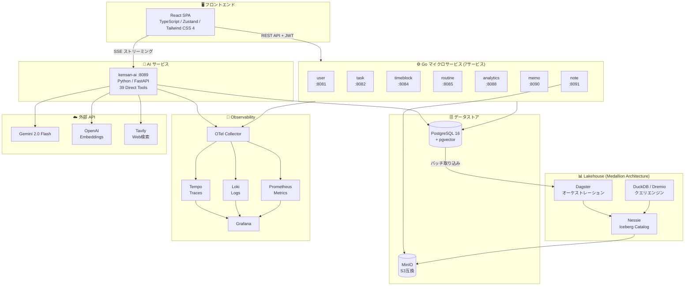
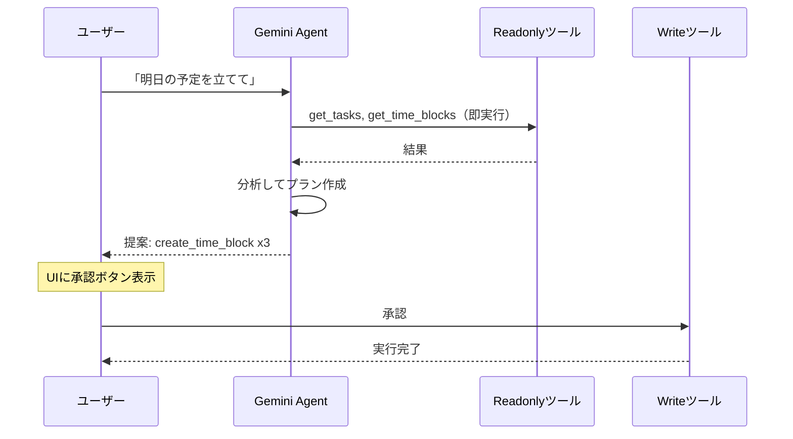

## エンジニアの「ちょうどいい」生産性ツールは存在しない

エンジニアとして働いていると、「自分の成長をちゃんと管理したい」と思う場面があります。資格を取りたい、OSSに貢献したい、新しい技術を学びたい。── でも、日々の業務に追われてなかなか進まない。

既存のツールも試しました。Notion、Todoist、Google Calendar。どれも悪くないけれど、エンジニアの学習サイクル──**目標を立てて、時間を確保して、振り返る**──に最適化されたものはありません。目標管理と時間管理とメモが別々のアプリに散らばり、「今週、目標に対してどれだけ時間を使えたか」を知るのが意外と難しい。

自分のワークフローにぴったり合うツールは、結局自分で作るしかない。でも、個人開発でマイクロサービスやAIエージェントを搭載した本格的なアプリを作って維持するのは、以前なら非現実的でした。

**Claude CodeやGeminiといったAIの登場で、この状況は大きく変わりました。**

AIが開発のパートナーになることで、個人でも本格的なアプリケーションを作り、育てていける時代になっています。本記事では、その実践として作った **Kensan** というアプリの設計思想と技術的な工夫を紹介します。

## Kensan: 使って研鑽、育てて研鑽

Kensanは、エンジニアの自己研鑽を支援するパーソナル生産性アプリです。

**主な機能:**
- **目標・タスク管理**: 年間目標 → マイルストーン → タスクの階層管理
- **タイムブロック**: 1日の時間を目標に紐づけて計画・記録
- **学習ノート**: 日記、学習メモ、読書レビューをリッチエディタで記録
- **AIチャット**: 39種類のツールを持つエージェントが進捗分析・計画提案
- **AI週次レビュー**: 1週間のデータを自動分析し、振り返りレポートを生成

<!-- TODO: デモ動画 (YouTube埋め込み) -->

<!-- TODO: 主要画面のスクリーンショット 2-3枚 -->

### 「研鑽の二重ループ」という思想

Kensanの名前は「研鑽」から来ています。そして、このアプリには二重の意味での研鑽が組み込まれています。

```
┌──────────────────────────────────────────────┐
│            研鑽の二重ループ                      │
│                                                │
│   ループ1: Kensanを「使う」研鑽                  │
│   目標設定 → 時間投資 → AI分析 → 振り返り → ...  │
│                                                │
│   ループ2: Kensanを「育てる」研鑽                 │
│   気になる技術 → 自分のアプリに組み込む            │
│   → 動かして学ぶ → 次の技術へ → ...              │
│                                                │
│   ループ2の成果がループ1の体験を向上させ、         │
│   ループ1で見つけた課題がループ2の動機になる       │
└──────────────────────────────────────────────┘
```

OpenTelemetryが気になったら、自分のアプリに組み込んで挙動を観察する。Lakehouseアーキテクチャを学びたければ、自分のデータで構築してみる。**「教材」ではなく「自分の道具」に技術を組み込む**ことで、理解の深さがまったく違ってきます。

このループを回しやすくするために、Kensanのアーキテクチャは「育てやすさ」を最優先に設計しています。

## 「育てやすい」アーキテクチャ



### 全体構成

| レイヤー | 技術 |
|---------|------|
| フロントエンド | React 18, TypeScript, Vite, Zustand, Tailwind CSS 4, shadcn/ui |
| バックエンド | Go (chi, pgx), 7つのマイクロサービス |
| AI | Python (FastAPI), Gemini 2.0 Flash / Claude 切替可能 |
| データ | PostgreSQL 16, MinIO, Apache Iceberg |
| 可観測性 | OTel Collector → Tempo / Loki / Prometheus → Grafana |
| データ基盤 | Dagster + Nessie + PyIceberg (Medallion Architecture) |

### なぜマイクロサービスか

「個人開発にマイクロサービスは過剰では？」という声が聞こえそうですが、「育てやすさ」の観点では合理的な選択です。

1つのサービスは **Handler → Service → Repository** の3層で約300〜500行。Claude Codeが一度に理解できるサイズに収まります。タスク管理だけ触りたいときに、認証やノートのコードを気にする必要がありません。**1サービスだけ変更しても全体が壊れない**という安心感が、気軽にコードを触れる環境を作ります。

### Claude Codeとの協働を前提とした開発体験

Kensanでは、Claude Codeがプロジェクトのルールを理解した状態で開発をサポートできるよう、**7つのルールファイルと6つのスキル**を整備しています。

**ルール** (`.claude/rules/`):
各ルールファイルが、Go のレイヤード規約、API レスポンス形式、DB のマルチテナント設計、セキュリティ要件、テスト方針などを定義しています。Claude Codeはこのルールを読み込んだ状態でコードを生成するため、プロジェクトの規約から逸脱しにくくなります。

**スキル** (`.claude/skills/`):
頻出の作業をワンコマンドで実行できます。

```bash
/new-service payment    # Go マイクロサービスの雛形を13ステップで自動生成
/new-endpoint task POST /api/v1/tasks "タスク作成"  # エンドポイントをフルスタックで追加
/new-page WeeklyPlan W  # 新しいページをルーティングまで含めて追加
```

新しいサービスを追加するのに必要なのは `/new-service` コマンド1つ。ディレクトリ構造、Dockerfile、Makefile、テストの雛形まで生成されます。**「新しい技術を試したい」と思ったとき、足場作りで時間を使わない**のが重要です。

さらに、ワークフロールールにより、コード変更時のテスト実行とARCHITECTURE.mdの更新が自動化されています。ドキュメントが常に最新であることで、Claude Codeが次回のセッションでも正確にコードベースを理解できます。

## AIエージェント: 39ツールを安全に使わせるRead/Write分離

### 39ツール、7カテゴリ

KensanのAIエージェントは **39種類のツール** を持ち、アプリ内のほぼすべてのデータにアクセスできます。

| カテゴリ | ツール数 | 例 |
|---------|---------|-----|
| DB操作 | 21 | get_tasks, create_task, create_time_block |
| メモリ | 4 | get_user_memory, add_user_fact |
| 検索 | 6 | semantic_search, hybrid_search |
| レビュー | 3 | generate_weekly_review |
| 分析 | 2 | get_analytics_summary |
| パターン | 1 | get_user_patterns |
| Web | 2 | web_search, web_fetch |

これだけのツールを持たせると、「AIが意図しない書き込みをする」リスクが無視できなくなります。

### Read/Write分離: 「読み取りは即実行、書き込みは承認」

解決策はシンプルです。**読み取りツールは即座に実行し、書き込みツールは必ずユーザーに提示してから実行する**という分離を行いました。



技術的には、各ツールに `readonly` フラグを付与し、エージェントループ内で分岐させています。

```python
@tool(name="get_tasks", readonly=True, ...)    # → 即実行
@tool(name="create_task", readonly=False, ...)  # → 承認待ち
```

### フレームワークを使わない理由

LangChainやADKは便利ですが、**ツール実行タイミングの細かい制御**（Readは即実行、Writeは中断して承認待ち）がフレームワークの抽象化と合いませんでした。Kensanでは Gemini の Function Calling API を直接叩く **Direct Tools パターン**を採用し、エージェントループを自前で書いています。ループ本体は約100行で、やっていることは明快です。

さらに、ユーザーの発言を意図分析し、書き込みが不要な質問（「進捗を教えて」）には読み取りツールだけを渡すことで、不要な書き込みの提案自体を減らしています。

## 先進技術の実験場

「育てて研鑽」を実践するために、Kensanには複数の先進的な技術を組み込んでいます。

### OpenTelemetry: AIエージェントの行動を追跡する

39ツールを持つエージェントを自律的に動かす以上、「何が起きたか」を確認できる仕組みは不可欠です。

Kensanでは OTel Collector を中心に **Traces(Tempo) / Logs(Loki) / Metrics(Prometheus)** の3本柱を構築し、Grafanaで可視化しています。

```
agent.stream (全体)
  ├── gen_ai.turn #1
  │     ├── agent.tool_execution: get_tasks (12ms)
  │     └── agent.tool_execution: get_time_blocks (8ms)
  ├── gen_ai.turn #2
  │     └── agent.tool_execution: get_analytics_summary (45ms)
  └── gen_ai.turn #3  ← テキスト応答のみ
```

各スパンにトークン数・ツール呼び出し回数を記録し、構造化ログにも `trace_id` を自動注入。Grafana上で **「このリクエストでAIが何ターン回って、どのツールを呼んで、何トークン使ったか」** をドリルダウンで追跡できます。

これはデバッグだけでなく、プロンプトやツール構成のチューニングにも直結します。

### Lakehouse: 自分のデータで分析基盤を構築する

AIの週次レビューをより高精度にするために、**Medallion Architecture** (Bronze → Silver → Gold) のデータ基盤を構築しました。

| 層 | 内容 |
|----|------|
| Bronze | PostgreSQL からバッチ取り込み（差分検知で効率化） |
| Silver | クレンジング + 算出値追加（duration_minutes, is_subtask等） |
| Gold | 週次集計（goal_progress, ai_usage_weekly等） |

**Nessie** (Iceberg REST Catalog) でテーブルメタデータを管理し、**MinIO** にParquetファイルを格納。**Dagster** がパイプライン全体をオーケストレーションし、毎日自動でデータを更新します。集計結果は **DuckDB** や **Dremio** でアドホックにクエリできます。

個人アプリのデータ量でLakehouseは過剰に見えるかもしれません。しかし、**自分のリアルなデータで Iceberg + Nessie + Dagster を触れる**というのが重要なポイントです。チュートリアルのサンプルデータでは得られない、実運用の感覚が身につきます。

## Google Cloud活用

### Gemini 2.0 Flash

39ツールのスキーマを毎ターン送信するため、コンテキストウィンドウの広さとFunction Callingの安定性が必要でした。Gemini 2.0 Flashは100万トークンの入力に対応しつつ高速で、コスト面でも個人プロジェクトに適しています。

プロバイダーは環境変数 `AI_PROVIDER` 1つで Claude と Gemini を切替可能です。モデルの得意不得意はタスクによって異なるため、いつでも戻せる設計にしています。

### GCEデプロイ

Docker Composeの構成をそのまま `docker-compose.prod.yml` オーバーレイで本番化し、GCE (e2-standard-4) にデプロイしています。アプリ本体、AIサービス、Observabilityスタック、Lakehouseまで、**すべてを単一インスタンス上で動作させています**。

## まとめ: アプリは「使う」から「育てる」へ

AIの進化により、個人でも本格的なアプリケーションを作って維持できる時代になりました。Kensanは、その可能性を「研鑽」というテーマで実践したプロジェクトです。

**研鑽の二重ループ:**
1. Kensanを**使って**日々の目標管理・時間管理を行い、自己研鑽する
2. Kensanを**育てて**新しい技術（OTel, Lakehouse, AIエージェント）を学び、技術的に研鑽する

**この2つのループが互いを強化します。** 使っていて見つけた課題が、次に組み込む技術の動機になる。組み込んだ技術が、日々の体験を向上させる。

設計上のポイントは3つです:

1. **育てやすいアーキテクチャ**: マイクロサービス分離 + Claude Code rules/skills で、1箇所だけ安全に触れる構造
2. **安全なAIエージェント**: Read/Write分離で、39ツールでも安心して使える設計
3. **先進技術の実験場**: OTel、Lakehouse、マルチAIプロバイダなど、気になる技術を自分のデータで試せる環境

「自分のためのアプリを、自分で育てる」── AIがそれを可能にした今、これは新しい研鑽の形だと考えています。

---

リポジトリ: （提出時にリンク追加）
デモ動画: （提出時にリンク追加）
