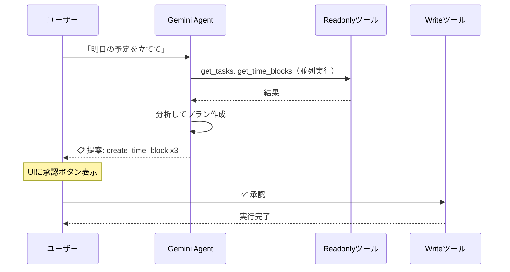

## AIエージェントに40個のツールを渡したら何が起きるか

AIエージェントにツールを持たせると便利になる。しかし、ツールの数が増えるほど **「AIが勝手にやったこと」** のリスクも増える。

タスクを作ったつもりが消されていた。メモを書いたつもりがゴールの設定が変わっていた。── エージェントがユーザーの意図と異なる書き込み操作を実行してしまう問題は、ツール数が多いほど深刻になる。

Kensanは、タスク管理・時間計画・学習記録・AI週次レビューを統合した個人向け生産性アプリで、AIエージェントには **40種類のツール** を持たせている。この規模でも安全に運用するために採用したのが、**Read/Write分離** と **可観測性によるエージェント行動の追跡** という2つのアプローチだ。

本記事では、この設計判断に至った背景と、Gemini 2.0 FlashのFunction Callingで実現した具体的な仕組みを紹介する。


*React + Go マイクロサービス(x6) + Python AIサービス + OTelスタック on GCE*

## 課題: エージェントの「便利さ」と「怖さ」の両立

Kensanの対象ユーザーはエンジニアで、自分の目標（資格取得、OSS活動など）に対する進捗をこのアプリで管理している。AIにはそのデータ全体へのアクセスを与え、「今週の進捗を分析して」「明日の予定を立てて」といった指示に応えさせたい。

ここで問題になるのが、ツールの性質の違いだ:

| 操作 | 例 | リスク |
|------|-----|--------|
| **読み取り** | タスク一覧取得、進捗分析 | なし。何度呼んでもデータは変わらない |
| **書き込み** | タスク作成、タイムブロック追加、目標変更 | AIの判断ミスでデータが壊れる |

40ツールのうち約半数が書き込み系だ。全部にユーザー確認を挟むと遅い。全部自動実行すると怖い。この **「便利だけど怖い」** をどう解決するか。

## 設計: Read/Write分離エージェント

答えはシンプルで、 **「読み取りは即実行、書き込みは必ずユーザーに見せてから」** という分離だ。



技術的には、各ツールに `readonly` フラグを付与し、エージェントループ内で分岐させている:

```python
@tool(name="get_tasks", readonly=True, ...)    # → 即実行
@tool(name="create_task", readonly=False, ...)  # → 承認待ち
```

- **Readonlyツール**: エージェントが呼んだ瞬間に並列実行。結果をそのまま次のターンに渡す
- **Writeツール**: `action_proposal` イベントとしてフロントに送信。UIが承認/却下ボタンを表示し、ユーザーが判断する

この分離により、「タスク一覧を見て→分析して→予定を提案する」という3ターンの流れのうち、**ユーザーが待つのは最後の承認だけ**。読み取りフェーズでは体感待ちゼロで進む。

## 実装: フレームワークなしでFunction Callingを直接制御する

### なぜフレームワークを使わないか

LangChainやADKを使えば早い。しかし、Read/Write分離のような **ツール実行タイミングの細かい制御** はフレームワークの抽象化と相性が悪い。また、40ツール規模になるとデバッグ時にフレームワーク内部を追う羽目になる。

Kensanでは、LLMのFunction Calling APIを直接叩く **Direct Tools** パターンを採用し、エージェントループを自前で書いている。ループの本体は約100行で、やっていることは明快だ:

1. Geminiにメッセージ+ツール定義を送る
2. レスポンスにテキストがあればSSEで即送信
3. `function_call` があればreadonly/writeを判定して処理
4. ツール結果を `function_response` として戻し、次のターンへ
5. `function_call` がなくなるまで繰り返す

### ツールは「デコレータ1つ」で追加できる

ツール追加のコストを最小化するため、Pythonデコレータで定義と実装を一体管理している:

```python
@tool(
    name="get_tasks",
    description="プロジェクトのタスク一覧を取得する",
    readonly=True,
    input_schema={
        "properties": {
            "project_id": {"type": "string"},
            "completed": {"type": "boolean"},
        },
    },
)
async def get_tasks(args):
    # PostgreSQLクエリ → 結果を返す
```

デコレータがグローバルレジストリに自動登録し、APIスキーマ生成もワンライナー。新しいツールを足すのに触るのは **ツール定義ファイル1つだけ** だ。

## 可観測性: 「AIが何をしたか」を追跡できるようにする

エージェントに40ツールを渡して自律的に動かす以上、「何が起きたか」を事後的に確認できる仕組みが不可欠だ。

KensanではOpenTelemetryで **Traces / Logs / Metrics** の3本柱を組み、エージェントの各ターンをスパンとして記録している:

```
agent.stream (全体)
  ├── gen_ai.turn #1
  │     ├── agent.tool_execution: get_tasks (12ms)
  │     └── agent.tool_execution: get_time_blocks (8ms)
  ├── gen_ai.turn #2
  │     └── agent.tool_execution: get_analytics_summary (45ms)
  └── gen_ai.turn #3  ← テキスト応答のみ、ツールなし
```

各スパンにはトークン数・ツール呼び出し回数・成功/失敗を記録。構造化ログにも `trace_id` が自動注入されるので、Grafanaで **「このリクエストでAIが何ターン回って、どのツールを呼んで、何トークン使ったか」** をドリルダウンできる。

これはデバッグだけでなく、**プロンプトやツール構成のチューニング**にも直結する。「このパターンの質問で不要なツール呼び出しが多い」と分かれば、コンテキスト認識ロジックを調整してトークンを節約できる。

## Google Cloud活用: Gemini 2.0 Flash + GCE

### Geminiの選定理由

40ツールのスキーマを毎ターン送信するため、コンテキストウィンドウの広さとFunction Callingの安定性が必要だった。Gemini 2.0 Flashは100万トークンの入力に対応し、かつ高速。コスト面でも有利で、個人プロジェクトとして運用しやすい。

### プロバイダー切り替え設計

元々Anthropic Claude向けに作っていたエージェントを、環境変数 `AI_PROVIDER` 1つで切り替えられる設計にした。既存のAnthropicコードは一切削除せず、Gemini版の `GeminiAgentRunner` を追加して **ファクトリ関数で分岐** するだけ。

この設計にしたのは、モデルの得意不得意がタスクによって異なるため、いつでも戻せるようにしておきたかったからだ。

### GCEデプロイ

Docker Composeの構成をそのまま `docker-compose.prod.yml` オーバーレイで本番化し、GCE (e2-standard-4) にデプロイしている。Observabilityスタック（Tempo, Loki, Prometheus, Grafana）もすべて同一インスタンス上で動かし、AIエージェントの挙動をリアルタイムで監視できる。

## まとめ

AIエージェントは「何でもできる」ほど「何をするか分からない」リスクが増える。Kensanでは3つの設計判断でこの問題に対処した:

1. **Read/Write分離**: 読み取りは即実行、書き込みはユーザー承認。便利さと安全性を両立
2. **Direct Tools**: フレームワークなしでFunction Callingを直接制御。ツール実行タイミングを完全にコントロール
3. **OTelによる追跡**: エージェントの全ターン・全ツール呼び出しをトレース/ログで記録。ブラックボックスにしない

「AIに任せる」と「AIを管理する」は矛盾しない。適切な境界を設計すれば、40ツールでも安心して使えるエージェントは作れる。

---

リポジトリ: （提出時にリンク追加）
デモ動画: （提出時にリンク追加）
