# Kensan AIアーキテクチャ

KensanアプリケーションのためのDirect Toolsを使用したPython AIサービス。

---

## 目次

1. [概要](#概要)
2. [リクエスト処理フロー](#リクエスト処理フロー)
3. [エージェント](#エージェント)
4. [Direct Tools](#direct-tools)
5. [コンテキスト管理](#コンテキスト管理)
6. [メモリとファクト抽出](#メモリとファクト抽出)
7. [埋め込みと検索](#埋め込みと検索)
8. [APIエンドポイント](#apiエンドポイント)
9. [設定と環境変数](#設定と環境変数)
10. [テレメトリ](#テレメトリ)

---

## 概要

### アーキテクチャスタイル

- **FastAPI** アプリケーション（非同期サポート）
- **エージェントベース** アーキテクチャ（LLMのDirect Tools / Function Calling使用）
- **コンテキスト認識** AI（状況別プロンプト選択 + A/Bテスト）
- **メモリシステム**（ファクト自動抽出 + プロフィール要約）
- **マルチプロバイダ**: Anthropic (Claude) / Google (Gemini) を `AI_PROVIDER` で切替

### 技術スタック

| コンポーネント | 技術 |
|--------------|------|
| フレームワーク | FastAPI (非同期) |
| ランタイム | Python 3.12+ |
| AIモデル | Claude (Anthropic SDK) / Gemini (Google GenAI SDK) |
| 埋め込み | OpenAI text-embedding-3-small (1536次元) |
| データベース | PostgreSQL 16 + pgvector (asyncpg) |
| ストレージ | MinIO (S3互換、読み取り専用) |
| 外部検索 | Tavily API (web_search / web_fetch) |
| データレイク | Iceberg via Nessie Catalog (オプション) |

### ディレクトリ構成

```
kensan-ai/src/kensan_ai/
├── main.py                    # FastAPIエントリー
├── config.py                  # Pydantic BaseSettings
├── errors.py                  # 統一エラー階層
├── agents/                    # エージェント実装
│   ├── base.py               # AgentRunner (Anthropic, プロンプトキャッシング)
│   ├── gemini_runner.py       # GeminiAgentRunner
│   ├── chat.py               # チャットエージェント（動的ツール選択）※DBマイグレーション元ネタ
│   ├── weekly_review.py       # 週次レビューエージェント ※DBマイグレーション元ネタ
│   └── planning_agent.py      # 計画提案エージェント ※DBマイグレーション元ネタ
├── tools/                     # Direct Tools (39+)
│   ├── base.py               # ツールレジストリ & デコレータ
│   ├── db_tools.py           # DB操作 (21)
│   ├── memory_tools.py       # メモリ (4)
│   ├── search_tools.py       # 検索 (6)
│   ├── review_tools.py       # レビュー (3)
│   ├── analytics_tools.py    # 分析 (2)
│   ├── pattern_tools.py      # 行動パターン (1)
│   └── web_tools.py          # Web検索 (2, Tavily)
├── context/                   # AIコンテキスト管理
│   ├── detector.py           # 状況検出
│   ├── resolver.py           # コンテキスト読み込み
│   ├── variable_replacer.py  # 動的プロンプト変数
│   └── ab_selector.py        # A/Bテスト
├── db/queries/                # ドメインクエリ
├── extraction/                # ファクト抽出
├── embeddings/                # ベクトル埋め込み
├── indexing/                  # チャンク分割+インデックス
├── logging/                   # インタラクションログ
├── lakehouse/                 # Iceberg Bronze書き込み
└── batch/                     # オフラインジョブ
```

---

## リクエスト処理フロー

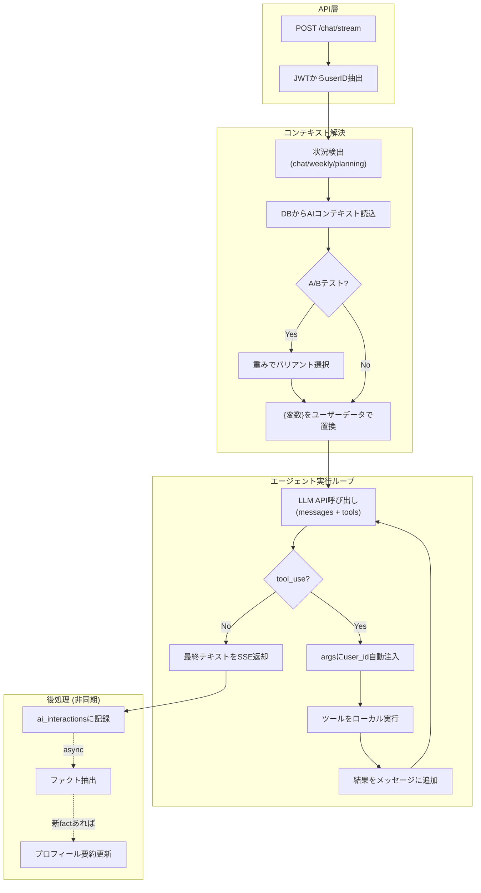

---

## エージェント

### エージェント一覧

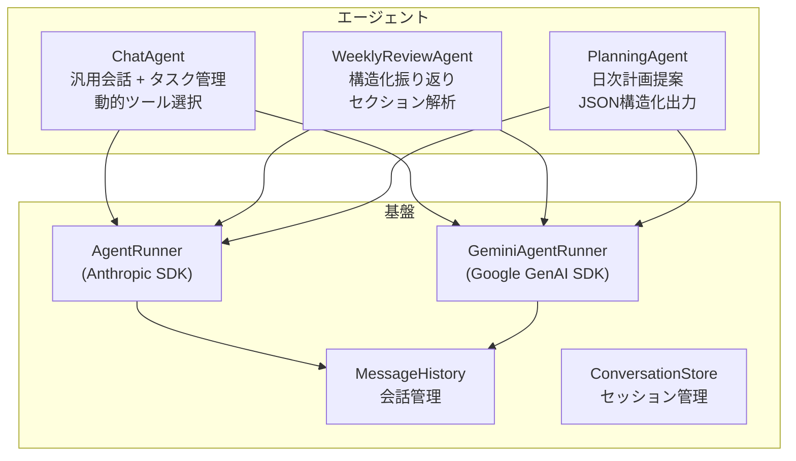

| エージェント | 用途 | 出力形式 | ツール |
|------------|------|---------|--------|
| ChatAgent | 汎用会話、タスク管理 | テキスト (SSEストリーミング) | 動的選択 (7-39ツール) |
| WeeklyReviewAgent | 週次振り返り | 構造化テキスト (セクション解析) | DB読み取り系 |
| PlanningAgent | 日次計画提案 | JSON (insights, proposedBlocks, taskPriorities, alerts) | 計画系 + パターン分析 |

### AgentRunner コア動作

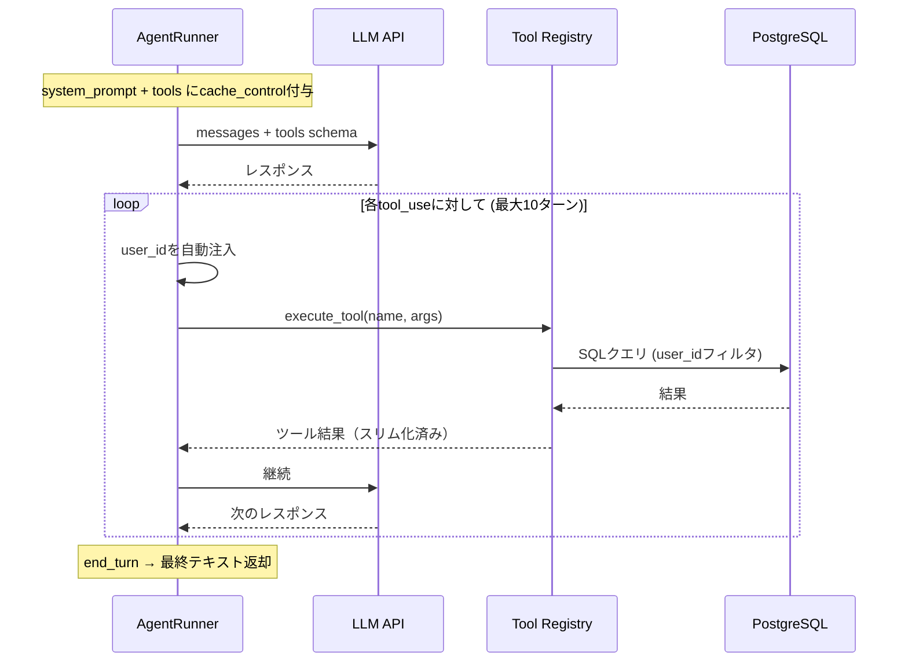

**トークン最適化:**

| 手法 | 効果 |
|------|------|
| Anthropic Prompt Caching | Turn 2以降の入力トークンコスト90%削減 |
| ツール結果スリム化 | ネストIDの除外、descriptionの除外、コンテンツ切り詰め(300文字) |
| 動的ツール選択 | 全39ツール→必要な7-15ツールのみ送信 |

### 動的ツール選択

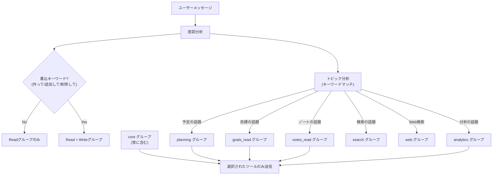

**ツールグループ一覧:**

| グループ | 種別 | 含まれるツール |
|---------|------|-------------|
| `core` | 常に含む | get_tasks, get_time_blocks, get_time_entries, get_memos |
| `planning` | Write | create/update/delete_time_block |
| `task` | Write | create/update/delete_task |
| `goals_read` | Read | get_goals_and_milestones |
| `goals_write` | Write | create/update/delete_goal, create/update/delete_milestone |
| `notes_read` | Read | get_notes |
| `notes_write` | Write | create/update_note, create_memo |
| `analytics` | Read | get_analytics_summary, get_daily_summary |
| `search` | Read/Write | semantic_search, keyword_search, hybrid_search, reindex_notes |
| `review` | Read/Write | get_reviews, get_review, generate_weekly_review |
| `memory` | Read/Write | get_user_memory, get_user_facts, add_user_fact |
| `patterns` | Read | get_user_patterns |
| `web` | Read | web_search, web_fetch |

**Situationベース静的選択:**

| Situation | 使用グループ |
|-----------|------------|
| `weekly` | core, review, notes_read, goals_read, search, patterns |
| `planning` | core, planning, task, goals_read, analytics, patterns |

---

## Direct Tools

### ツールインフラ

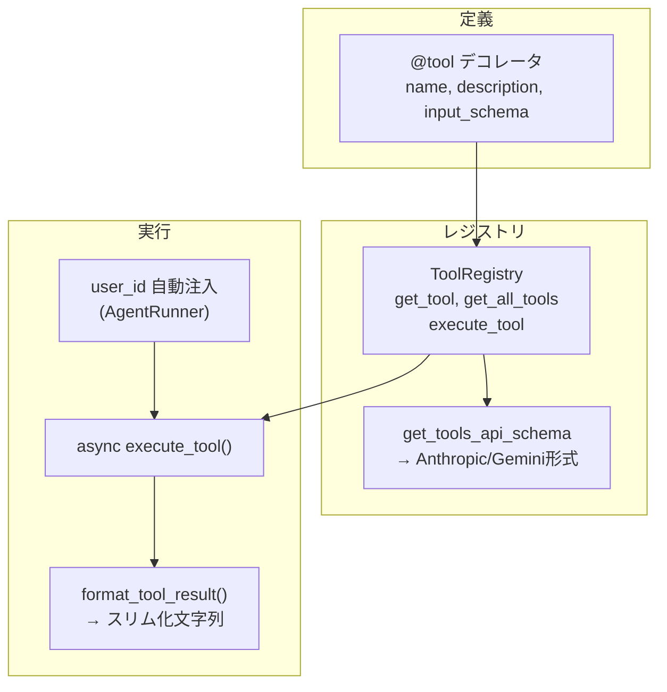

### ツールカテゴリ

| カテゴリ | ファイル | ツール数 | 主なツール |
|---------|--------|---------|-----------|
| **DB操作** | `db_tools.py` | 21 | get_tasks, create_task, get_time_blocks, create_time_block, get_notes, create_note |
| **メモリ** | `memory_tools.py` | 4 | get_user_memory, get_user_facts, add_user_fact, get_recent_interactions |
| **検索** | `search_tools.py` | 6 | semantic_search, keyword_search, hybrid_search, search_notes, reindex_notes |
| **レビュー** | `review_tools.py` | 3 | get_reviews, get_review, generate_weekly_review |
| **分析** | `analytics_tools.py` | 2 | get_analytics_summary, get_daily_summary |
| **パターン** | `pattern_tools.py` | 1 | get_user_patterns |
| **Web** | `web_tools.py` | 2 | web_search (Tavily Search), web_fetch (Tavily Extract) |

### DB操作ツールのタイムゾーン処理

ツール入力はローカル日時（LLMの使いやすさ優先）。内部で `user_settings` からタイムゾーンを取得しUTCに変換してDB保存:

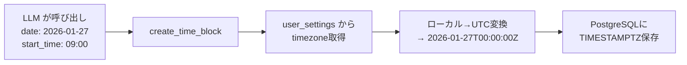

### パターン分析ツール

`get_user_patterns` が返す行動パターン統計:

| メトリクス | 説明 |
|-----------|------|
| `productivityByHour` | 時間帯別の実績分数・件数・計画実行率 |
| `planAccuracy` | 実績/計画（全体） |
| `overcommitRatio` | 計画/実績（1.0超 = 計画過多） |
| `chronicOverdueTasks` | 未完了+期限超過+作成2週間以上のタスク |
| `goalVelocity` | 目標別の週次推移とトレンド (accelerating/stable/declining/stalled) |
| `avgSessionMinutes` | 平均作業セッション時間 |

### Web検索ツール (Tavily)

| ツール | 機能 | Lakehouse連携 |
|-------|------|-------------|
| `web_search` | キーワード検索、検索深度・最大結果数指定可 | `bronze.external_tool_results_raw` に記録 |
| `web_fetch` | URL指定でコンテンツ抽出（最大10,000文字） | 同上 |

Lakehouse書き込みはfire & forget。失敗はログのみで応答をブロックしない。`LAKEHOUSE_ENABLED=false` で全操作no-op。

---

## コンテキスト管理

### コンテキスト選択フロー

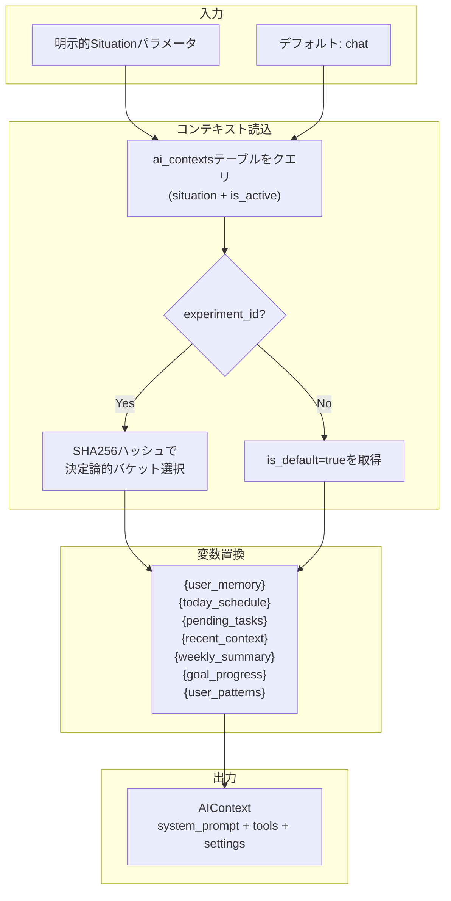

### 動的プロンプト変数

| 変数 | データソース | 内容 |
|------|------------|------|
| `{user_memory}` | user_memory テーブル | プロフィール要約 + 強み + 成長領域 |
| `{today_schedule}` | time_blocks テーブル | 今日のタイムブロック一覧 |
| `{today_entries}` | time_entries テーブル | 今日の実績一覧 |
| `{pending_tasks}` | tasks テーブル | 未完了タスク一覧 |
| `{recent_context}` | ai_interactions テーブル | 最近3件のやり取り |
| `{weekly_summary}` | analytics クエリ | 今週のサマリー統計 |
| `{goal_progress}` | goals + milestones | 目標・マイルストーン進捗 |
| `{user_patterns}` | パターン分析クエリ | 生産性ピーク、計画精度、目標トレンド |

### A/Bテスト

同一situationに複数のコンテキストを紐付け、`experiment_id` + `traffic_weight` で分割:

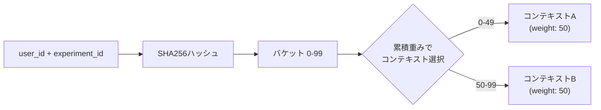

同一ユーザー+実験には常に同じバリアントが割り当てられる（決定論的）。

---

## メモリとファクト抽出

### メモリ構築パイプライン

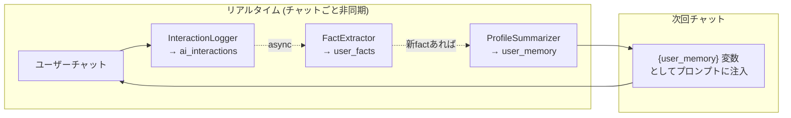

### ファクト抽出の詳細

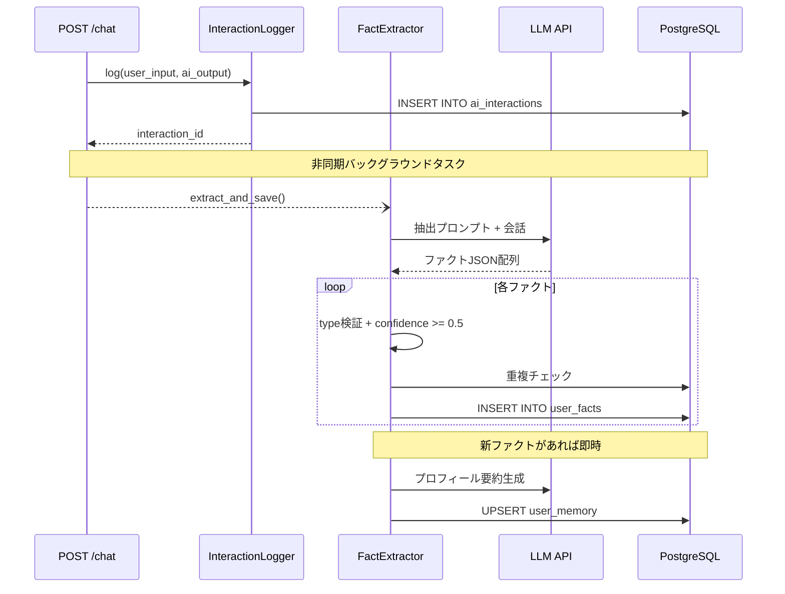

### ファクトタイプ

| タイプ | 説明 | 例 |
|-------|------|-----|
| `preference` | 好み | "早朝に作業するのが好き" |
| `habit` | 習慣 | "毎朝7時に起きる" |
| `skill` | スキル | "Pythonが得意" |
| `goal` | 目標 | "来月までにリリース" |
| `constraint` | 制約 | "平日は19時以降のみ" |

### プロフィール要約 (user_memory)

| フィールド | 説明 | ソース |
|-----------|------|--------|
| `profile_summary` | プロフィール要約（最大300文字） | LLMで生成 |
| `strengths` | 強みリスト | skillタイプ、confidence >= 0.7 |
| `growth_areas` | 成長領域リスト | goal/constraintタイプ |

---

## 埋め込みと検索

### 検索アーキテクチャ

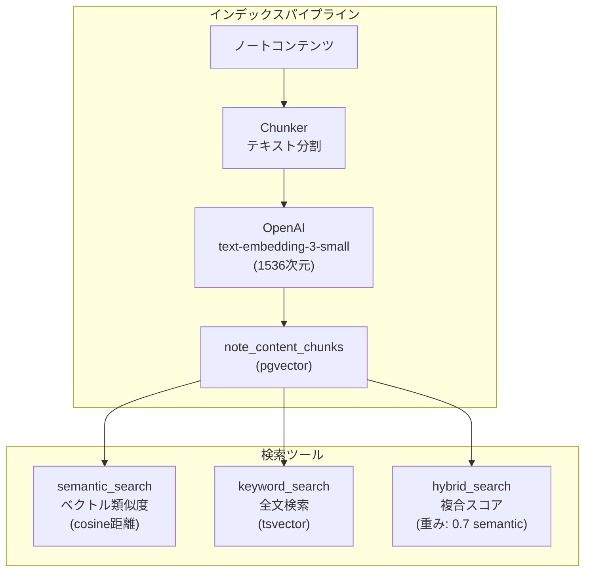

### 検索手法

| ツール | 手法 | スコア計算 |
|-------|------|----------|
| `semantic_search` | pgvectorのcosine距離 | `1 - (embedding <=> query_embedding)` |
| `keyword_search` | PostgreSQL全文検索 | `ts_rank(to_tsvector('simple', text), query)` |
| `hybrid_search` | 上記2つを組み合わせ | `semantic_score * 0.7 + keyword_score * 0.3` |
| `search_notes` | notesテーブル直接検索 | `ts_rank` on title + content |

---

## APIエンドポイント

| メソッド | パス | 説明 |
|---------|------|------|
| GET | `/health` | ヘルスチェック |
| POST | `/chat/stream` | SSEストリーミングチャット |
| POST | `/chat` | 非ストリーミングチャット |
| POST | `/advice` | 朝の計画アドバイス |
| POST | `/reflect` | 夕方の振り返り |
| POST | `/review` | 週次レビュー |
| POST | `/ai/reviews/generate` | レビュー生成 |
| GET | `/ai/reviews` | レビュー一覧 |
| GET | `/ai/reviews/{id}` | レビュー詳細 |
| POST | `/ai/ask` | 質問応答 |
| POST | `/interactions/{id}/feedback` | フィードバック送信 (1-5評価) |

認証: `Authorization: Bearer <token>` → JWT (HS256) から `user_id` を抽出。

---

## 設定と環境変数

### 主要設定

| カテゴリ | 環境変数 | 説明 |
|---------|---------|------|
| **AIプロバイダ** | `AI_PROVIDER` | `anthropic` or `google` (デフォルト: `google`) |
| **Anthropic** | `ANTHROPIC_API_KEY`, `ANTHROPIC_MODEL` | Claude API (デフォルト: `claude-sonnet-4-20250514`) |
| **Google** | `GOOGLE_API_KEY`, `GOOGLE_MODEL` | Gemini API (デフォルト: `gemini-2.0-flash`) |
| **埋め込み** | `OPENAI_API_KEY` | OpenAI text-embedding-3-small |
| **DB** | `DATABASE_URL` or `DB_HOST/PORT/USER/PASSWORD/NAME` | PostgreSQL 16 |
| **ストレージ** | `MINIO_ENDPOINT`, `MINIO_ACCESS_KEY`, `MINIO_SECRET_KEY` | MinIO (ノートコンテンツ読み取り) |
| **Web検索** | `TAVILY_API_KEY` | Tavily API (web_search/web_fetch) |
| **Lakehouse** | `LAKEHOUSE_ENABLED`, `NESSIE_URI` | Iceberg Bronze書き込み (オプション) |
| **OTel** | `OTEL_ENABLED`, `OTEL_COLLECTOR_URL` | OpenTelemetry |
| **サーバー** | `SERVER_PORT`, `SERVER_ENV` | FastAPI (デフォルト: 8089, development) |

### 本番バリデーション

`SERVER_ENV=production` 時に以下を自動検証:
- APIキーが開発用デフォルトでないこと
- JWTシークレットが安全であること
- DBパスワードがデフォルトでないこと

---

## テレメトリ

### 構造化ログイベント

各実行フェーズで構造化JSONログを出力。Lokiに収集されフロントエンドのInteraction Explorerで可視化:

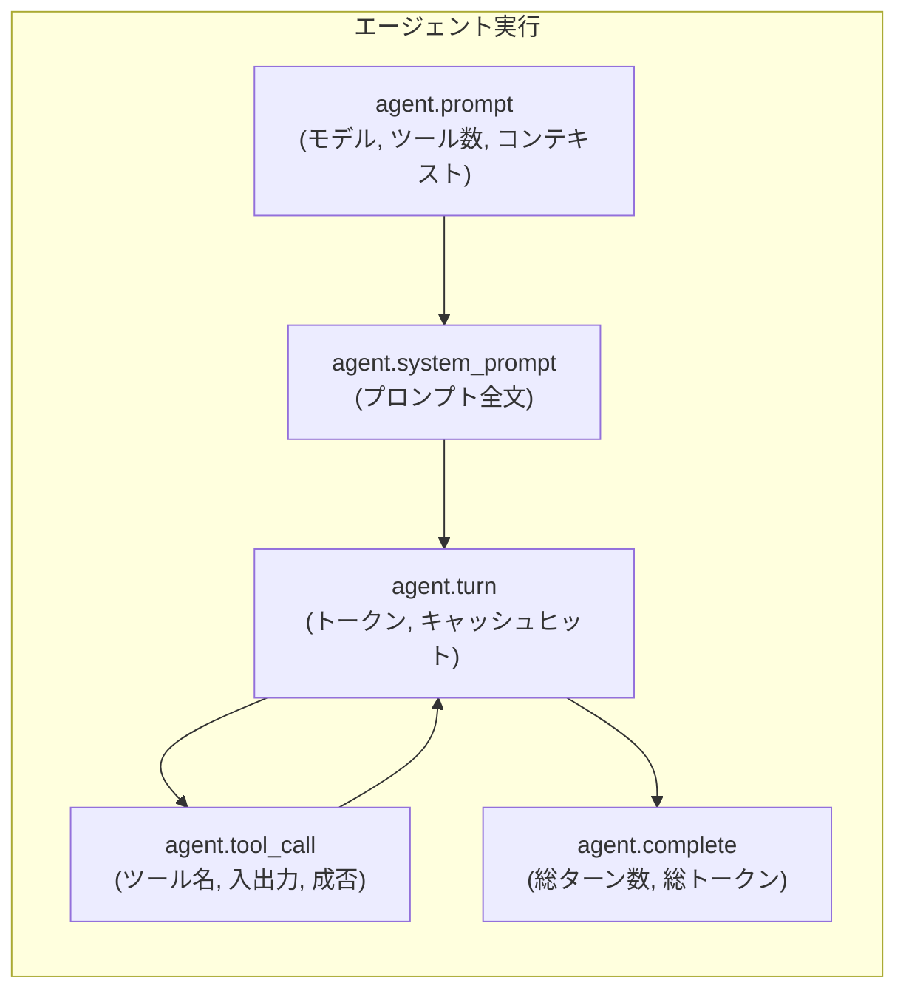

### GenAIメトリクス (OpenTelemetry)

| メトリクス | 種別 | 説明 |
|-----------|------|------|
| `gen_ai.client.token.usage` | Counter | トークン消費量 (input/output) |
| `gen_ai.client.operation.duration` | Histogram | エージェント実行時間 (秒) |
| `gen_ai.client.operation.count` | Counter | エージェント実行回数 |

自動計装: FastAPI (HTTPスパン)、asyncpg (DBスパン)、httpx (外部HTTPスパン)。`OTEL_ENABLED=false` で全no-op。
