# Kensan システムアーキテクチャ入門ガイド

このドキュメントでは、Kensanサービスの仕組みを図を使ってわかりやすく説明します。

**最終更新: 2026-01-24**

---

## 目次

1. [Kensanとは？](#1-kensanとは)
2. [システム全体像](#2-システム全体像)
3. [フロントエンドの仕組み](#3-フロントエンドの仕組み)
4. [バックエンドの仕組み](#4-バックエンドの仕組み)
5. [データの流れ](#5-データの流れ)
6. [データベース構造](#6-データベース構造)
7. [目標・タスク管理の階層](#7-目標タスク管理の階層)
8. [開発モードと本番モードの違い](#8-開発モードと本番モードの違い)

---

## 1. Kensanとは？

Kensanは、個人の生産性を向上させるためのアプリケーションです。

**主な機能:**
- 目標・マイルストーン・タスクの階層管理
- 時間管理（タイムブロック計画 & 実績記録）
- タイマー機能（作業時間の計測）
- ノート機能（日記・学習記録を統合管理）
- 定期タスク管理（日次・週次・月次）
- AIによる週次レビュー

---

## 2. システム全体像

Kensanは「フロントエンド」と「バックエンド」の2つの部分で構成されています。

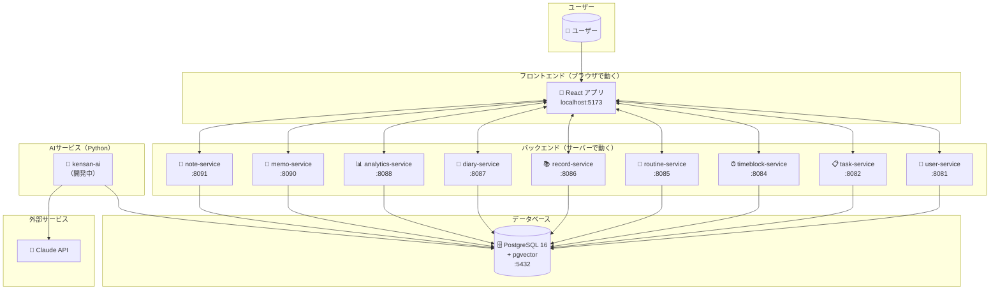

### ポイント解説

| 用語 | 説明 |
|------|------|
| **フロントエンド** | ユーザーが直接触る画面部分。ブラウザで動作します |
| **バックエンド** | データの保存・処理を担当。Goで書かれた9つのマイクロサービス |
| **kensan-ai** | AI機能を担当するPythonサービス（Claude API連携） |
| **PostgreSQL** | すべてのデータを保存するデータベース。ベクトル検索にも対応 |

---

## 3. フロントエンドの仕組み

フロントエンドは、ユーザーが見る画面を担当します。

### 3.1 ページ一覧

現在、Kensanには10個のページがあります：

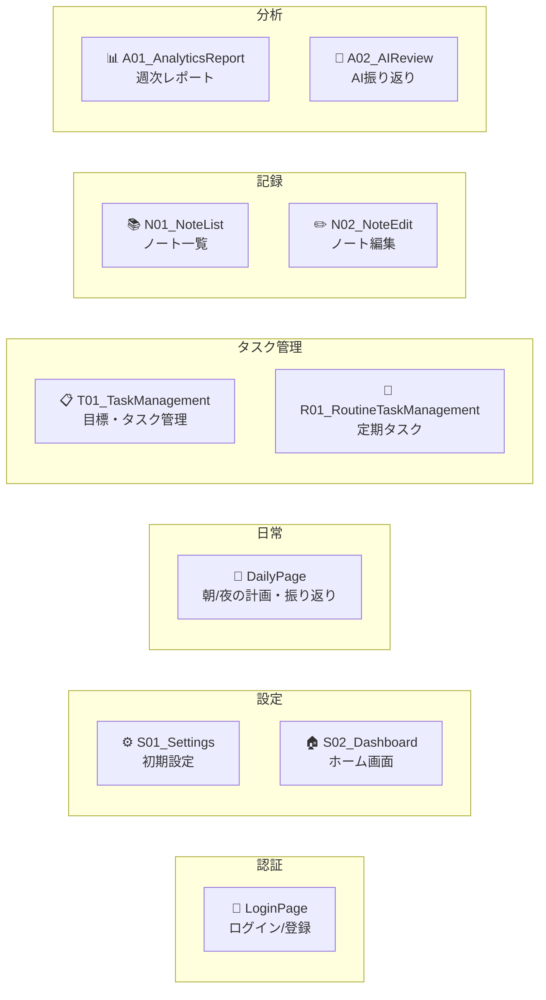

### 3.2 ページの命名規則

ページ名の先頭文字には意味があります：

| 文字 | 意味 | 例 |
|------|------|-----|
| **S** | Settings（設定） | S01_Settings, S02_Dashboard |
| **D** | Daily（日常） | DailyPage（朝/夜統合） |
| **T** | Task（タスク） | T01_TaskManagement |
| **R** | Routine（定期タスク） | R01_RoutineTaskManagement |
| **N** | Note（ノート） | N01_NoteList, N02_NoteEdit |
| **A** | Analytics/AI（分析） | A01_AnalyticsReport, A02_AIReview |

> **変更点**: 以前の `M01_Morning`（朝）と `E01_Evening`（夜）は `DailyPage` に統合されました。

### 3.3 フロントエンドの構成

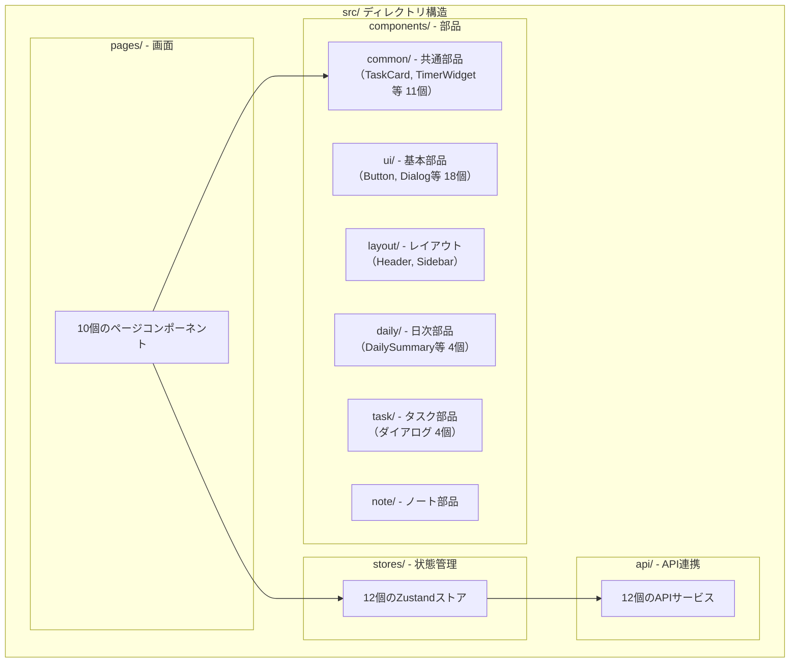

### 3.4 コンポーネント階層

```
components/
├── ui/                 # shadcn/ui（18個）
│   ├── button.tsx      # ボタン
│   ├── dialog.tsx      # モーダル
│   ├── input.tsx       # 入力欄
│   └── ...
├── layout/             # レイアウト（3個）
│   ├── Header.tsx      # ヘッダー
│   ├── Sidebar.tsx     # サイドバー
│   └── Layout.tsx      # 全体レイアウト
├── common/             # ドメイン共通（11個）
│   ├── TaskCard.tsx    # タスクカード
│   ├── TimerWidget.tsx # タイマー
│   ├── GoalBadge.tsx   # 目標バッジ
│   └── ...
├── daily/              # 日次（4個）
│   ├── DailySummary.tsx
│   └── TimeBlockSection.tsx
├── task/               # タスクダイアログ（4個）
│   ├── GoalDialog.tsx
│   ├── MilestoneDialog.tsx
│   └── TaskDialog.tsx
└── note/               # ノート（1個）
    └── NoteEditor.tsx
```

### 3.5 Zustandストアとは？

**Zustand**は、アプリ全体でデータを共有するための仕組みです。

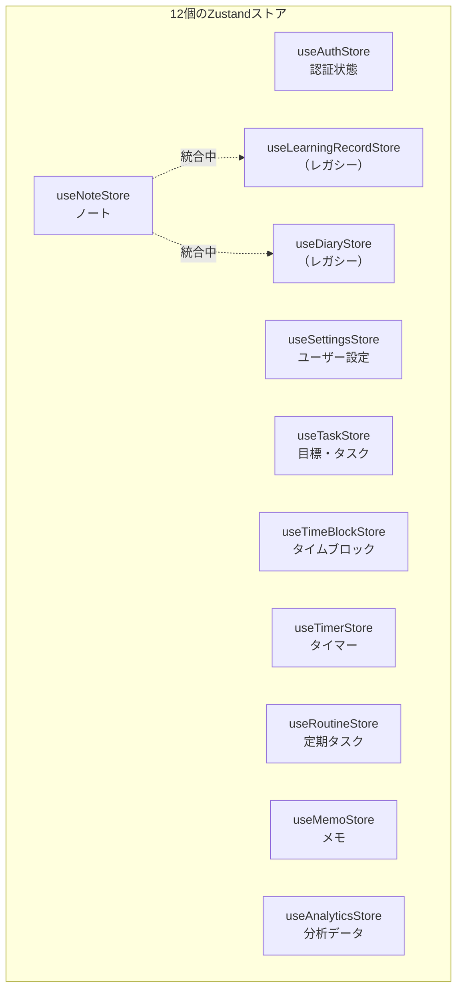

**主要ストアの役割:**

| ストア | 役割 | 主な機能 |
|--------|------|---------|
| `useAuthStore` | 認証 | ログイン、ログアウト、トークン管理 |
| `useSettingsStore` | 設定 | タイムゾーン、テーマ、ユーザー名 |
| `useTaskStore` | タスク | 目標・マイルストーン・タスクのCRUD |
| `useTimeBlockStore` | 時間 | タイムブロック、時間記録（timezone対応） |
| `useTimerStore` | タイマー | 作業タイマーの開始・停止 |
| `useNoteStore` | ノート | 日記・学習記録の統合管理 |

---

## 4. バックエンドの仕組み

バックエンドは9つの**Goマイクロサービス**で構成されています。

### 4.1 マイクロサービス一覧

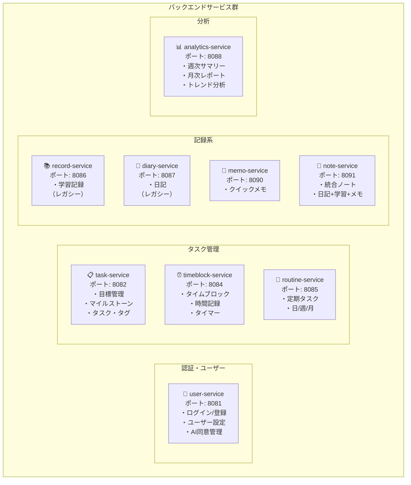

### 4.2 各サービスの主要エンドポイント

#### user-service (8081)
| メソッド | パス | 説明 |
|---------|------|------|
| POST | `/auth/register` | ユーザー登録 |
| POST | `/auth/login` | ログイン |
| GET | `/users/me` | 自分の情報取得 |
| GET/PUT | `/users/me/settings` | 設定の取得・更新 |

#### task-service (8082)
| メソッド | パス | 説明 |
|---------|------|------|
| GET/POST | `/goals` | 目標一覧・作成 |
| GET/POST | `/milestones` | マイルストーン一覧・作成 |
| GET/POST | `/tasks` | タスク一覧・作成 |
| GET/POST | `/tags` | タグ一覧・作成 |
| PATCH | `/tasks/{id}/complete` | タスク完了トグル |

#### timeblock-service (8084)
| メソッド | パス | 説明 |
|---------|------|------|
| GET/POST | `/timeblocks` | 計画タイムブロック |
| GET/POST | `/time-entries` | 実績時間記録 |
| GET | `/timer/current` | 実行中タイマー |
| POST | `/timer/start` | タイマー開始 |
| POST | `/timer/stop` | タイマー停止 |

#### note-service (8091) - 新規追加
| メソッド | パス | 説明 |
|---------|------|------|
| GET/POST | `/notes` | ノート一覧・作成 |
| GET | `/notes/search` | ノート検索 |
| POST | `/notes/{id}/archive` | アーカイブ |

### 4.3 各サービスの内部構造

すべてのサービスは同じ構造（レイヤードアーキテクチャ）で作られています：

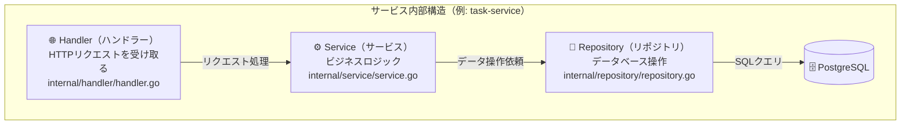

### 4.4 共有パッケージ

`backend/shared/` には、全サービスで共通利用するコードがあります：

| パッケージ | 役割 | 主なファイル |
|-----------|------|-------------|
| `auth` | JWT認証 | `jwt.go` - トークン生成・検証 |
| `config` | 設定読み込み | `config.go` - 環境変数から設定 |
| `database` | DB接続 | `postgres.go` - pgxpoolでコネクション管理 |
| `middleware` | HTTPミドルウェア | `middleware.go` - 認証、ログ、リクエストID |
| `logging` | ログ出力 | `setup.go` - zerolog設定 |

---

## 5. データの流れ

ユーザーがタスクを追加する場合を例に、データがどう流れるか見てみましょう。

### 5.1 タスク追加の流れ

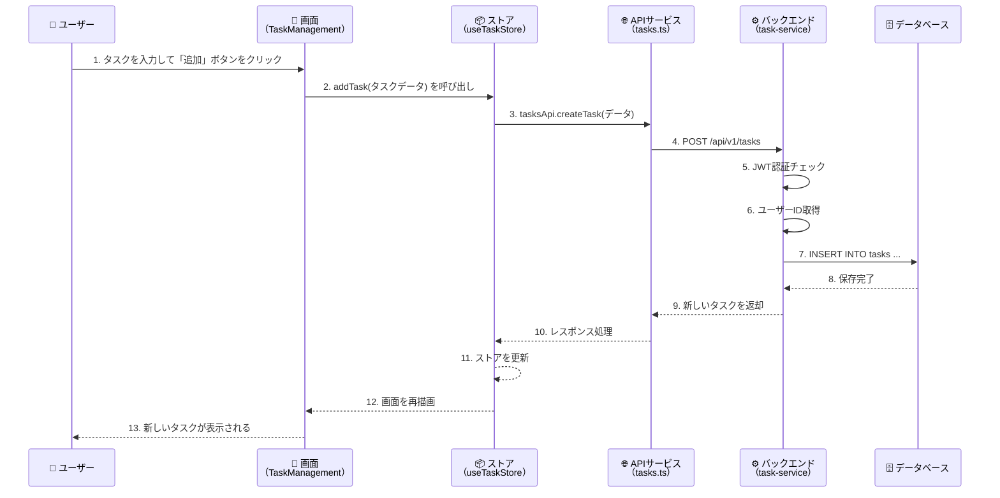

### 5.2 認証の流れ

すべてのリクエストには「認証」が必要です：

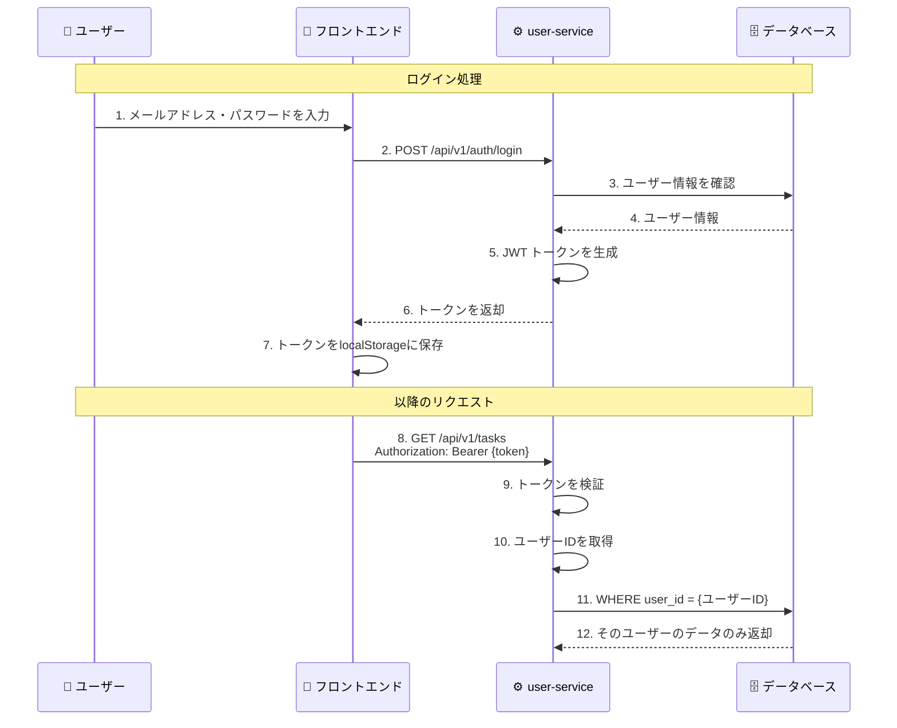

### 5.3 タイムゾーン処理

Kensanは世界中どこからでも使えるよう、タイムゾーンを正しく処理します：

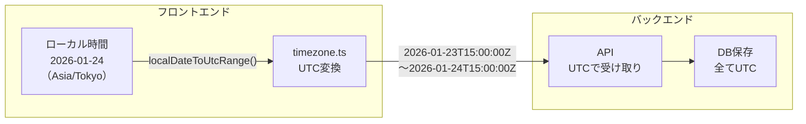

**ポイント:**
- データベースには全て**UTC**で保存
- フロントエンドでユーザーのタイムゾーンに変換して表示
- `useSettingsStore`からタイムゾーン設定を取得

---

## 6. データベース構造

すべてのデータはPostgreSQL 16データベースに保存されます。

### 6.1 主要テーブルの関係

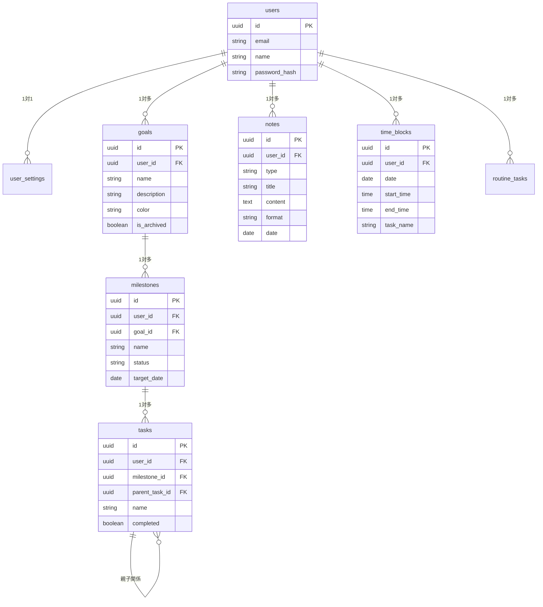

### 6.2 主要テーブル一覧

| テーブル | 説明 | 主要カラム |
|---------|------|-----------|
| `users` | ユーザー | email, name, password_hash |
| `user_settings` | 設定 | timezone, theme, ai_enabled |
| `goals` | 目標 | name, color, is_archived |
| `milestones` | マイルストーン | goal_id, name, status, target_date |
| `tasks` | タスク | milestone_id, parent_task_id, name, completed |
| `tags` | タグ | name, color |
| `task_tags` | タスク-タグ関連 | task_id, tag_id |
| `time_blocks` | 計画時間 | date, start_time, end_time, task_name |
| `time_entries` | 実績時間 | date, start_time, end_time, task_name |
| `running_timers` | 実行中タイマー | task_name, started_at |
| `routine_tasks` | 定期タスク | name, frequency, days_of_week |
| `notes` | 統合ノート | type, title, content, format |
| `memos` | クイックメモ | content, archived |

### 6.3 マルチテナント設計

すべてのテーブルに`user_id`があり、ユーザーごとにデータが分離されています：

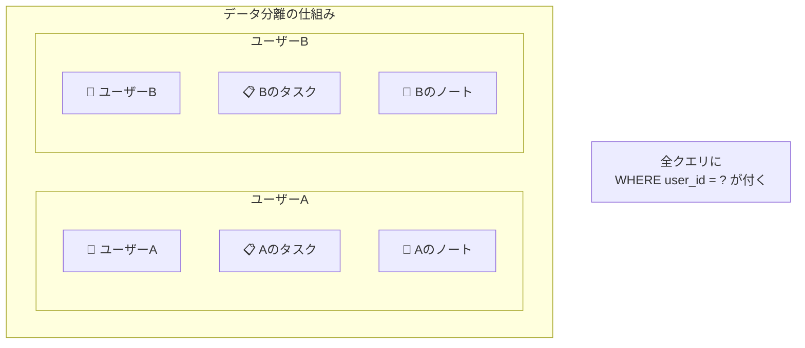

---

## 7. 目標・タスク管理の階層

Kensanでは、**目標 → マイルストーン → タスク**の3層構造でタスクを管理します。

### 7.1 階層構造

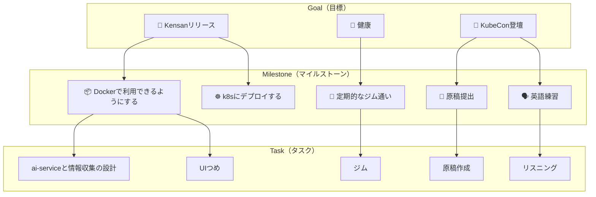

### 7.2 タグによる横断的な分類

目標・マイルストーンの縦の階層に加え、**タグ**で横断的に分類できます：

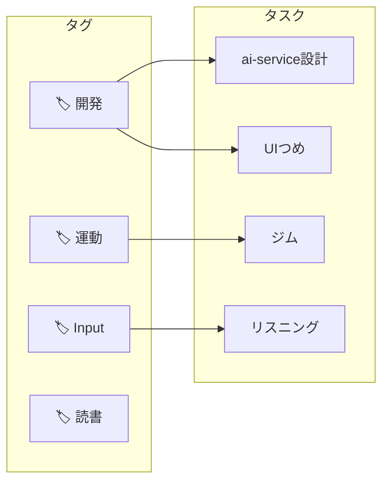

**使い分け:**
- **目標・マイルストーン**: 達成したいゴールに向けた構造
- **タグ**: 活動の種類（Input、開発、運動など）で集計

---

## 8. 開発モードと本番モードの違い

### 8.1 MSW（Mock Service Worker）とは？

開発中はバックエンドなしでも動作できるように、**MSW**がAPIリクエストを横取りしてモックデータを返します。

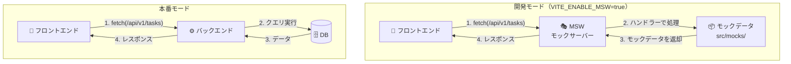

### 8.2 モードの切り替え

| 環境 | MSW | バックエンド | 用途 |
|------|-----|------------|------|
| **開発モード** | 有効 | 不要 | UIの開発・テスト |
| **本番モード** | 無効 | 必要 | 実際の運用 |

```bash
# 開発モード（MSW有効）
VITE_ENABLE_MSW=true npm run dev

# 本番モード（バックエンド必要）
npm run dev  # MSWなし

# Docker Composeで全部起動
cd backend && make up
```

---

## まとめ

### Kensanの技術スタック

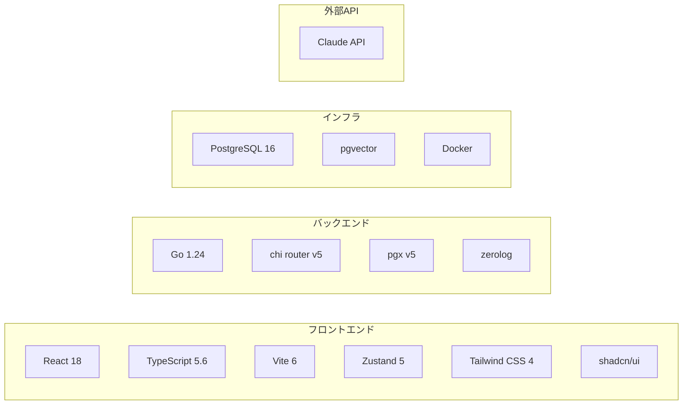

### 覚えておくべきポイント

1. **フロントエンド**はReact + TypeScriptで、Zustandで状態管理
2. **バックエンド**は9つのGoマイクロサービスで構成
3. すべてのサービスは**Handler → Service → Repository**の3層構造
4. **JWT**で認証し、**user_id**でデータを分離（マルチテナント）
5. **Goal → Milestone → Task**の3層でタスク管理、**Tag**で横断分類
6. 開発時は**MSW**でモック、本番は実際のバックエンドを使用
7. タイムゾーンは**UTC**で保存、フロントエンドで変換

### ファイル統計

| カテゴリ | 数 |
|---------|-----|
| ページ | 10 |
| コンポーネント | 47 |
| Zustandストア | 12 |
| APIサービス | 12 |
| バックエンドサービス | 9 |
| データベーステーブル | 14+ |

---

## 参考リンク

- [React公式ドキュメント](https://react.dev/)
- [Zustand GitHub](https://github.com/pmndrs/zustand)
- [Go言語公式](https://go.dev/)
- [PostgreSQL公式](https://www.postgresql.org/)
- [MSW公式ドキュメント](https://mswjs.io/)
- [shadcn/ui](https://ui.shadcn.com/)
- [Tailwind CSS](https://tailwindcss.com/)
