# Kensan システムアーキテクチャ入門ガイド

このドキュメントでは、Kensanサービスの仕組みを図を使ってわかりやすく説明します。

---

## 目次

1. [Kensanとは？](#1-kensanとは)
2. [システム全体像](#2-システム全体像)
3. [フロントエンドの仕組み](#3-フロントエンドの仕組み)
4. [バックエンドの仕組み](#4-バックエンドの仕組み)
5. [データの流れ](#5-データの流れ)
6. [データベース構造](#6-データベース構造)
7. [開発モードと本番モードの違い](#7-開発モードと本番モードの違い)

---

## 1. Kensanとは？

Kensanは、個人の生産性を向上させるためのアプリケーションです。

**主な機能:**
- 時間管理（タイムブロック）
- タスク管理
- 学習記録
- 日記
- AIによる週次レビュー

---

## 2. システム全体像

Kensanは「フロントエンド」と「バックエンド」の2つの部分で構成されています。

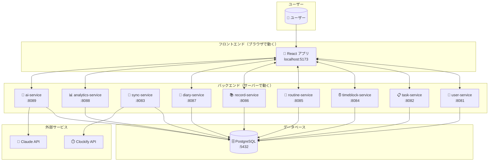

### ポイント解説

| 用語 | 説明 |
|------|------|
| **フロントエンド** | ユーザーが直接触る画面部分。ブラウザで動作します |
| **バックエンド** | データの保存・処理を担当。サーバーで動作します |
| **マイクロサービス** | 機能ごとに分けられた小さなサービス群 |
| **データベース** | すべてのデータを保存する場所 |

---

## 3. フロントエンドの仕組み

フロントエンドは、ユーザーが見る画面を担当します。

### 3.1 フロントエンドの構成

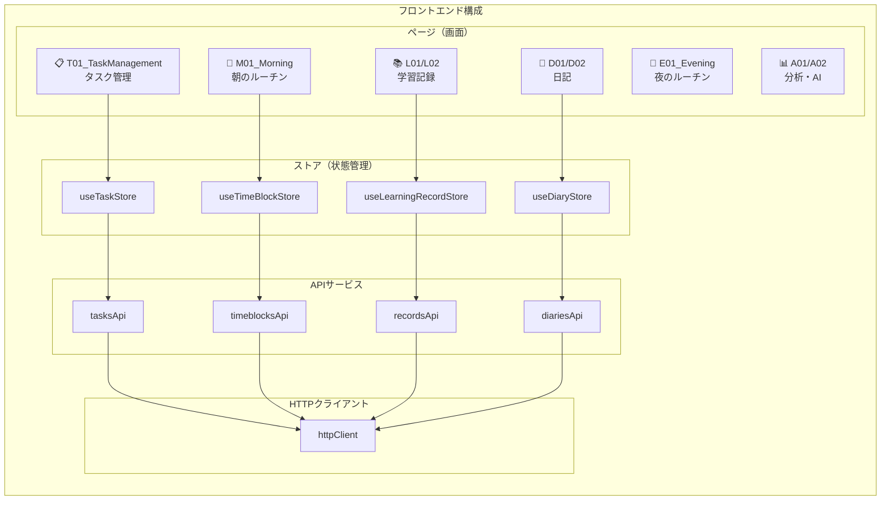

### 3.2 ページの命名規則

ページ名の先頭文字には意味があります：

| 文字 | 意味 | 例 |
|------|------|-----|
| **S** | Settings（設定） | S01_Settings, S02_Dashboard |
| **M** | Morning（朝） | M01_Morning |
| **E** | Evening（夜） | E01_Evening |
| **T** | Task（タスク） | T01_TaskManagement |
| **R** | Routine（定期タスク） | R01_RoutineTaskManagement |
| **L** | Learning（学習） | L01_LearningRecordList |
| **D** | Diary（日記） | D01_DiaryList |
| **A** | Analytics/AI（分析） | A01_AnalyticsReport |

### 3.3 Zustandストアとは？

**Zustand**は、アプリ全体でデータを共有するための仕組みです。

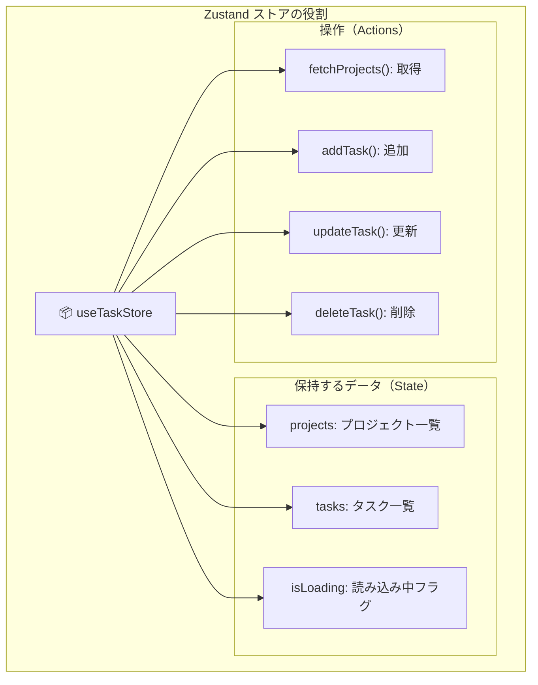

**ストアを使うメリット:**
- どの画面からでも同じデータにアクセスできる
- データが変わると自動で画面が更新される

---

## 4. バックエンドの仕組み

バックエンドは9つの**マイクロサービス**で構成されています。

### 4.1 マイクロサービス一覧

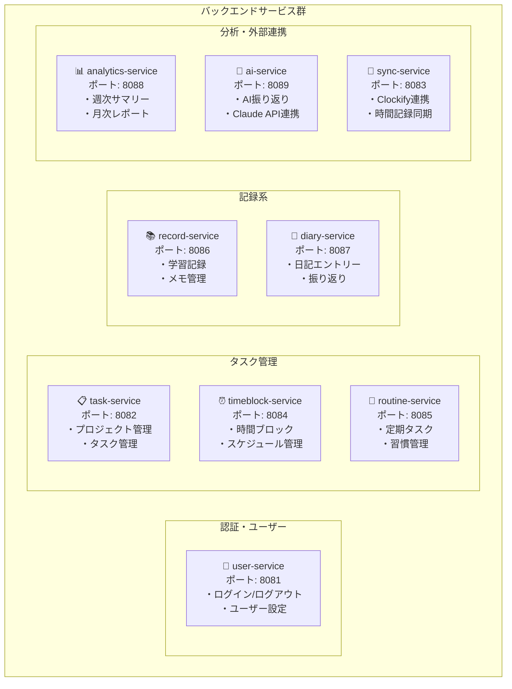

### 4.2 各サービスの内部構造

すべてのサービスは同じ構造（レイヤードアーキテクチャ）で作られています：

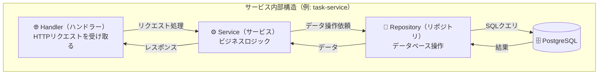

### 4.3 レイヤーの役割

| レイヤー | 役割 | 例 |
|---------|------|-----|
| **Handler** | HTTPリクエストの受付・レスポンス返却 | `GET /api/v1/tasks` を受け取る |
| **Service** | ビジネスロジック（処理ルール） | 「完了タスクは削除できない」などのルール適用 |
| **Repository** | データベースとのやり取り | SQLでデータを取得・保存 |

---

## 5. データの流れ

ユーザーがタスクを追加する場合を例に、データがどう流れるか見てみましょう。

### 5.1 タスク追加の流れ

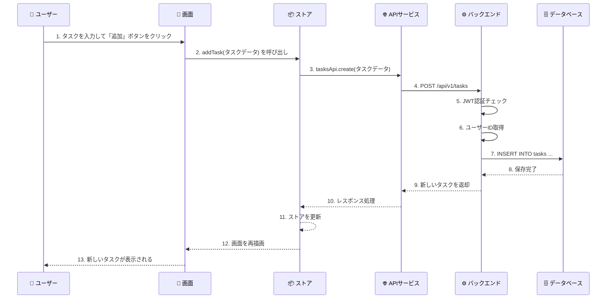

### 5.2 認証の流れ

すべてのリクエストには「認証」が必要です：

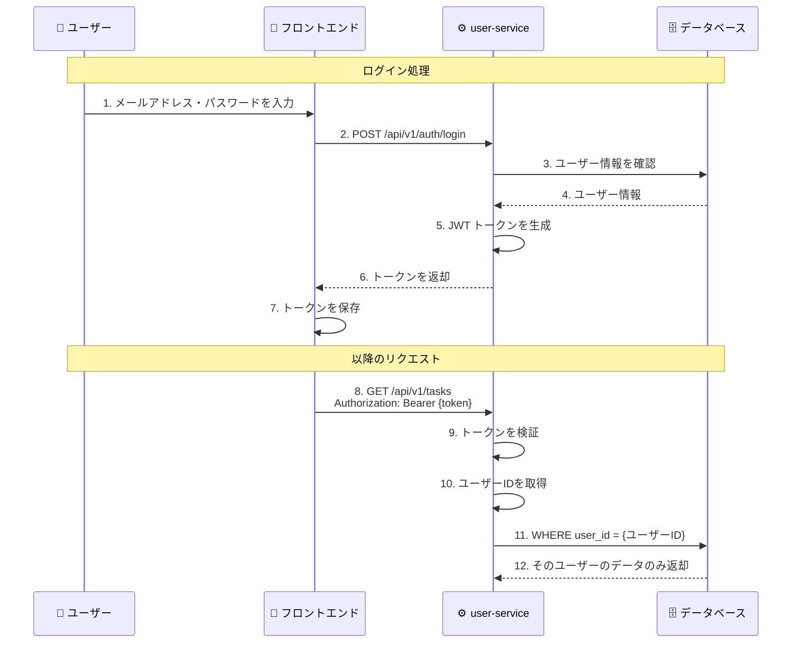

### 5.3 JWT（ジェイダブリューティー）とは？

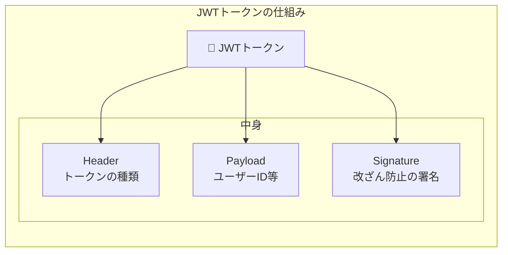

**JWTのメリット:**
- 毎回データベースに問い合わせなくてもユーザーを識別できる
- 改ざんされると署名が無効になるのでセキュリティが高い

---

## 6. データベース構造

すべてのデータはPostgreSQLデータベースに保存されます。

### 6.1 主要テーブルの関係

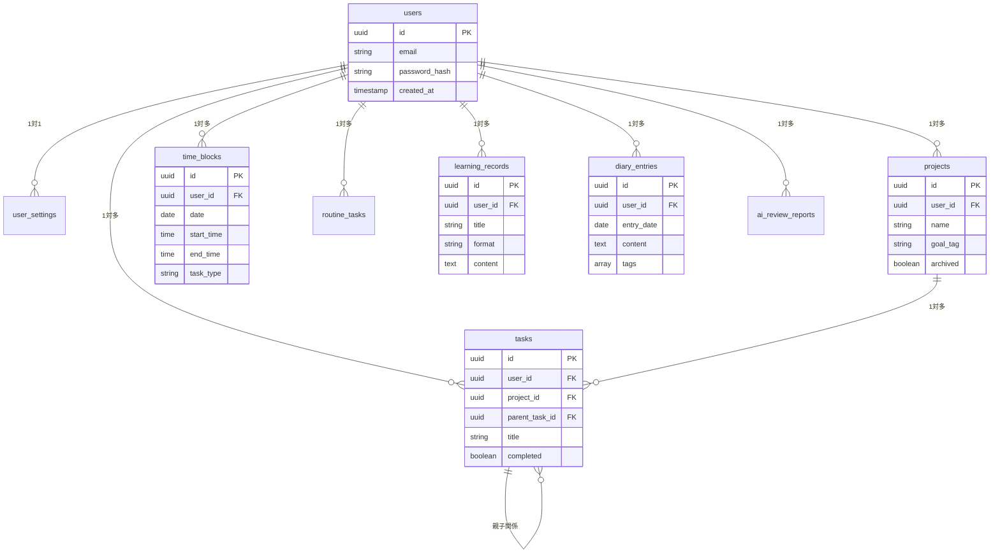

### 6.2 マルチテナント設計

すべてのテーブルに`user_id`があり、ユーザーごとにデータが分離されています：

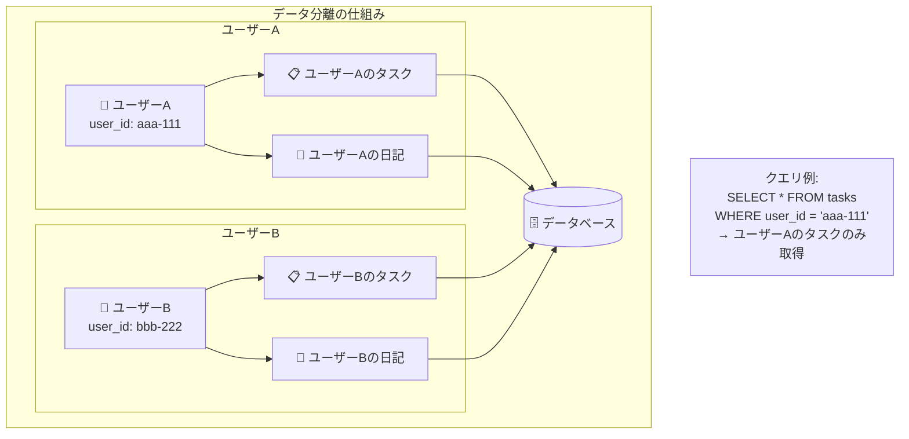

---

## 7. 開発モードと本番モードの違い

### 7.1 MSW（Mock Service Worker）とは？

開発中はバックエンドなしでも動作できるように、**MSW**がAPIリクエストを横取りしてモックデータを返します。

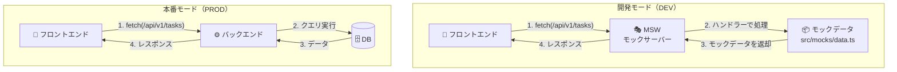

### 7.2 モードの切り替え

| 環境 | MSW | バックエンド | 用途 |
|------|-----|------------|------|
| **開発モード** | 有効 | 不要 | UIの開発・テスト |
| **本番モード** | 無効 | 必要 | 実際の運用 |

```bash
# 開発モード（MSW有効）
npm run dev

# 本番モード（バックエンド必要）
npm run build && npm run preview
```

---

## まとめ

### Kensanの技術スタック

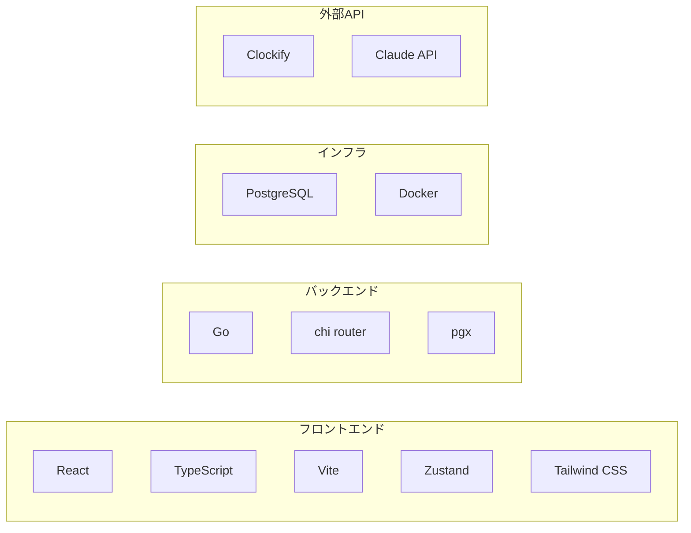

### 覚えておくべきポイント

1. **フロントエンド**はReact + TypeScriptで、Zustandで状態管理
2. **バックエンド**は9つのGoマイクロサービスで構成
3. すべてのサービスは**Handler → Service → Repository**の3層構造
4. **JWT**で認証し、**user_id**でデータを分離（マルチテナント）
5. 開発時は**MSW**でモック、本番は実際のバックエンドを使用

---

## 参考リンク

- [React公式ドキュメント](https://react.dev/)
- [Zustand GitHub](https://github.com/pmndrs/zustand)
- [Go言語公式](https://go.dev/)
- [PostgreSQL公式](https://www.postgresql.org/)
- [MSW公式ドキュメント](https://mswjs.io/)
