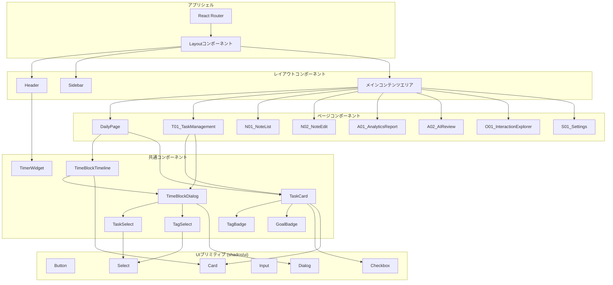
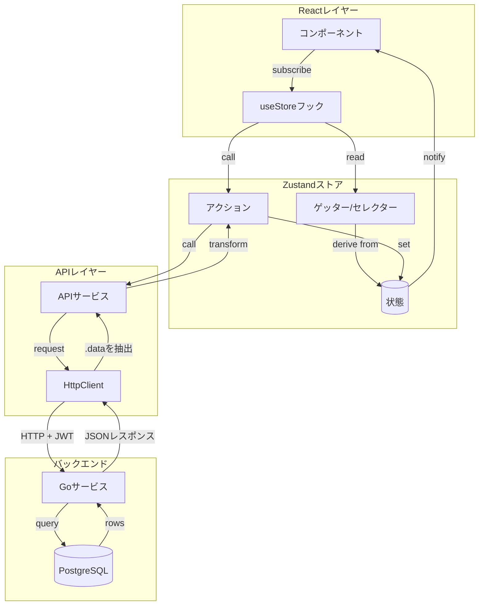
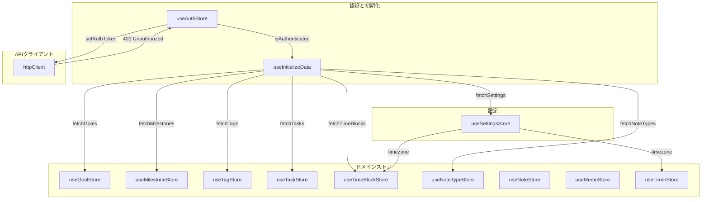
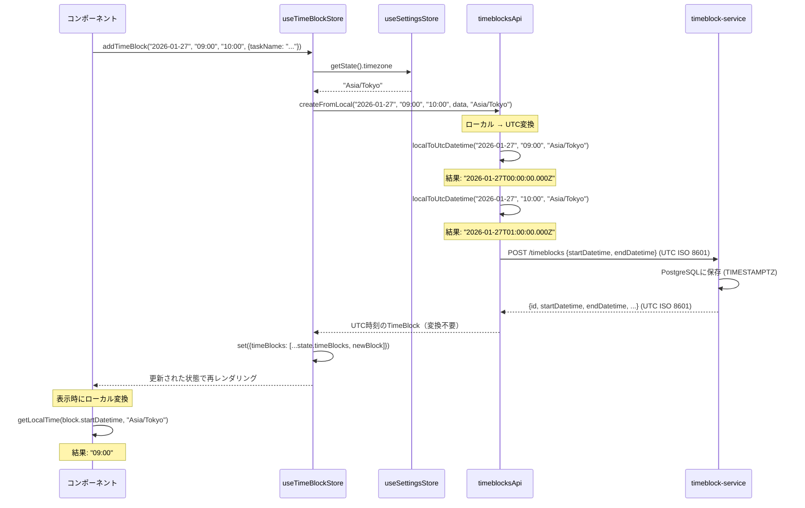

# フロントエンドアーキテクチャ

Kensanパーソナル生産性アプリケーションのReact + TypeScript SPA。

---

## 目次

1. [概要](#概要)
2. [ディレクトリ構成](#ディレクトリ構成)
3. [コンポーネント階層](#コンポーネント階層)
4. [状態管理](#状態管理)
5. [APIクライアント層](#apiクライアント層)
6. [ルーティング](#ルーティング)
7. [型定義](#型定義)
8. [スタイリング](#スタイリング)
9. [主要パターン](#主要パターン)
10. [開発](#開発)

---

## 概要

### アーキテクチャスタイル
- **React 18 SPA** + TypeScript strictモード
- **Zustand** によるグローバル状態管理
- **レイヤードアーキテクチャ**: Components → Stores → API Services → Backend
- **タイムゾーン対応**: 全ての日時操作はローカルとUTC間で変換

### 技術スタック

| コンポーネント | 技術 | バージョン |
|--------------|------|----------|
| フレームワーク | React | 18.3 |
| 言語 | TypeScript | 5.6 |
| ビルドツール | Vite | 6.x |
| 状態管理 | Zustand | 5.x |
| ルーティング | React Router | 7.x |
| スタイリング | Tailwind CSS | 4.x |
| UIコンポーネント | shadcn/ui | - |
| アイコン | Lucide React | 0.562 |
| エディタ | TipTap | 3.16 |
| チャート | Recharts | 3.6 |

---

## ディレクトリ構成

```
src/
├── api/                          # HTTPクライアントとAPIサービス
│   ├── client.ts                 # HttpClientシングルトン
│   ├── config.ts                 # 環境変数からのサービスURL
│   ├── createApiService.ts       # 汎用CRUDファクトリ
│   └── services/                 # ドメイン別API（13ファイル）
│       ├── auth.ts, user.ts
│       ├── tasks.ts              # Goals, Milestones, Tags, Tasks
│       ├── timeblocks.ts         # TimeBlocks, TimeEntries
│       ├── timer.ts, routines.ts, notes.ts
│       ├── records.ts, diaries.ts, memos.ts
│       ├── agent.ts, analytics.ts
│       └── observability.ts      # Loki直接クエリ（AI Interaction Explorer用）
├── components/
│   ├── ui/                       # shadcn/uiプリミティブ
│   ├── layout/                   # Header, Sidebar, Layout
│   ├── common/                   # ドメインコンポーネント
│   ├── editor/                   # Markdown, Drawioエディタ
│   ├── task/                     # Goal, Milestone, Taskダイアログ
│   ├── daily/                    # デイリーページセクション
│   ├── note/                     # ノートエディタコンポーネント (NoteEditor, MetadataForm + validateMetadata)
│   ├── agent/                    # AIチャットUI (ChatPanel, ChatMessage, ChatInput, ActionProposal, MarkdownContent)
│   └── interactions/             # AI Interaction Explorer (InteractionTable, ConversationFlow)
├── pages/                        # ページコンポーネント（10ファイル）
├── stores/                       # Zustandストア（12ストア）
├── hooks/                        # カスタムReactフック
├── lib/                          # ユーティリティ（timezone, dateFormat, noteTypeIcons, actionFormatter, utils）
├── mocks/                        # MSWハンドラとモックデータ
├── types/                        # TypeScript型定義
├── config/                       # アプリ設定
├── App.tsx                       # ルートルーター
├── main.tsx                      # エントリーポイント
└── index.css                     # グローバルスタイル
```

---

## コンポーネント階層

### 全体図



### 3層構造

#### 1. UIコンポーネント (`components/ui/`)

プリミティブでステートレスなshadcn/uiコンポーネント:
- Button, Input, Card, Dialog, Select, Checkbox
- Tabs, Dropdown, Popover, Badge, Progress
- Calendar, Textarea, ScrollArea, TimeRangeInput

**特徴:**
- ビジネスロジックなし
- propsによる完全制御
- Radix UIベースでアクセシビリティ対応

#### 2. 共通コンポーネント (`components/common/`)

ドメイン知識を持つ再利用可能なコンポーネント:

| コンポーネント | 目的 |
|--------------|------|
| `TaskCard` | チェックボックス、ゴールバッジ付きタスク表示 |
| `TimeBlockTimeline` | インタラクティブタイムライン（ドラッグ/リサイズ） |
| `TimeBlockDialog` | 予定/実績の共通追加・編集ダイアログ |
| `TagBadge` | 色付きタグ表示 |
| `GoalBadge` | 色付き目標インジケータ |
| `TimerWidget` | ヘッダー内アクティブタイマー |
| `StartTimerDialog` | タイマー開始フォーム |
| `FloatingMemoButton` | クイックメモFAB |
| `TaskSelect` | タスクドロップダウン |
| `TagSelect` | 複数選択タグ |

**TimeBlockDialogの機能:**
- 予定（plan）/実績（entry）モード切替
- デフォルトは「タスクから選択」
- インラインでの新規タスク作成機能
- 実績モード: 日付・説明フィールド追加
- 目標未設定時の警告表示（達成率に含まれない旨）

**TimeBlockTimelineアーキテクチャ（SRPベースの分割）:**

タイムラインは`components/common/timeline/`内の特化したサブコンポーネントで構成:

| コンポーネント | 責務 |
|--------------|------|
| `TimeBlockTimeline.tsx` | グリッドとアイテムを統括するコンテナ |
| `TimeBlockTimelineGrid.tsx` | 時間線と背景グリッドのレンダリング |
| `TimeBlockItem.tsx` | 個別タイムブロック表示（目標スタイリング） |
| `useTimeBlockDragResize.ts` | ドラッグ/リサイズインタラクションロジック |

**機能:**
- ドラッグで移動（15分スナップ）
- エッジリサイズで時間調整
- 予定と実績の表示
- インタラクション中のプレビュー
- 目標あり/なしの視覚的区別:
  - 目標あり: 左ボーダーに目標色（4px）+ 目標色の薄い背景
  - 目標なし: グレー点線ボーダー + muted背景 + 「その他」ラベル

#### AI Interaction Explorer (`components/interactions/`)

Lokiログからのリアルタイムなインタラクション可視化:

| コンポーネント | 責務 |
|--------------|------|
| `InteractionTable` | インタラクション一覧テーブル（時刻、モデル、トークン数、ツール数、outcome）|
| `ConversationFlow` | 選択したインタラクションの詳細タイムライン（システムプロンプト、ツール定義サマリー、各ターン、ツール呼び出し）|

**ConversationFlowの主要要素:**
- **SystemPromptEntry**: システムプロンプトのセクション分析（セクション別トークン推定）
- **ToolDefinitionsSummary**: ツール定義の概要（ツール数、定義サイズ、推定トークン、ツール名リスト）
- **TurnEntry**: ターンごとのトークン使用量（input/output、cache hit表示）
- **ToolCallEntry**: ツール呼び出しの入力/出力、成否表示

#### 3. レイアウトコンポーネント (`components/layout/`)

**Layout.tsx**（メインラッパー）:
```tsx
<div className="h-screen flex flex-col">
  <Header />
  <div className="flex-1 flex overflow-hidden">
    <Sidebar />
    <main className="flex-1 overflow-auto p-6">
      <Outlet />
    </main>
  </div>
  <FloatingMemoButton />
</div>
```

**Header.tsx:**
- ロゴ + ブランド名
- TimerWidget
- テーマ切替
- ユーザードロップダウン（プロフィール、ログアウト）

**Sidebar.tsx:**
- アイコン付きナビゲーション項目
- アクティブ状態のハイライト
- Phase 2バッジ

---

## 状態管理

### Zustandアーキテクチャ



**テキストフロー:**
```
コンポーネント
    ↓ (アクション呼び出し)
Zustandストア
    ↓ (API呼び出し)
APIサービス
    ↓ (HTTPリクエスト)
バックエンド
    ↓ (レスポンス)
APIサービス
    ↓ (変換)
Zustandストア
    ↓ (状態更新)
コンポーネント (再レンダリング)
```

### ストアファクトリ (`createCrudStore.ts`)

標準化されたインターフェースを持つ汎用CRUDストア:

```typescript
interface CrudStore<T> {
  items: T[]
  isLoading: boolean
  error: string | null

  fetchAll(): Promise<void>
  add(data): Promise<T>
  update(id, data): Promise<T>
  remove(id): Promise<void>
  getById(id): T | undefined
  clearError(): void
}
```

### コアストア

#### useAuthStore
```typescript
// 状態
token: string | null
user: User | null
isAuthenticated: boolean

// アクション
login(email, password): Promise<void>
register(email, password, name): Promise<void>
logout(): void
restoreSession(): void

// localStorageに永続化: 'kensan-auth'
```

#### useSettingsStore
```typescript
// 状態
timezone: string  // 例: 'Asia/Tokyo'
theme: 'light' | 'dark' | 'system'
userName: string
isConfigured: boolean

// アクション
setTimezone(tz): void
setTheme(theme): void
saveSettings(): Promise<void>
fetchSettings(): Promise<void>

// localStorageに永続化: 'kensan-settings'
```

#### ドメインストア（ISPベースの分離）

タスク関連の状態は特化したドメインストアに分割:

**useGoalStore** (`stores/useGoalStore.ts`)
```typescript
// 状態
goals: Goal[]
isLoading: boolean
error: string | null

// アクション
fetchGoals(): Promise<void>
addGoal(data): Promise<Goal>
updateGoal(id, data): Promise<Goal>
deleteGoal(id): Promise<void>
getGoalById(id): Goal | undefined
```

**useMilestoneStore** (`stores/useMilestoneStore.ts`)
```typescript
// 状態
milestones: Milestone[]

// アクション
fetchMilestones(): Promise<void>
addMilestone(data): Promise<Milestone>
updateMilestone(id, data): Promise<Milestone>
deleteMilestone(id): Promise<void>
getMilestonesByGoal(goalId): Milestone[]
```

**useTagStore** (`stores/useTagStore.ts`)
```typescript
// 状態
tags: Tag[]

// アクション
fetchTags(): Promise<void>
addTag(data): Promise<Tag>
updateTag(id, data): Promise<Tag>
deleteTag(id): Promise<void>
```

**useTaskManagerStore**（便利な統合フック）
```typescript
// 後方互換性のため全ストアアクションを再エクスポート
export const useTaskManagerStore = () => ({
    ...useGoalStore(),
    ...useMilestoneStore(),
    ...useTagStore(),
    ...useTaskStore(),
})
```

#### useTaskStore
```typescript
// 状態
tasks: Task[]

// アクション
fetchTasks(): Promise<void>
addTask(data): Promise<Task>
updateTask(id, data): Promise<Task>
deleteTask(id): Promise<void>
toggleTaskComplete(id): Promise<void>

// クエリ
getTasksByMilestone(milestoneId): Task[]
getChildTasks(parentId): Task[]
```

#### useTimeBlockStore
```typescript
// 状態
timeBlocks: TimeBlock[]
timeEntries: TimeEntry[]

// タイムゾーン対応フェッチ
fetchTimeBlocksForLocalDate(localDate, timezone): Promise<void>
fetchTimeEntriesForLocalDate(localDate, timezone): Promise<void>

// CRUD（ローカル日時 → UTC変換をAPI層で実行）
addTimeBlock(localDate, localStartTime, localEndTime, data): Promise<void>
updateTimeBlock(id, localDate, localStartTime?, localEndTime?, data?): Promise<void>
addTimeEntry(localDate, localStartTime, localEndTime, data): Promise<void>
updateTimeEntry(id, localDate, localStartTime?, localEndTime?, data?): Promise<void>

// クエリ
getTimeBlocksByDate(localDate): TimeBlock[]  // getLocalDate()でフィルタ
getTodayTimeBlocks(): TimeBlock[]
getTodayTimeEntries(): TimeEntry[]
```

#### useNoteTypeStore
```typescript
// 状態
types: NoteTypeConfig[]        // note_types一覧
isLoaded: boolean              // キャッシュ済みフラグ

// アクション
fetchTypes(): Promise<void>    // APIから取得（isLoaded時はスキップ）

// ゲッター
getBySlug(slug): NoteTypeConfig | undefined
getDisplayName(slug): string
getIcon(slug): string
getColor(slug): string
getConstraints(slug): TypeConstraints | undefined
getMetadataSchema(slug): FieldSchema[]
```

#### useNoteStore
```typescript
// 状態
items: NoteListItem[]           // メタデータのみ
noteCache: Map<string, Note>    // フルコンテンツキャッシュ
searchResults: NoteSearchResult[]

// アクション
fetchNotes(filter?): Promise<void>
fetchNote(id): Promise<Note>
createNote(data): Promise<Note>
updateNote(id, data): Promise<Note>
deleteNote(id): Promise<void>
search(query, filter?): Promise<void>

// クエリ
getById(id): NoteListItem | undefined
getByType(type): NoteListItem[]
getByGoal(goalId): NoteListItem[]
```

#### useTimerStore
```typescript
// 状態
currentTimer: RunningTimer | null
isRunning: boolean

// アクション
startTimer(input): Promise<void>
stopTimer(): Promise<TimeEntry>
fetchCurrentTimer(): Promise<void>
```

### 永続化パターン

```typescript
// リハイドレーション付き認証ストア
persist(
  (set, get) => ({...}),
  {
    name: 'kensan-auth',
    partialize: (state) => ({
      token: state.token,
      user: state.user,
      isAuthenticated: state.isAuthenticated,
    }),
    onRehydrateStorage: () => (state) => {
      if (state?.token) {
        httpClient.setAuthToken(state.token)
      }
    },
  }
)
```

---

## APIクライアント層

### HttpClient (`api/client.ts`)

認証管理付きシングルトンHTTPクライアント:

```typescript
class HttpClient {
  private authToken: string | null

  setAuthToken(token: string): void
  clearAuthToken(): void
  setOnUnauthorized(callback: () => void): void

  async get<T>(baseUrl, endpoint): Promise<T>
  async post<T>(baseUrl, endpoint, body): Promise<T>
  async put<T>(baseUrl, endpoint, body): Promise<T>
  async patch<T>(baseUrl, endpoint, body): Promise<T>
  async delete(baseUrl, endpoint): Promise<void>
}
```

**機能:**
- 自動`Authorization: Bearer <token>`ヘッダー
- W3C `traceparent`ヘッダー自動生成（OpenTelemetryトレース伝搬）
- レスポンスエンベロープのアンラップ（`{data}` → `data`）
- 401検出 → ログアウトコールバック
- エラー時のToast通知

### APIサービスファクトリ (`createApiService.ts`)

汎用CRUDファクトリ:

```typescript
const tasksApi = createApiService<TaskResponse, Task, CreateInput, UpdateInput>({
  baseUrl: API_CONFIG.baseUrls.task,
  resourcePath: '/tasks',
  transform: transformTask,  // Response → Entity
})

// 戻り値: { list, get, create, update, delete }
```

**拡張パターン:**
```typescript
const tasksApi = extendApiService(baseTasksApi, (base) => ({
  toggleComplete(id: string): Promise<Task> {
    return httpClient.patch(baseUrl, `/tasks/${id}/complete`)
  },
  reorder(taskIds: string[]): Promise<Task[]> {
    return httpClient.post(baseUrl, '/tasks/reorder', { taskIds })
  },
}))
```

### ドメインサービス

**tasks.ts** - Goals, Milestones, Tags, Tasks
```typescript
goalsApi.list(), goalsApi.create({name, color}), ...
milestonesApi.list({goalId}), ...
tagsApi.list(), ...
tasksApi.list({milestoneId, completed}), tasksApi.toggleComplete(id), ...
```

**timeblocks.ts** - タイムゾーン対応操作
```typescript
// フェッチ: ローカル日付 → UTC範囲に変換してクエリ
timeblocksApi.listByLocalDate(localDate, timezone): Promise<TimeBlock[]>
timeblocksApi.listByDateRange(startDate, endDate, timezone): Promise<TimeBlock[]>

// 作成/更新: ローカル日時 → UTC ISO変換
timeblocksApi.createFromLocal(localDate, localStartTime, localEndTime, data, timezone): Promise<TimeBlock>
timeblocksApi.updateFromLocal(id, localDate, localStartTime?, localEndTime?, data, timezone): Promise<TimeBlock>

// TimeEntries も同様のAPI
timeentriesApi.listByLocalDate(localDate, timezone): Promise<TimeEntry[]>
timeentriesApi.createFromLocal(localDate, localStartTime, localEndTime, data, timezone): Promise<TimeEntry>
timeentriesApi.updateFromLocal(id, localDate, localStartTime?, localEndTime?, data, timezone): Promise<TimeEntry>
```

**notes.ts** - 統合ノート
```typescript
notesApi.list({types, goalId, archived}): Promise<NoteListItem[]>
notesApi.get(id): Promise<Note>
notesApi.create({type, format, title, content, ...}): Promise<Note>
notesApi.search(query, filter): Promise<NoteSearchResult[]>
notesApi.archive(id, archived): Promise<Note>
noteTypesApi.list(): Promise<NoteTypeConfig[]>   // ノートタイプ設定取得
```

**observability.ts** - Loki直接クエリ（AI Interaction Explorer用）
```typescript
// Lokiからログを取得し、構造化AIイベントにパース
fetchAiEvents(start: Date, end: Date): Promise<AiEvent[]>

// traceIdでグループ化したInteractionリストを返す
fetchInteractions(start: Date, end: Date): Promise<Interaction[]>

// 特定traceのイベントを取得
fetchTraceEvents(traceId: string, start: Date, end: Date): Promise<AiEvent[]>

// イベントタイプ: agent.prompt, agent.system_prompt, agent.turn, agent.tool_call, agent.complete
// Interactionはprompt + complete + turnsを集約した1エージェント実行単位
```

### 設定 (`api/config.ts`)

```typescript
export const API_CONFIG = {
  baseUrls: {
    user: import.meta.env.VITE_USER_SERVICE_URL || 'http://localhost:8081',
    task: import.meta.env.VITE_TASK_SERVICE_URL || 'http://localhost:8082',
    timeblock: import.meta.env.VITE_TIMEBLOCK_SERVICE_URL || 'http://localhost:8084',
    // ... 全サービスURL
  },
}
```

---

## ルーティング

### ルート構成

```
/login                     LoginPage（公開）
/settings                  S01_Settings（ログイン後セットアップ）

/ (認証済み + 設定完了)
├── /                      S02_Dashboard
├── /daily                 DailyPage
├── /notes                 N01_NoteList
│   ├── /notes/new        N02_NoteEdit
│   └── /notes/:id        N02_NoteEdit
├── /tasks                 T01_TaskManagement
├── /routines              R01_RoutineTaskManagement
├── /analytics             A01_AnalyticsReport
├── /ai-review             A02_AIReview
└── /interactions          O01_InteractionExplorer
```

### ページ命名規則

| プレフィックス | ドメイン | 例 |
|--------------|---------|-----|
| S | 設定/システム | S01_Settings, S02_Dashboard |
| D | デイリー | DailyPage |
| N | ノート | N01_NoteList, N02_NoteEdit |
| T | タスク | T01_TaskManagement |
| R | ルーティン | R01_RoutineTaskManagement |
| A | 分析/AI | A01_AnalyticsReport, A02_AIReview |
| O | Observability | O01_InteractionExplorer |

### ルート保護

```tsx
// App.tsx内
<Route element={<RequireAuth />}>
  <Route element={<RequireConfigured />}>
    <Route element={<Layout />}>
      {/* 保護されたルート */}
    </Route>
  </Route>
</Route>
```

- 未認証 → `/login`にリダイレクト
- 未設定 → `/settings`にリダイレクト

---

## 型定義

### コアエンティティ (`types/index.ts`)

```typescript
interface Goal {
  id: string
  name: string
  description?: string
  color: string
  isArchived: boolean
  createdAt: string
  updatedAt: string
}

interface Milestone {
  id: string
  goalId: string
  name: string
  description?: string
  targetDate?: string
  status: 'active' | 'completed' | 'archived'
}

interface Task {
  id: string
  milestoneId?: string
  parentTaskId?: string
  name: string
  tagIds: string[]
  estimatedMinutes?: number
  completed: boolean
  dueDate?: string
}

interface TimeBlock {
  id: string
  startDatetime: string  // ISO 8601 UTC (e.g., "2026-01-20T00:00:00.000Z")
  endDatetime: string    // ISO 8601 UTC
  taskName: string
  taskId?: string
  goalId?: string
  goalName?: string
  goalColor?: string
  milestoneId?: string
  milestoneName?: string
  tagIds?: string[]
}

interface Note {
  id: string
  type: string          // データ駆動（note_typesテーブルで定義）
  format: 'markdown' | 'drawio'
  title?: string
  content: string
  date?: string         // constraints.dateRequired=true のタイプ用
  goalId?: string
  goalName?: string
  goalColor?: string
  milestoneId?: string
  milestoneName?: string
  tagIds: string[]
  metadata?: NoteMetadata[]  // タイプ固有メタデータ
  archived: boolean
  createdAt: string
  updatedAt: string
}

// ノートタイプ設定（APIから取得）
interface NoteTypeConfig {
  id: string
  slug: string           // 'diary', 'learning', 'general', 'book_review'
  displayName: string
  displayNameEn?: string
  description?: string
  icon: string           // Lucideアイコン名
  color: string
  constraints: TypeConstraints
  metadataSchema: FieldSchema[]
  sortOrder: number
  isSystem: boolean
  isActive: boolean
}

interface TypeConstraints {
  dateRequired: boolean
  titleRequired: boolean
  contentRequired: boolean
  dailyUnique: boolean
}

interface FieldSchema {
  key: string
  label: string
  labelEn?: string
  type: 'string' | 'integer' | 'float' | 'boolean' | 'enum' | 'date' | 'url'
  required: boolean
  constraints?: Record<string, any>  // min, max, values等
}
```

### 列挙型

```typescript
type MilestoneStatus = 'active' | 'completed' | 'archived'
type RoutineFrequency = 'daily' | 'weekly' | 'monthly' | 'custom'
type NoteType = string  // データ駆動（例: 'diary', 'learning', 'general', 'book_review'）
type NoteFormat = 'markdown' | 'drawio'
type Theme = 'light' | 'dark' | 'system'
```

### デフォルトカラー

```typescript
const DEFAULT_COLORS = [
  '#0EA5E9',  // スカイブルー（ブランドカラー）
  '#10B981',  // エメラルド
  '#F59E0B',  // アンバー
  '#EF4444',  // レッド
  '#8B5CF6',  // バイオレット
  '#EC4899',  // ピンク
  '#06B6D4',  // シアン
  '#84CC16',  // ライム
]
```

---

## スタイリング

### Tailwind CSS設定

```javascript
// tailwind.config.js
module.exports = {
  darkMode: ['class'],
  theme: {
    extend: {
      colors: {
        background: 'hsl(var(--background))',
        foreground: 'hsl(var(--foreground))',
        primary: 'hsl(var(--primary))',
        brand: 'hsl(var(--brand))',
        // ... その他のセマンティックカラー
      },
    },
  },
  plugins: [require('tailwindcss-animate')],
}
```

### CSS変数 (`index.css`)

```css
:root {
  --background: 0 0% 100%;
  --foreground: 222.2 84% 4.9%;
  --primary: 222.2 47.4% 11.2%;
  --brand: 199 89% 48%;           /* Kensanスカイブルー */
  --timeblock-plan-bg: #f8fafc;
  --timeblock-actual-bg: #e2e8f0;
}

.dark {
  --background: 222 47% 11%;
  --foreground: 210 40% 98%;
  --brand: 199 89% 60%;
  --timeblock-plan-bg: #1e293b;
  --timeblock-actual-bg: #334155;
}
```

### ユーティリティヘルパー

```typescript
// lib/utils.ts
import { clsx } from 'clsx'
import { twMerge } from 'tailwind-merge'

export function cn(...inputs: ClassValue[]) {
  return twMerge(clsx(inputs))
}

// 使用例
<div className={cn('base-class', conditional && 'optional-class')} />
```

---

## 主要パターン

### ストア連携図

複数のストアがどのように連携するかを示す図。



### タイムゾーン変換フロー

**設計方針:**
- DBは `TIMESTAMPTZ` でUTC保存
- APIはUTC ISO 8601文字列をそのまま返す（例: `"2026-01-27T00:00:00.000Z"`）
- タイムゾーン変換はフロントエンドに統一（表示時にgetLocalTime/getLocalDateで変換）

**シーケンス図: TimeBlock作成時のタイムゾーン変換**



**ユーティリティ関数:**

```typescript
// lib/timezone.ts

// ローカル日付をバックエンドクエリ用のUTC範囲に変換
localDateToUtcRange('2026-01-23', 'Asia/Tokyo')
// → { startUtc: '2026-01-22T15:00:00.000Z', endUtc: '2026-01-23T15:00:00.000Z' }

// UTC ISO文字列からローカル日付を取得
getLocalDate('2026-01-22T15:00:00.000Z', 'Asia/Tokyo')
// → '2026-01-23'

// UTC ISO文字列からローカル時刻を取得
getLocalTime('2026-01-27T00:00:00.000Z', 'Asia/Tokyo')
// → '09:00'

// ローカル日時をUTC ISO文字列に変換
localToUtcDatetime('2026-01-27', '09:00', 'Asia/Tokyo')
// → '2026-01-27T00:00:00.000Z'
```

### ストア初期化

```typescript
// hooks/useInitializeData.ts
export function useInitializeData() {
  const { isAuthenticated } = useAuthStore()
  const { fetchSettings, timezone } = useSettingsStore()

  useEffect(() => {
    if (!isAuthenticated) return

    const init = async () => {
      await fetchSettings()
      const tz = useSettingsStore.getState().timezone

      await Promise.all([
        fetchTasks(),
        fetchTimeBlocksForLocalDate(today, tz),
        fetchTimeEntriesForLocalDate(today, tz),
        fetchRoutines(),
      ])
    }

    init()
  }, [isAuthenticated])
}
```

### ダイアログ状態パターン

```typescript
// hooks/useDialogState.ts
export function useDialogState(initial = false) {
  const [open, setOpen] = useState(initial)

  const handleOpenChange = useCallback((value: boolean) => {
    setOpen(value)
  }, [])

  return [open, handleOpenChange] as const
}

// 使用例
const [dialogOpen, setDialogOpen] = useDialogState()
<Dialog open={dialogOpen} onOpenChange={setDialogOpen}>
```

### 配列ユーティリティ (`lib/arrayUtils.ts`)

配列並び替え操作の再利用可能なユーティリティ:

```typescript
// インデックスによる並び替え（ドラッグ＆ドロップ）
reorderByIndex<T>(array: T[], fromIndex: number, toIndex: number): T[]

// IDリストを使用した並び替え（APIレスポンス）
reorderByIds<T extends { id: string }>(items: T[], orderedIds: string[]): T[]

// IDで単一アイテムを移動
moveItemById<T extends { id: string }>(
  items: T[],
  itemId: string,
  direction: 'up' | 'down'
): T[]
```

### エラーハンドリング

```typescript
// HttpClientがエラーをキャッチしてToast表示
try {
  const response = await fetch(url, options)
  if (!response.ok) {
    toast.error('エラー', { description: 'リクエストが失敗しました' })
    throw new Error(...)
  }
  if (response.status === 401) {
    toast.error('セッションが期限切れです')
    this.onUnauthorizedCallback?.()
  }
} catch (error) {
  toast.error('ネットワークエラー')
}

// ストアがキャッチしてエラー状態を設定
const store = create((set) => ({
  error: null,
  fetchData: async () => {
    try {
      set({ isLoading: true, error: null })
      const data = await api.list()
      set({ items: data, isLoading: false })
    } catch (error) {
      set({ error: error.message, isLoading: false })
    }
  },
}))
```

### コンポーネント合成

```tsx
// ページがストアを調整してセクションに渡す
export function DailyPage() {
  const { getTodayTimeBlocks } = useTimeBlockStore()
  const { timezone } = useSettingsStore()

  return (
    <div className="space-y-6">
      <TimeBlockSection
        blocks={getTodayTimeBlocks()}
        timezone={timezone}
        onEdit={handleEdit}
      />
      <TimeEntrySection entries={getTodayTimeEntries()} />
    </div>
  )
}

// セクションが表示ロジックを処理
function TimeBlockSection({ blocks, onEdit }) {
  return (
    <Card>
      <CardHeader>予定</CardHeader>
      <CardContent>
        <TimeBlockTimeline blocks={blocks} onEdit={onEdit} />
      </CardContent>
    </Card>
  )
}
```

### 目標ベースの時間集計

DailySummaryの達成率計算は**goal_idあり**のデータのみを対象とする:

```typescript
// 目標ありのデータのみ達成率計算に含める
const blocksWithGoal = todayBlocks.filter(b => b.goalId)
const entriesWithGoal = todayEntries.filter(e => e.goalId)

const plannedMinutes = calculateMinutes(blocksWithGoal)
const actualMinutes = calculateMinutes(entriesWithGoal)
const completionRate = plannedMinutes > 0
  ? Math.round((actualMinutes / plannedMinutes) * 100)
  : 0

// 目標なしは別枠表示（達成率に含まず）
const otherPlannedMinutes = calculateMinutes(blocksWithoutGoal)
const otherActualMinutes = calculateMinutes(entriesWithoutGoal)
```

**理由:**
- タスク名直接入力（目標未設定）の時間は「その他の作業」として扱う
- 目標に紐づく作業のみを達成率で追跡することで、目標達成の進捗が正確に測れる

---

## 開発

### コマンド

```bash
npm run dev          # Vite開発サーバー (localhost:5173)
npm run dev:mock     # MSWモッキング有効
npm run build        # TypeScriptチェック + プロダクションビルド
npm run lint         # ESLint
npm run preview      # プロダクションビルドのプレビュー
```

### 環境変数

```bash
# .env
VITE_USER_SERVICE_URL=http://localhost:8081
VITE_TASK_SERVICE_URL=http://localhost:8082
VITE_TIMEBLOCK_SERVICE_URL=http://localhost:8084
VITE_ROUTINE_SERVICE_URL=http://localhost:8085
VITE_RECORD_SERVICE_URL=http://localhost:8086
VITE_DIARY_SERVICE_URL=http://localhost:8087
VITE_ANALYTICS_SERVICE_URL=http://localhost:8088
VITE_AI_SERVICE_URL=http://localhost:8089
VITE_MEMO_SERVICE_URL=http://localhost:8090
VITE_NOTE_SERVICE_URL=http://localhost:8091
VITE_ENABLE_MSW=false
```

### MSW (Mock Service Worker)

開発用オプトインモッキング:

```bash
VITE_ENABLE_MSW=true npm run dev
```

ハンドラは`src/mocks/handlers/`にあり、APIサービスをミラーリング。

### 新機能の追加

1. **型**: `types/index.ts`にインターフェースを追加
2. **APIサービス**: `api/services/`にファクトリを使用して作成
3. **ストア**: `stores/`にファクトリまたはカスタムで作成
4. **コンポーネント**: 適切な`components/`サブディレクトリに追加
5. **ページ**: `pages/`に命名規則に従って作成
6. **ルート**: `App.tsx`に追加
7. **MSWハンドラ**: `mocks/handlers/`に開発用として追加

### パスエイリアス

```typescript
// tsconfig.json
{
  "compilerOptions": {
    "paths": {
      "@/*": ["./src/*"]
    }
  }
}

// 使用例
import { Button } from '@/components/ui/button'
import { useTaskStore } from '@/stores/useTaskStore'
```

---

## 依存関係

```json
{
  "react": "^18.3.1",
  "react-dom": "^18.3.1",
  "react-router-dom": "^7.1.1",
  "zustand": "^5.0.3",
  "tailwindcss": "^4.1.8",
  "@radix-ui/react-*": "各種",
  "@tiptap/react": "^3.16.2",
  "react-drawio": "^1.0.0",
  "recharts": "^3.6.0",
  "date-fns": "^4.1.0",
  "lucide-react": "^0.562.0",
  "sonner": "^2.0.0",
  "msw": "^2.12.7",
  "react-markdown": "^9.x",
  "remark-gfm": "^4.x"
}
```
